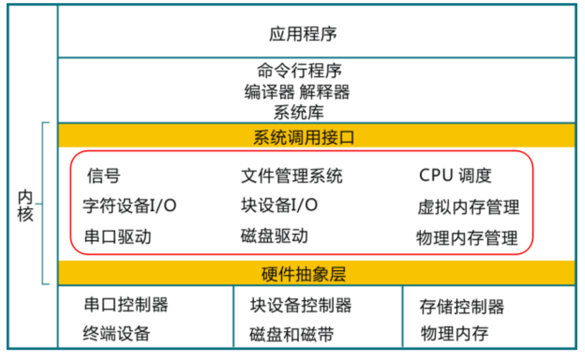
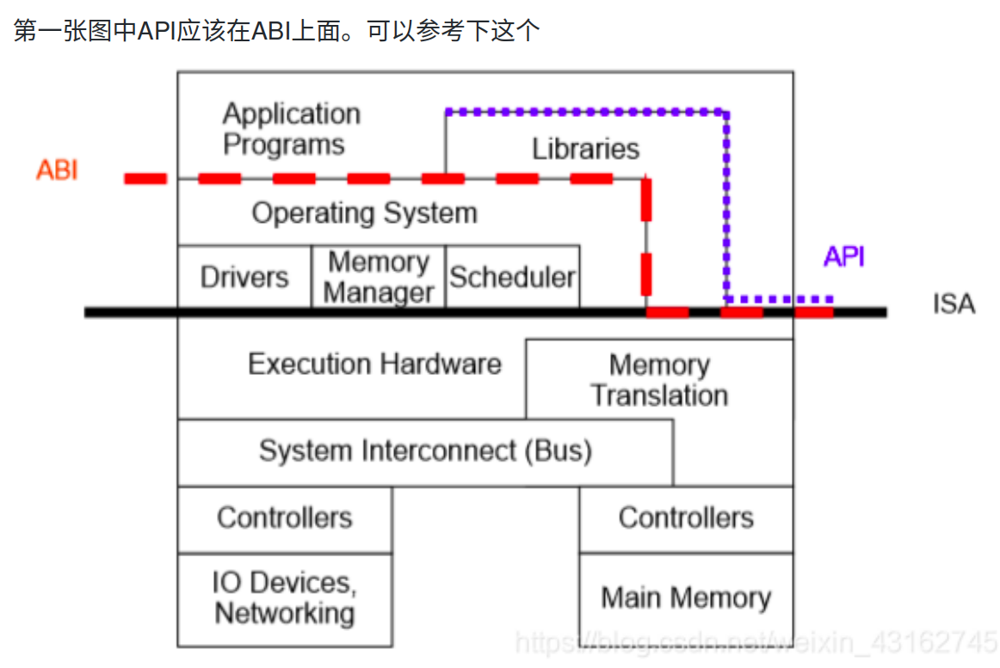

### 引言

- 通过足够详尽的测试程序和自动测试框架，可以随时验证同学实现的操作系统在每次更新后是否正常工作。
- 我们推荐的编程语言和架构分别是 Rust 和 RISC-V。
- 其中第0章是本书的总览，介绍了为何写本书，概述了操作系统的简要发展历史，操作系统的定义，系统调用接口，操作系统的抽象表示和特征等，以及如何基于本书来学习操作系统。

### 操作系统定义

**执行环境**提供了运行应用软件所需的运行时服务，包括内存管理、文件系统访问、网络连接等，这些服务大部分是由操作系统来提供的。

操作系统这个系统软件干的事主要有两件：

- 是向下管理并控制计算机硬件和各种外设。

- 是向上管理应用软件并提供各种服务。


那操作系统的组成部分包含哪些内容呢？在一般情况下，操作系统的主要组成包括：

1. 操作系统内核：操作系统的核心部分，负责控制计算机的硬件资源并为用户和应用程序**提供服务**。
2. 系统工具和软件库：为操作系统提供**基本功能**的软件，包括工具软件和系统软件库等。
3. 用户接口：是操作系统的外壳，是用户与操作系统**交互的方式**。用户接口包括图形用户界面（GUI）和命令行界面（CLI）等。

简单描述如下：



#### 系统调用接口

值得注意的是，我们设计的各种操作系统总共只用到三十个左右系统调用功能接口（如下表所示），就可以支持应用需要的上述功能。

| 编号 |       系统调用       | 功能描述                       | 所在章节 |
| ---- | :------------------: | ------------------------------ | -------- |
| 1    |       sys_exit       | 结束执行                       | 2        |
| 2    |      sys_write       | (2)输出字符串/(6)写文件        | 2/6      |
| 3    |      sys_yield       | 暂时放弃执行                   | 3        |
| 4    |     sys_get_time     | 获取当前时间                   | 3        |
| 5    |      sys_getpid      | 获取进程id                     | 5        |
| 6    |       sys_fork       | 创建子进程                     | 5        |
| 7    |       sys_exec       | 执行新程序                     | 5        |
| 8    |     sys_waitpid      | 等待子进程结束                 | 5        |
| 9    |       sys_read       | (5)读取字符串/(6)读文件        | 5/6      |
| 10   |       sys_open       | 打开/创建文件                  | 6        |
| 11   |      sys_close       | 关闭文件                       | 6        |
| 12   |       sys_dup        | 复制文件描述符                 | 7        |
| 13   |       sys_pipe       | 创建管道                       | 7        |
| 14   |       sys_kill       | 发送信号给某进程               | 7        |
| 15   |    sys_sigaction     | 设立信号处理例程               | 7        |
| 16   |   sys_sigprocmask    | 设置要阻止的信号               | 7        |
| 17   |    sys_sigreturn     | 从信号处理例程返回             | 7        |
| 18   |      sys_sleep       | 进程休眠一段时间               | 8        |
| 19   |  sys_thread_create   | 创建线程                       | 8        |
| 20   |      sys_gettid      | 获取线程id                     | 8        |
| 21   |     sys_waittid      | 等待线程结束                   | 8        |
| 22   |   sys_mutex_create   | 创建锁                         | 8        |
| 23   |    sys_mutex_lock    | 获取锁                         | 8        |
| 24   |   sys_mutex_unlock   | 释放锁                         | 8        |
| 25   | sys_semaphore_create | 创建信号量                     | 8        |
| 26   |   sys_semaphore_up   | 减少信号量的计数               | 8        |
| 27   |  sys_semaphore_down  | 增加信号量的计数               | 8        |
| 28   |  sys_condvar_create  | 创建条件变量                   | 8        |
| 29   |  sys_condvar_signal  | 唤醒阻塞在条件变量上的线程     | 8        |
| 30   |   sys_condvar_wait   | 阻塞与此条件变量关联的当前线程 | 8        |

异常控制流：应用程序在执行过程中，如果发出系统调用请求，或出现外设中断、CPU 异常等情况，处理器执行的前一条指令和后一条指令将会位于两个完全不同的位置，即**不同的执行环境**。

异常：代码正常执行，却出现了不正确的地方。

中断：执行环境的变化。

- 函数级转移：编译器自动生成堆栈（调用相关指令）
- 异常级中断：os手动生成堆栈

**ABI与API区别：**



#### 操作系统特性

从总体上看，操作系统具有五个方面的特征：虚拟化 (Virtualization)、并发性 (Concurrency)、异步性、共享性和持久性  (Persistency)。操作系统的虚拟化可以理解为它对内存、CPU  的抽象和处理；并发性和共享性可以理解为操作系统支持多个应用程序“同时”运行；异步性可以从操作系统调度、中断处理对应用程序执行造成的影响等几个方面来理解；持久性则可以从操作系统中的文件系统支持把数据方便地从磁盘等存储介质上存入和取出来理解。

- 并行 (Parallel) 是指两个或者多个事件在同一时刻发生；
- 并发 (Concurrent) 是指两个或多个事件在同一时间间隔内发生。

### 环境配置

- 用的rustc的`nightly`版本，这个是开发版

### QEMU

```bash
cd os
make run
```

之后，可以先按下 `Ctrl+a` （即：先按下 Ctrl 不松开，再按下小写字母 a 不放，随后同时将两个键松开） ，再按下 `x` 来退出 QEMU。

### 移除标准库的依赖

为了构建操作系统，不能用标准库函数，标准库函数会调用系统调用，裸机是没有系统调用的
