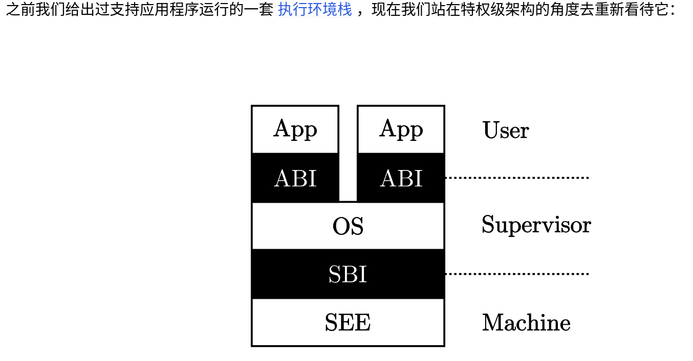
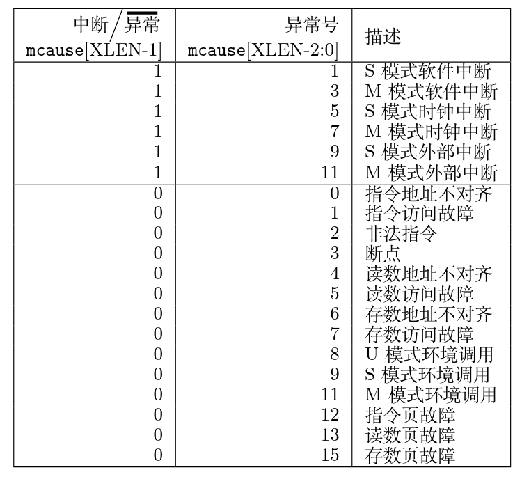
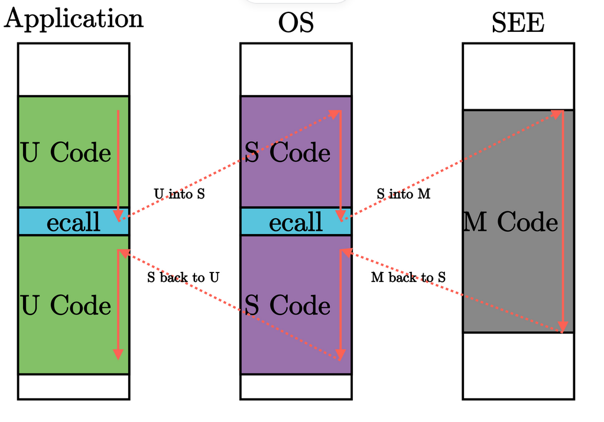

# 引言

**批处理系统** (Batch System) 应运而生，它可用来管理无需或仅需少量用户交互即可运行的程序，在资源允许的情况下它可以自动安排程序的执行，这被称为“批处理作业；

**特权级** (Privilege) 机制： *保护* 计算机系统不受有意或无意出错的程序破坏的机制。应用程序总是难免会出现错误，如果一个程序的执行错误导致其它程序或者整个计算机系统都无法运行就太糟糕了。人们希望一个应用程序的错误不要影响到其它应用程序、操作系统和整个计算机系统。这就需要操作系统能够终止出错的应用程序，转而运行下一个应用程序。

## 本章任务

本章我们的目标让泥盆纪“邓式鱼”操作系统能够感知多个应用程序的存在，并一个接一个地运行这些应用程序，当一个应用程序执行完毕后，会启动下一个应用程序，直到所有的应用程序都执行完毕。


邓式鱼BatchOS操作系统的总体结构如下图所示：


通过上图，大致可以看出Qemu把包含多个app的列表和BatchOS的image镜像加载到内存中，RustSBI（bootloader）完成基本的硬件初始化后，跳转到邓式鱼BatchOS起始位置，邓式鱼BatchOS首先进行正常运行前的初始化工作，即建立栈空间和清零bss段，然后通过 AppManager 内核模块从app列表中依次加载各个app到指定的内存中在用户态执行。app在执行过程中，会通过系统调用的方式得到邓式鱼BatchOS提供的OS服务，如输出字符串等。

位于 `ch2` 分支上的邓式鱼BatchOS操作系统的源代码如下所示：

```
./os/src
Rust        13 Files   372 Lines
Assembly     2 Files    58 Lines

├── bootloader
│   └── rustsbi-qemu.bin
├── LICENSE
├── os
│   ├── build.rs(新增：生成 link_app.S 将应用作为一个数据段链接到内核)
│   ├── Cargo.toml
│   ├── Makefile(修改：构建内核之前先构建应用)
│   └── src
│       ├── batch.rs(新增：实现了一个简单的批处理系统)
│       ├── console.rs
│       ├── entry.asm
│       ├── lang_items.rs
│       ├── link_app.S(构建产物，由 os/build.rs 输出)
│       ├── linker-qemu.ld
│       ├── main.rs(修改：主函数中需要初始化 Trap 处理并加载和执行应用)
│       ├── sbi.rs
│       ├── sync(新增：同步子模块 sync ，目前唯一功能是提供 UPSafeCell)
│       │   ├── mod.rs
│       │   └── up.rs(包含 UPSafeCell，它可以帮助我们以更 Rust 的方式使用全局变量)
│       ├── syscall(新增：系统调用子模块 syscall)
│       │   ├── fs.rs(包含文件 I/O 相关的 syscall)
│       │   ├── mod.rs(提供 syscall 方法根据 syscall ID 进行分发处理)
│       │   └── process.rs(包含任务处理相关的 syscall)
│       └── trap(新增：Trap 相关子模块 trap)
│           ├── context.rs(包含 Trap 上下文 TrapContext)
│           ├── mod.rs(包含 Trap 处理入口 trap_handler)
│           └── trap.S(包含 Trap 上下文保存与恢复的汇编代码)
├── README.md
├── rust-toolchain
└── user(新增：应用测例保存在 user 目录下)
   ├── Cargo.toml
   ├── Makefile
   └── src
      ├── bin(基于用户库 user_lib 开发的应用，每个应用放在一个源文件中)
      │   ├── 00hello_world.rs
      │   ├── 01store_fault.rs
      │   ├── 02power.rs
      │   ├── 03priv_inst.rs
      │   └── 04priv_csr.rs
      ├── console.rs
      ├── lang_items.rs
      ├── lib.rs(用户库 user_lib)
      ├── linker.ld(应用的链接脚本)
      └── syscall.rs(包含 syscall 方法生成实际用于系统调用的汇编指令，
                     各个具体的 syscall 都是通过 syscall 来实现的)
```

本章操作系统优点：

1. 操作系统自身运行在内核态，且支持应用程序在用户态运行，且能完成应用程序发出的系统调用
2. 能够一个接一个地自动运行不同的应用程序

一般来说执行一个用户态应用程序的流程是，读取elf文件，创建新的进程页表，把elf文件里面的可执行文件段分别map到这个地址空间内的不同区域，切换页表然后设置特权等级。但是现在好像还没有文件系统，也没有类似C语言里面map的功能（后面应该会有），所以就靠链接器把用户态应用程序直接写入内核映像里，执行的时候直接跳转到这片内存区域即可


> 屏蔽中断是一种机制，用于在特定的时间段内忽略或屏蔽可屏蔽中断的请求。它并不直接限制接下来的操作是否可以被拆分，但可以在某些情况下用于确保操作的原子性或一致性。


为确保操作系统的安全，对应用程序而言，需要限制的主要有两个方面：

- 应用程序不能访问任意的地址空间（这个在第四章会进一步讲解，本章不会涉及）
- 应用程序不能执行某些可能破坏计算机系统的指令（本章的重点）

为了让应用程序获得操作系统的函数服务，采用传统的函数调用方式（即通常的 `call` 和 `ret` 指令或指令组合）将会直接绕过硬件的特权级保护检查。为了解决这个问题， RISC-V 提供了新的机器指令：执行环境调用指令（Execution Environment Call，简称 `ecall` ）和一类执行环境返回（Execution Environment Return，简称 `eret` ）指令。其中：

- `ecall` 具有用户态到内核态的执行环境切换能力的函数调用指令；
- `sret` ：具有内核态到用户态的执行环境切换能力的函数返回指令。

`mret` 也属于执行环境返回指令，当从 Machine 模式的执行环境返回时使用

`eret` 代表一类执行环境返回指令

> 一般来说， `ecall` 这条指令和 `eret` 这类指令分别可以用来让 CPU 从当前特权级切换到比当前高一级的特权级和切换到不高于当前的特权级，


上面对硬件进行了处理，后面还需要操作系统的配合：

1. 执行 `sret` 前准备和恢复用户态执行应用程序的上下文。
2. 在应用程序调用 `ecall` 指令后，能够检查应用程序的系统调用参数，确保参数不会破坏操作系统。


### RISC-V 特权级

#### 寄存器编号


| 寄存器级别 | 编码 | 名称                                |
| ---------- | ---- | ----------------------------------- |
| 0          | 00   | 用户/应用模式 (U, User/Application) |
| 1          | 01   | 监督模式 (S, Supervisor)            |
| 2          | 10   | 虚拟监督模式 (H, Hypervisor)        |
| 3          | 11   | 机器模式 (M, Machine)               |

其中，级别的数值越大，特权级越高，掌控硬件的能力越强。从表中可以看出， M 模式处在最高的特权级，而 U 模式处于最低的特权级。在CPU硬件层面，除了M模式必须存在外，其它模式可以不存在。



- 白色执行环境

- 黑色：相邻执行环境之间的接口

- 操作系统内核：Supervisor

- 监督模式执行环境(SEE)：M模式运行的软件，`eg.` Bootloader-RustSBI

  **特权级规范**：

- 简单的嵌入式应用只需要实现 M 模式；

- 带有一定保护能力的嵌入式系统需要实现 M/U 模式；

- 复杂的多任务系统则需要实现 M/S/U 模式。

- 到目前为止，(Hypervisor, H)模式的特权规范还没完全制定好，所以本书不会涉及。

> 回顾第一章，当时只是实现了简单的支持单个裸机应用的库级别的“三叶虫”操作系统，它和应用程序全程运行在 S 模式下，应用程序很容易破坏没有任何保护的执行环境–操作系统。
>
> 我们之前提到的引导加载程序会在加电后对整个系统进行初始化，它实际上是 SEE 功能的一部分，也就是说在 RISC-V 架构上的引导加载程序一般运行在 M 模式上（bin文件）。

**执行环境**的**另一种**功能是对上层软件的执行进行监控管理。监控管理可以理解为，当上层软件执行的时候出现了一些异常或特殊情况，导致需要用到执行环境中提供的功能，因此需要暂停上层软件的执行，转而运行执行环境的代码。由于上层软件和执行环境被设计为运行在不同的特权级，这个过程也往往（而 **不一定** ）伴随着 CPU 的 **特权级切换** 。

#### 异常1与中断0



##### 异常

- 意料之外的异常
  - 在执行某一条指令的时候发生了某种错误（如除零、无效地址访问、无效指令等）
  - 处理器认为处于当前特权级下执行的当前指令是高特权级指令或会访问不应该访问的高特权级的资源（可能危害系统）
- 故意而为之的异常：陷入
  - 断点(ebreak):触发断点陷入异常
  - 执行环境调用(ecall):会随着 CPU 当前所处特权级而触发不同的异常(M/S/U -> 11/9/8)

事实上 M/S/U 三个特权级的软件可分别由不同的编程语言实现

在RISCV中，中断（interrupt）和异常（exception）被统称为trap

在arm中我们知道中断和异常是通过中断向量表中不同入口调用不同的处理函数处理的，**但是在riscv中，所有中断和异常一般都是使用的同一个处理入口**

**ecall示意图:**



碰到异常情况，就需要将控制转交给高特权级的软件（如操作系统）来处理：

- 当错误/异常恢复后，则可重新回到低优先级软件去执行；
- 如果不能恢复错误/异常，那高特权级软件可以杀死和清除低特权级软件，避免破坏整个执行环境。

#### 特权指令

1. 与特权级无关的一般的指令和通用寄存器 `x0` ~ `x31` 在任何特权级都可以执行
2. 每个特权级都对应一些特殊指令和 **控制状态寄存器** (CSR, Control and Status Register) ，来控制该特权级的某些行为并描述其状态。当然特权指令不仅具有读写 CSR 的指令，还有其他功能的特权指令
3. 如果处于低特权级状态的处理器执行了高特权级的指令，会产生非法指令错误的异常。此时，高特权级会知道他发生了错误，但是这种错误**不可恢复**，然后执行环境会终止这个软件，就是所谓特权级保护机制。

##### Supervisor特权指令

会有两类属于高特权级 S 模式的特权指令：

- 指令本身属于高特权级的指令，如 `sret` 指令（表示从 S 模式返回到 U 模式）。
- 指令访问了 [S模式特权级下才能访问的寄存器](https://rcore-os.cn/rCore-Tutorial-Book-v3/chapter2/4trap-handling.html#term-s-mod-csr) 或内存，如表示S模式系统状态的 **控制状态寄存器** `sstatus` 等。

| 指令                   | 含义                                                         |
| ---------------------- | ------------------------------------------------------------ |
| sret                   | 从 S 模式返回 U 模式：在 U 模式下执行会产生非法指令异常      |
| wfi                    | 处理器在空闲时进入低功耗状态等待中断：在 U 模式下执行会产生非法指令异常 |
| sfence.vma             | 刷新 TLB 缓存：在 U 模式下执行会产生非法指令异常             |
| 访问 S 模式 CSR 的指令 | 通过访问 [sepc/stvec/scause/sscartch/stval/sstatus/satp等CSR](https://rcore-os.cn/rCore-Tutorial-Book-v3/chapter2/4trap-handling.html#term-s-mod-csr) 来改变系统状态：在 U 模式下执行会产生非法指令异常 |


## User目录

- `user/src/bin/*.rs` ：各个应用程序
- `user/src/*.rs` ：用户库（包括入口函数、初始化函数、I/O 函数和系统调用接口等）
- `user/src/linker.ld` ：应用程序的内存布局说明。


```bash
# User代码运行的方式
make build # 建立bin文件(一次只会链接一个app)
cd tar->/ri->/re->
qemu-riscv64 xx # bin下的文件
```


```
user(用户库代码)
└─ src
   ├─ bin(各个应用程序)
   │  ├─ ch2b_bad_address.rs(访问一个非法的物理地址，测试批处理系统是否会被该错误影响)
   │  ├─ ch2b_bad_instructions.rs
   │  ├─ ch2b_bad_register.rs
   │  ├─ ch2b_hello_world.rs(在屏幕上打印一行 Hello world from user mode program!)
   │  ├─ ch2b_power_3.rs(不断在计算操作和打印字符串操作之间进行特权级切换)
   │  ├─ ch2b_power_5.rs
   │  ├─ ch2b_power_7.rs
   ├─ console.rs
   ├─ lang_items.rs
   ├─ lib.rs
   ├─ linker.ld
   └─ syscall.rs
```


#### syscall.rs

在编写系统调用时，`fd`（文件描述符）和系统调用号（system call number）是两个不同的概念，它们各自在操作系统和编程中扮演着不同的角色。以下是它们之间的区别：

- **fd**
  1. **定义**：文件描述符是操作系统内核为了高效管理已被打开的文件所创建的索引。它是一个非负整数，用于指代被打开的文件。
  2. **类型**：文件描述符可以指向多种类型的I/O资源，如硬盘上的文件、网络套接字、管道等。
  3. **管理**：操作系统通过文件描述符表管理每个进程打开的所有文件。当进程打开一个新文件时，系统会为该文件分配一个未被当前进程使用的最小的文件描述符。
  4. **默认值**：在Linux系统中，文件描述符0、1、2分别用于表示标准输入（STDIN）、标准输出（STDOUT）和标准错误（STDERR）。

- **系统调用号**
  1. **定义**：系统调用号是操作系统为每一个系统调用定义的唯一编号。这个编号用于在用户空间的进程和内核空间的服务例程之间建立映射关系。
  2. **用途**：当用户空间的进程执行一个系统调用时，这个系统调用号被用来指明到底是要执行哪个系统调用。系统调用号在`sys_call_table`数组（系统调用表）中作为下标使用，以找到对应的内核函数执行。
  3. **重要性**：系统调用号一旦分配就不能再改变，否则可能会导致编译好的应用程序因为调用到错误的系统调用而崩溃。

- **区别**

  - **功能**：`fd`用于标识和访问文件或其他I/O资源，而系统调用号用于标识和触发特定的系统服务。

  - **管理**：`fd`由操作系统通过文件描述符表进行管理，而系统调用号通过系统调用表进行管理。

  - **使用场景**：在编程中，当需要进行文件操作时，会使用`fd`；而当需要请求操作系统提供某种服务时（如内存分配、进程管理等），会使用系统调用号触发相应的系统调用。

> [linux针对不同指令集的系统调用号](https://gpages.juszkiewicz.com.pl/syscalls-table/syscalls.html)
>
> 由于我们使用的是sbi规范

**RISC-V 寄存器编号和别名**

RISC-V 寄存器编号从 `0~31` ，表示为 `x0~x31` 。 其中：

- `x10~x17` : 对应  `a0~a7`
- `x1` ：对应 `ra`

```rust
// args:[usize;3]
// 一个包含三个无符号整数的数组
fn syscall(id:usize,args:[usize;3]) -> isize { 
    let mut ret:isize;
    unsafe{
        asm!(
            "ecall", // 环境切换
            inlateout("x10") args[0] => ret, 
            //x10 = a0输入参数/函数返回值
            //inlateout说明a0不仅作为(args[0])输入，还作为输出ret(上面的变量)
            in("x11") args[1],// args[1]输入到寄存器x11(a1)
            in("x12") args[2],
            in("x17") id // 系统调用号输入到x17
        );
    } 
    ret
}
```

> 而这里的 `asm!` 宏可以将汇编代码嵌入到局部的函数上下文中。相比 `global_asm!` ， `asm!` 宏可以获取上下文中的变量信息并允许嵌入的汇编代码对这些变量进行操作。


Qemu 有两种运行模式：用户态模拟（User mode）和系统级模拟（System mode）。在 RISC-V 架构中，用户态模拟可使用 `qemu-riscv64` 模拟器，它可以模拟一台预装了 Linux 操作系统的 RISC-V 计算机，需要做到二者的系统调用的接口是一样的（包括系统调用编号，参数约定的具体的寄存器和栈等）。。

如果碰到是系统调用相关的汇编指令，它会把不同处理器（如 RISC-V）的 Linux 系统调用转换为本机处理器（如 x86-64）上的 Linux 系统调用。

在汇编语言和链接器（linker）的上下文中，`.bss` 和 `.text`（注意，通常不是 `.test`）是特定的段（section）名称，它们有特定的含义和用途。这些段名称并不是汇编语言本身的默认规范，而是链接器和加载器（loader）在操作系统和处理器架构中用来处理二进制对象文件和可执行文件的约定。


# 批处理系统

我猜测的,sbi-riscv是内核规范，提供可以被直接调用的接口，而且是汇编级别的，甚至是S模式

```rust
// os/src/main.rs

// 可以运行S模式指令，至少是supervisor级别
unsafe{
    asm!("sret");
}
```

但是User由于全是空的，就是完全的空接口定义，处于用户态的

> [!warning]
>
> 上面的猜想在后面的章节得到了肯定的答案


>在批处理操作系统中，每当一个应用执行完毕，我们都需要将下一个要执行的应用的代码和数据加载到内存。

在**具体实现其批处理执行应用程序功能**之前，本节我们首先实现该应用加载机制：

> 在**操作系统和应用程序需要被放置到同一个可执行文件**的前提下，设计一种尽量简洁的应用放置和加载方式，使得操作系统容易找到应用被放置到的位置，从而在批处理操作系统和应用程序之间建立起联系的纽带。具体而言，应用放置采用“静态绑定”的方式，而操作系统加载应用则采用“动态加载”的方式：

- 静态绑定：通过一定的编程技巧，把多个应用程序代码和批处理操作系统代码“绑定”在一起。
- 动态加载：基于静态编码留下的“绑定”信息，操作系统可以找到每个应用程序文件二进制代码的起始地址和长度，并能加载到内存中运行。


###### link_app.S


```asm
# os/src/link_app.S

    .align 3
    .section .data
    .global _num_app
_num_app:
    .quad 5
    .quad app_0_start
    .quad app_1_start
    .quad app_2_start
    .quad app_3_start
    .quad app_4_start
    .quad app_4_end


    .section .data
    .global app_0_start
    .global app_0_end
app_0_start:
    .incbin "../user/target/riscv64gc-unknown-none-elf/release/00hello_world.bin"
app_0_end:

    .section .data
    .global app_1_start
    .global app_1_end
app_1_start:
    .incbin "../user/target/riscv64gc-unknown-none-elf/release/01store_fault.bin"
app_1_end:

    .section .data
    .global app_2_start
    .global app_2_end
app_2_start:
    .incbin "../user/target/riscv64gc-unknown-none-elf/release/02power.bin"
app_2_end:

    .section .data
    .global app_3_start
    .global app_3_end
app_3_start:
    .incbin "../user/target/riscv64gc-unknown-none-elf/release/03priv_inst.bin"
app_3_end:

    .section .data
    .global app_4_start
    .global app_4_end
app_4_start:
    .incbin "../user/target/riscv64gc-unknown-none-elf/release/04priv_csr.bin"
app_4_end:


```

###### read_volatile

`read_volatile`方法是Rust标准库中的`ptr`模块提供的一个方法，它从`self`（一个可变引用）中读取值，而不会移动它。这与`read`方法不同，`read`方法会移动被引用的值。

`read_volatile`方法主要用于对I/O内存进行操作，并保证在编译器中不会被优化或重新排序。这使得`read_volatile`方法非常适合于需要对内存进行原子操作的场景，例如在多线程环境中读取共享内存中的值。

需要注意的是，使用`read_volatile`方法可能会导致悬空指针和内存泄漏的风险，因为它不会检查被引用值的合法性。在使用`read_volatile`方法时，需要确保被引用值的内存是有效的，并且不会在离开作用域后被修改。

示例：

```rust
let mut s = String::from("hello");
let value = unsafe { s.as_ptr().read_volatile() };
```

在这个例子中，`read_volatile`方法从`s`的`as_ptr()`返回的指针中读取值，而不会移动`s`中的字符串。

###### pointer_add

在 Rust 中，`pointer.add(1)` 通常用于原始指针（raw pointers）或引用（references，但更常见的是原始指针），它表示将指针向前移动一个元素的距离。这里的“一个元素的距离”取决于指针所指向的数据类型的大小。

例如，如果你有一个指向 `i32` 的原始指针（在大多数平台上，`i32` 的大小为 4 字节），那么 `pointer.add(1)` 将使指针向前移动 4 字节。

###### copy_from_slice

复制切片，而且两个切片必须相同长度

```rust
#![allow(unused)]
fn main() {
    let src = [1, 2, 3, 4];
    let mut dst:[isize;6]=[0;6];
    
    // Because the slices have to be the same length,
    // we slice the source slice from four elements
    // to two. It will panic if we don't do this.
    dst[..=3].copy_from_slice(&src);
    
    assert_eq!(src, [1, 2, 3, 4]);
    // assert_eq!(dst, [1, 2, 3, 4]);
    println!("{:#?}",dst);// [1,2,3,4,0,0]
}
```


###### slice.fill

`*[_;Len] -> [fill_value;Len]`

###### fence.i

我们在加载完应用代码之后插入了一条奇怪的汇编指令 `fence.i` ，它起到什么作用呢？我们知道缓存是存储层级结构中提高访存速度的很重要一环。而 CPU 对物理内存所做的缓存又分成 **数据缓存** (d-cache) 和 **指令缓存** (i-cache) 两部分，分别在 CPU 访存和取指的时候使用。在取指的时候，对于一个指令地址， CPU 会先去 i-cache  里面看一下它是否在某个已缓存的缓存行内，如果在的话它就会直接从高速缓存中拿到指令而不是通过总线访问内存。通常情况下， CPU  会认为程序的代码段不会发生变化，因此 i-cache 是一种只读缓存。但在这里，OS 将修改会被 CPU 取指的内存区域，这会使得  i-cache 中含有与内存中不一致的内容。因此， OS 在这里必须使用取指屏障指令 `fence.i` ，它的功能是保证 **在它之后的取指过程必须能够看到在它之前的所有对于取指内存区域的修改** ，这样才能保证 CPU 访问的应用代码是最新的而不是 i-cache 中过时的内容。至于硬件是如何实现 `fence.i` 这条指令的，这一点每个硬件的具体实现方式都可能不同，比如直接清空 i-cache 中所有内容或者标记其中某些内容不合法等等。

我的理解：

> 由于我们单线程的加载应用程序，每次加载的指令地址差不多(0x80400000)，但是，每个应用被重新刷新之后，相同地址，指令缓存的指令与刷新的内存的指令不相同（先看指令缓存，再看内存）

至少在 Qemu 模拟器的默认配置下，各类缓存如 i-cache/d-cache/TLB 都处于机制不完全甚至完全不存在的状态。


## OS批操作系统实现

user:用户态执行环境

OS:内核级别执行环境


批处理操作系统为了建立好应用程序的执行环境，需要在执行应用程序之前进行一些初始化工作，并监控应用程序的执行，具体体现在：

- 当启动应用程序的时候，需要初始化应用程序的用户态上下文，并能切换到用户态执行应用程序；
- 当应用程序发起系统调用（即发出 Trap）之后，需要到批处理操作系统中进行处理；
- 当应用程序执行出错的时候，需要到批处理操作系统中杀死该应用并加载运行下一个应用；
- 当应用程序执行结束的时候，需要到批处理操作系统中加载运行下一个应用（实际上也是通过系统调用 `sys_exit` 来实现的）。

当从一般意义上讨论 RISC-V 架构的 Trap 机制时，通常需要注意两点：

- 在触发 Trap 之前 CPU 运行在哪个特权级；
- CPU 需要切换到哪个特权级来处理该 Trap ，并在处理完成之后返回原特权级。

###### 本章任务

当 CPU 在用户态特权级（ RISC-V 的 U 模式）运行应用程序，执行到 Trap，切换到内核态特权级（ RISC-V的S 模式），批处理操作系统的对应代码响应 Trap，并执行系统调用服务，处理完毕后，从内核态返回到用户态应用程序继续执行后续指令。

1. 在 Trap 前的特权级不会高于 Trap 后的特权级(trap后为S，trap前只能为U/S)
2. 只要是 Trap 到 S 特权级，操作系统就会使用 S 特权级中与 Trap 相关的 **控制状态寄存器** (CSR, Control and Status Register) 来辅助 Trap 处理。

<center>进入 S 特权级 Trap 的相关 CSR</center>

| CSR 名  | 该 CSR 与 Trap 相关的功能                                    |
| ------- | ------------------------------------------------------------ |
| sstatus | `SPP` 等字段给出 Trap 发生之前 CPU 处在哪个特权级（S/U）等信息 |
| sepc    | 当 Trap 是一个异常的时候，记录 Trap 发生之前执行的最后一条指令的地址（对于同步异常，mepc指向触发异常的指令； 对于中断，它指向中断处理后应恢复执行的指令） |
| scause  | 描述 Trap 的原因                                             |
| stval   | 给出 Trap 附加信息                                           |
| stvec   | 控制 Trap 处理代码的入口地址                                 |

注意 `sstatus` 是 S 特权级最重要的 CSR，可以从多个方面控制 S 特权级的 CPU 行为和执行状态。


我们做的内核，是U-S的应用执行环境，User里面的是ABI二进制接口

trap需要保证的东西：

- 应用程序的上下文包括通用寄存器和栈两个主要部分：
  - CPU 在不同特权级下共享一套通用寄存器：需要在某个地方（某内存块或内核的栈）保存这些寄存器并在 Trap 处理结束后恢复这些寄存器
  - 处理 Trap 过程中会被修改的 CSR，比如 CPU 所在的特权级。

特权级切换的具体过程一部分由硬件直接完成，另一部分则需要由操作系统来实现。


### 硬件控制

当 CPU 执行完一条指令（如 `ecall` ）并准备从用户特权级 陷入（ `Trap` ）到 S 特权级的时候，硬件会自动完成如下这些事情：

- `sstatus` 的 `SPP` 字段会被修改为 CPU 当前的特权级（U/S）。
- `sepc` 会被修改为 Trap 处理完成后默认会执行的下一条指令的地址。
- `scause/stval` 分别会被修改成这次 Trap 的原因以及相关的附加信息。
- CPU 会跳转到 `stvec` 所设置的 Trap 处理入口地址，并将当前特权级设置为 S ，然后从Trap 处理入口地址处开始执行。

[M/S寄存器详解](https://blog.csdn.net/fdfasf/article/details/126985691)

[操作CSR寄存器的指令详解](https://blog.csdn.net/humphreyandkate/article/details/112941145)

在 RV64 中， `stvec` 是一个 64 位的 CSR，在中断使能的情况下，保存了中断处理的入口地址。它有两个字段：

- MODE 位于 [1:0]，长度为 2 bits；
- BASE 位于 [63:2]，长度为 62 bits。

当 MODE 字段为 0 的时候， `stvec` 被设置为 Direct 模式，此时进入 S 模式的 Trap 无论原因如何，处理 Trap 的入口地址都是 `BASE<<2` ， CPU 会跳转到这个地方进行异常处理。本书中我们只会将 `stvec` 设置为 Direct 模式。而 `stvec` 还可以被设置为 Vectored 模式，有兴趣的同学可以自行参考 RISC-V 指令集特权级规范。Vectored叫做向量模式，类似于汇编语言的中断向量表。

而当 CPU 完成 Trap 处理准备返回的时候，需要通过一条 S 特权级的特权指令 `sret` 来完成，这一条指令具体完成以下功能：

- CPU 会将当前的特权级按照 `sstatus` 的 `SPP` 字段设置为 U 或者 S ；
- CPU 会跳转到 `sepc` 寄存器指向的那条指令，然后继续执行。

> [!note]
>
> 为什么要分内核栈与用户栈
>
> 如果两个控制流（即应用程序的控制流和内核的控制流）使用同一个栈，在返回之后应用程序就能读到 Trap 控制流的历史信息，比如内核一些函数的地址，这样会带来安全隐患。


**对齐的意义**：

1. **性能优化**：许多现代处理器在访问对齐数据时性能更好。这是因为它们可以更有效地从内存中读取和写入数据。如果数据未对齐，处理器可能需要执行额外的操作（如读取多个内存位置并合并它们）来获取所需的数据，这会增加处理时间。
2. **硬件兼容性**：某些硬件平台可能要求特定的数据对齐。例如，某些GPU或DSP（数字信号处理器）可能要求纹理数据或信号处理数据按特定的字节边界对齐。在这些情况下，程序员必须确保数据满足硬件的对齐要求。
3. **内存使用**：虽然更高的对齐要求可能意味着更少的内存空间可以用于存储数据（因为每个数据项都需要更多的空间来满足对齐要求），但在某些情况下，更高的对齐可以提高缓存利用率和减少内存碎片，从而间接提高性能。
4. **简化硬件设计**：对于硬件设计师来说，确保数据对齐可以简化内存访问逻辑和其他硬件组件的设计。这有助于减少硬件的复杂性和成本。

#### trapcontext

```
#[repr(C)]
pub struct TrapContext {
    pub x: [usize; 32],
    pub sstatus: Sstatus,
    pub sepc: usize,
}
```

寄存器这里，主要看[trap之后做的一系列事](#硬件控制) :

我们知道进入 Trap 的时候，硬件会立即覆盖掉 `scause/stval/sstatus/sepc` 的全部或是其中一部分。

1. `scause/stval` 的情况是：它总是在 Trap 处理的第一时间就被使用或者是在其他地方保存下来了，因此它没有被修改并造成不良影响的风险。
2.  `sstatus/sepc` 的情况是，它们会在 Trap 处理的全程有意义（在 Trap 控制流最后 `sret` 的时候还用到了它们），而且确实会出现 Trap 嵌套的情况使得它们的值被覆盖掉。所以我们需要将它们也一起保存下来，并在 `sret` 之前恢复原样。

###### trap流程

特权级切换的核心是对Trap的管理。这主要涉及到如下一些内容：

- 应用程序通过 `ecall` 进入到内核状态时，操作系统保存被打断的应用程序的 Trap 上下文；
- 操作系统根据Trap相关的CSR寄存器内容，完成系统调用服务的分发与处理；
- 操作系统完成系统调用服务后，需要恢复被打断的应用程序的Trap 上下文，并通 `sret` 让应用程序继续执行。

`stevc`就是设置为中断入口的寄存器


```
ld t0, 32*8(sp)
    ld t1, 33*8(sp)
    ld t2, 2*8(sp)
    csrw sstatus, t0
    csrw sepc, t1
    csrw sscratch, t2
    # restore general-purpuse registers except sp/tp
    ld x1, 1*8(sp)
    ld x3, 3*8(sp)
    .set n, 5
    .rept 27
        LOAD_GP %n
        .set n, n+1
    .endr
    # release TrapContext on kernel stack
    addi sp, sp, 34*8
    # now sp->kernel stack, sscratch->user stack
    csrrw sp, sscratch, sp
    sret
```

## 本章疑问

```rust
...
main.rs
...

use riscv::register::time;
fn ptime() -> (){
    unsafe {
        let t = time::read();
        print!("start!!!");
        println!("start----:{}",1000);
    }
}

/*
为什么这个代码写在main.rs的文件里面，进行定义，并在rust_main函数里面使用，会报错
但是，如果这个函数ptime声明为模块，就不会报错

同样的问题，我发现许多模块化的代码，都不能写在rust_main的文件中定义，一使用就报错
*/
```


#### 2 代码设计问题

**试验证明：**

rust_main里面print_stack_info的终止地址是0x0,
但是其他模块的print_stack_info的终止地址都是0x1

**如下：**

如果print_stack_info使用0x0作为终止地址：

main.rs里面的print_stack_info引起的未被处理的trap,然后会被定义为storefault,然后被处理

但是其他文件在print_stack_info引起的未被处理trap，然后会被定义为loadfault,这个在第二章，这个异常未被捕获，然后不断panic！(`程序引起一个不被处理的trap,就会panic!，panic里面使用print_stack_info，打印堆栈，但是如果打印堆栈的时候，又引起一个不被处理的trap，又会panic,如此就导致没有递归深度的panic+print_stack_info`)


## 本章拓展

### time

主要就是使用了`riscv::register::time`的`time::read()`获得了时间，然后在`sys_exit`处打印时间和`trap/mod.rs`里面的`trap_handler`处打印时间(这里的时间是cpu一次处理)

### 补充

1. 我一直好奇，为什么os/下面就是特权级别，但是user/下面就是用户级别，到底是那部分在约束？亦或者说，你不是特权级别，到底是谁在报错用户级？

2. 什么东西处理让Linux能识别riscv的汇编语言？或者说，是哪部分能识别riscv的汇编语言？
3. 什么东西把rust高级语言转换成riscv的汇编语言？
4. ...

**下面这几个东西之间的联系和区别是啥呢：**

sbi_rt

rustsbi_bootloader

qemu

riscv64gc-unknown-none-elf

qemu-system-riscv64
