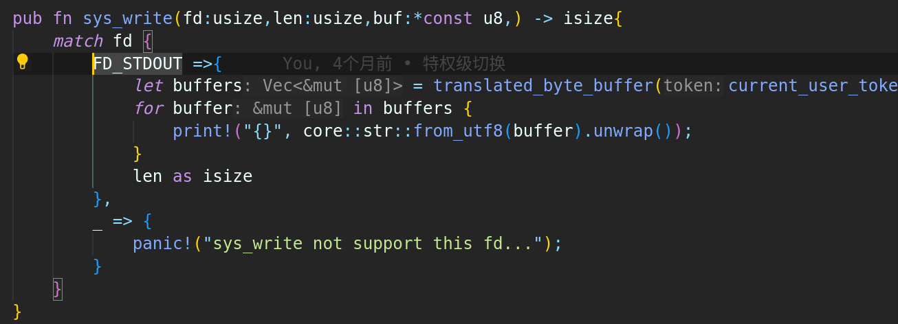

**新的章节，新的快乐**

## 简介

**目的**：到目前为止，操作系统启动后，能运行完它管理所有的应用程序。但在整个执行过程中，应用程序是被动地被操作系统加载运行，开发者与操作系统之间没有交互，开发者与应用程序之间没有交互，应用程序不能控制其它应用的执行。这使得开发者不能灵活地选择执行某个程序。**让开发者能够控制程序的运行** 

于是，本章我们会开发一个用户 **终端** (Terminal) 程序或称 **命令行** 应用（Command Line Application, 俗称 **shell** ），形成用户与操作系统进行交互的命令行界面（Command Line Interface），它就和我们今天常用的 OS 中的命令行应用（如  Linux 中的 bash，Windows 中的 CMD 等）没有什么不同：只需在其中输入命令即可启动或杀死应用，或者监控系统的运行状况。

我们需要在已有的 **任务** 抽象的基础上进一步扩展，形成新的抽象： **进程** ，并实现若干基于 **进程** 的强大系统调用。实现**创建** （Create）、**销毁** （Destroy）、**等待** （Wait）、**信息** （Info）、**其他** （Other）等功能就可以进化出本章的白垩纪“伤齿龙”操作系统了。

> [!note]
>
> 任务与进程的区别：
>
> 进程可以在运行的过程中，创建 **子进程** 、 用新的 **程序** 内容覆盖已有的 **程序** 内容。这种动态变化的功能可让程序在运行过程中动态使用更多的物理或虚拟的 **资源** 。


代码结构：

```
./os/src
Rust        28 Files    1848 Lines
Assembly     3 Files      86 Lines

├── bootloader
│   └── rustsbi-qemu.bin
├── LICENSE
├── os
│   ├── build.rs(修改：基于应用名的应用构建器)
│   ├── Cargo.toml
│   ├── Makefile
│   └── src
│       ├── config.rs
│       ├── console.rs
│       ├── entry.asm
│       ├── lang_items.rs
│       ├── link_app.S
│       ├── linker-qemu.ld
│       ├── loader.rs(修改：基于应用名的应用加载器)
│       ├── main.rs(修改)
│       ├── mm(修改：为了支持本章的系统调用对此模块做若干增强)
│       │   ├── address.rs
│       │   ├── frame_allocator.rs
│       │   ├── heap_allocator.rs
│       │   ├── memory_set.rs
│       │   ├── mod.rs
│       │   └── page_table.rs
│       ├── sbi.rs
│       ├── sync
│       │   ├── mod.rs
│       │   └── up.rs
│       ├── syscall
│       │   ├── fs.rs(修改：新增 sys_read)
│       │   ├── mod.rs(修改：新的系统调用的分发处理)
│       │   └── process.rs（修改：新增 sys_getpid/fork/exec/waitpid）
│       ├── task
│       │   ├── context.rs
│       │   ├── manager.rs(新增：任务管理器，为上一章任务管理器功能的一部分)
│       │   ├── mod.rs(修改：调整原来的接口实现以支持进程)
│       │   ├── pid.rs(新增：进程标识符和内核栈的 Rust 抽象)
│       │   ├── processor.rs(新增：处理器管理结构 ``Processor`` ，为上一章任务管理器功能的一部分)
│       │   ├── switch.rs
│       │   ├── switch.S
│       │   └── task.rs(修改：支持进程管理机制的任务控制块)
│       ├── timer.rs
│       └── trap
│           ├── context.rs
│           ├── mod.rs(修改：对于系统调用的实现进行修改以支持进程系统调用)
│           └── trap.S
├── README.md
├── rust-toolchain
└── user(对于用户库 user_lib 进行修改，替换了一套新的测例)
├── Cargo.toml
├── Makefile
└── src
    ├── bin
    │   ├── exit.rs
    │   ├── fantastic_text.rs
    │   ├── forktest2.rs
    │   ├── forktest.rs
    │   ├── forktest_simple.rs
    │   ├── forktree.rs
    │   ├── hello_world.rs
    │   ├── initproc.rs
    │   ├── matrix.rs
    │   ├── sleep.rs
    │   ├── sleep_simple.rs
    │   ├── stack_overflow.rs
    │   ├── user_shell.rs
    │   ├── usertests.rs
    │   └── yield.rs
    ├── console.rs
    ├── lang_items.rs
    ├── lib.rs
    ├── linker.ld
    └── syscall.rs
```

因此，进程就是操作系统选取某个可执行文件并对其进行一次动态执行的过程。相比可执行文件，它的动态性主要体现在：

1. 它是一个过程，从时间上来看有开始也有结束；
2. 在该过程中对于可执行文件中给出的需求要相应对 **硬件/虚拟资源** 进行 **动态绑定和解绑** 。

这里需要指出的是，两个进程可以选择同一个可执行文件执行，然而它们却是截然不同的进程。

在内核中，需要有一个**进程管理器**，在其中记录每个进程对资源的占用情况，这是内核作为一个硬件资源管理器所必须要做到的。进程管理器通常需要同时**管理多个进程**，因为如果同一时间只有一个进程的话，就可以简单的将所有的硬件资源都交给该进程，同时内核也会像第一章《RV64 裸机应用》那样退化成一个函数库。

> [!note]
>
> **进程，线程和协程**
>
> 进程，线程和协程是操作系统中经常出现的名词，它们都是操作系统中的抽象概念，有联系和共同的地方，但也有区别。计算机的核心是  CPU，它承担了基本上所有的计算任务；而操作系统是计算机的管理者，它可以以进程，线程和协程为基本的管理和调度单位来使用 CPU  执行具体的程序逻辑。
>
> 从历史角度上看，它们依次出现的顺序是进程、线程和协程。在还没有进程抽象的早期操作系统中，计算机科学家把程序在计算机上的一次执行过程称为一个任务（Task）或一个工作（Job），其特点是任务和工作在其整个的执行过程中，不会被切换。这样其他任务必须等待一个任务**结束**后，才能执行，这样系统的效率会比较低。
>
> 在引入面向 CPU 的分时切换机制和面向内存的虚拟内存机制后，进程的概念就被提出了，进程成为  CPU（也称处理器）调度（Scheduling）和分派（Switch）的**对象**，各个进程间**以时间片为单位轮流使用  CPU**，且每个进程有各自独立的一块内存，使得各个进程之间内存地址相互隔离。这时，操作系统通过进程这个抽象来完成对应用程序在 CPU  和内存使用上的管理。
>
> 随着计算机的发展，对计算机系统性能的要求越来越高，而进程之间的切换开销相对较大，于是计算机科学家就提出了线程。**线程是程序执行中一个单一的顺序控制流程**，线程是进程的一部分，一个进程可以包含一个或多个线程。各个线程之间共享进程的地址空间，但**线程要有自己独立的栈**（用于函数访问，局部变量等）和独立的控制流。且线程是处理器调度和分派的基本单位。**对于线程的调度和管理，可以在操作系统层面完成，也可以在用户态的线程库中完成**。用户态线程也称为绿色线程（GreenThread）。**如果是在用户态的线程库中完成，操作系统是“看不到”这样的线程的，也就谈不上对这样线程的管理了。**
>
> 协程（Coroutines，也称纤程（Fiber）），也是程序执行中一个单一的顺序控制流程，建立在线程之上（**即一个线程上可以有多个协程**），但又是比线程更加轻量级的处理器调度对象。**协程一般是由用户态的协程管理库来进行管理和调度，这样操作系统是看不到协程的**。**而且多个协程共享同一线程的栈**，这样协程在时间和空间的管理开销上，相对于线程又有很大的改善。在具体实现上，协程可以在用户态运行时库这一层面通过函数调用来实现；也可在语言级支持协程，比如 Rust 借鉴自其他语言的的 `async` 、 `await` 关键字等，通过编译器和运行时库二者配合来简化程序员编程的负担并提高整体的性能。

#### fork

系统中同一时间存在的每个进程都被一个不同的 **进程标识符** (PID, Process Identifier) 所标识。在内核初始化完毕之后会创建一个进程——即 **用户初始进程** (Initial Process) ，它是目前在内核中以硬编码方式创建的唯一一个进程。其他所有的进程都是通过一个名为 `fork` 的系统调用来创建的。

```rust
/// 功能：当前进程 fork 出来一个子进程。
/// 返回值：对于子进程返回 0，对于当前进程则返回子进程的 PID 。
/// syscall ID：220
pub fn sys_fork() -> isize;
```

进程 A 调用 `fork` 系统调用之后，内核会创建一个新进程 B，这个进程 B 和调用 `fork`  的进程A在它们分别返回用户态那一瞬间几乎处于相同的状态：这意味着它们包含的用户态的代码段、堆栈段及其他数据段的内容完全相同，但是它们是被放在两个独立的地址空间中的。因此新进程的地址空间需要从原有进程的地址空间完整拷贝一份。两个进程通用寄存器也几乎完全相同。例如， pc 相同意味着两个进程会从同一位置的一条相同指令（我们知道其上一条指令一定是用于系统调用的 ecall 指令）开始向下执行， sp  相同则意味着两个进程的用户栈在各自的地址空间中的位置相同。其余的寄存器相同则确保了二者回到了相同的控制流状态。**(虚拟信息除了a0完全相同)**

但是唯有用来保存 `fork` 系统调用返回值的 **a0 寄存器**（这是 RISC-V 64 的函数调用规范规定的函数返回值所用的寄存器）的值是不同的。这区分了两个进程：**原进程的返回值**为它==新创建进程的 PID== ，而**新创建进程的返回值**为 ==0== 。由于新的进程是原进程主动调用 `fork` 衍生出来的，我们称新进程为原进程的 **子进程** (Child Process) ，相对的原进程则被称为新进程的 **父进程** (Parent Process) 。这样二者就建立了一种父子关系。注意到每个进程可能有多个子进程，但最多只能有一个父进程，于是所有进程可以被组织成一颗树，**其根节点正是代表用户初始程序——initproc**，也即第一个用户态的初始进程。

相比创建一个进程， `fork` 的另一个重要功能是建立一对新的父子关系。在我们的进程模型中，父进程和子进程之间的联系更为紧密，它们更容易进行合作或通信，而且一些重要的机制（如第七章会涉及的进程间通信机制）也需要在它们之间才能展开。

#### waitpid

当一个进程通过 `exit` 系统调用退出之后，它所占用的资源并不能够立即全部回收。比如**该进程的内核栈目前就正用来进行系统调用处理，如果将放置它的物理页帧回收的话，可能会导致系统调用不能正常处理**。对于这种问题，一种典型的做法是当进程退出的时候内核立即回收一部分资源并将该进程标记为 **僵尸进程** (Zombie Process) 。之后，由该进程的父进程通过一个名为 `waitpid` 的系统调用来收集该进程的返回状态并回收掉它所占据的全部资源，这样这个进程才被彻底销毁。系统调用 `waitpid` 的原型如下：

```rust
/// 功能：当前进程等待一个子进程变为僵尸进程，回收其全部资源并收集其返回值。
/// 参数：pid 表示要等待的子进程的进程 ID，如果为 -1 的话表示等待任意一个子进程；
/// exit_code 表示保存子进程返回值的地址，如果这个地址为 0 的话表示不必保存。
/// 返回值：如果要等待的子进程不存在则返回 -1；否则如果要等待的子进程均未结束则返回 -2；
/// 否则返回结束的子进程的进程 ID。
/// syscall ID：260
pub fn sys_waitpid(pid: isize, exit_code: *mut i32) -> isize;
```

一般情况下一个进程要负责通过 `waitpid` 系统调用来等待它 `fork`  出来的子进程结束并回收掉它们占据的资源，这也是父子进程间的一种同步手段。但这并不是必须的。**如果一个进程先于它的子进程结束，在它退出的时候，它的所有子进程将成为进程树的根节点——用户初始进程的子进程，同时这些子进程的父进程也会转成用户初始进程**。这之后，这些子进程的资源就由用户初始进程负责回收了，这也是用户初始进程很重要的一个用途。

#### exec

如果仅有 `fork` 的话，**那么所有的进程都只能和用户初始进程一样执行同样的代码段**，这显然是远远不够的。于是我们还需要引入 `exec` 系统调用来执行不同的可执行文件：

```rust
/// 功能：将当前进程的地址空间清空并加载一个特定的可执行文件，返回用户态后开始它的执行。
/// 参数：path 给出了要加载的可执行文件的名字；
/// 返回值：如果出错的话（如找不到名字相符的可执行文件）则返回 -1，否则不应该返回。
/// syscall ID：221
pub fn sys_exec(path: &str) -> isize;
```

注意，我们知道 `path` 作为 `&str` 类型是一个胖指针，既有起始地址又包含长度信息。在实际进行系统调用的时候，我们只会将起始地址传给内核（对标 C 语言仅会传入一个 `char*` ）。这就需要应用负责在传入的字符串的末尾加上一个 `\0` ，这样内核才能知道字符串的长度。下面给出了用户库 `user_lib` 中的调用方式：

```rust
// user/src/exec.rs

pub fn sys_exec(path: &str) -> isize {
    syscall(SYSCALL_EXEC, [path.as_ptr() as usize, 0, 0])
}
```

这样，利用 `fork` 和 `exec` 的组合，我们很容易在一个进程内 `fork` 出一个子进程并执行一个特定的可执行文件。

> [!note]
>
> 为什么创建进程要通过两个系统调用，而不是一个？
>
> 如果使用 `fork` 和 `exec` 的组合，那么 `fork` 出来的进程仅仅是为了 `exec` 一个新应用提供空间。而执行 `fork` 中对父进程的地址空间拷贝没有用处，还浪费了时间，且在后续清空地址空间的时候还会产生一些资源回收的额外开销
>
> 这种做法经过实践考验的，事实上 `fork` 和 `exec` 是一种灵活的系统调用组合，在当时内存空间比较小的情况下，可以**支持更快的进程创建**，且上述的开销能够通过一些结合虚存的技术方法（如 *Copy on write* 等）来缓解
>
> 这一点与 Windows 操作系统不一样。在 Windows 中， `CreateProcess` 函数用来创建一个新的进程和它的主线程，通过这个新进程运行指定的可执行文件。虽然是一个函数，但这个函数的参数**十个之多，使得这个函数很复杂**，且没有 `fork` 和 `exec` 的组合的灵活性。


疑问：为啥要传输一个`fd`:



目前的`wait`系统调用不是阻塞性的，因为进程的状态转换没有实现，只能每次轮到这个程序的时候·，循环判断一次是否此时完成！


#### 进程控制块


管理进程信息的，超级重要，对内核而言，甚至可以当做一个进程。

```rust
pub parent: Option<Weak<TaskControlBlock>>,
pub children: Vec<Arc<TaskControlBlock>>,
```

注意我们在维护父子进程关系的时候大量用到了引用计数 `Arc/Weak` 。进程控制块的本体是被放到内核堆上面的，对于它的一切访问都是通过智能指针 `Arc/Weak` 来进行的，这样是便于建立父子进程的双向链接关系（避免仅基于 `Arc` 形成环状链接关系）。当且仅当智能指针 `Arc` 的引用计数变为 0 的时候，进程控制块以及被绑定到它上面的各类资源才会被回收。子进程的进程控制块并不会被直接放到父进程控制块中，因为子进程完全有可能在父进程退出后仍然存在。

#### 任务管理器

在前面的章节中，任务管理器 `TaskManager` 不仅负责管理所有的任务，还维护着 CPU 当前在执行哪个任务。由于这种设计不够灵活，不能拓展到后续的多核环境，我们需要将任务管理器对于 CPU 的监控职能拆分到下面即将介绍的处理器管理结构 `Processor` 中去，任务管理器自身仅负责管理所有任务。在这里，任务指的就是进程。

```rust
/// ARC多所有权
/// 通过ARC可以不用数据来回拷贝，数据在内核堆上
pub fn add_task(task: Arc<TaskControlBlock>) {
    TASK_MANAGER.exclusive_access().add(task);
}
```

#### 疑问

- 目前的问题：新fork的子任务的Satp什么时候处理的
- 在exec的时候需要进行任务上下文重新赋值？

*这里无需对任务上下文进行处理，因为这个进程本身已经在执行了，而只有被暂停的应用才需要在内核栈上保留一个任务上下文。*

- 孩子进程的强引用的记录

fork的时候返回的强引用，也被加入执行队列了;另一个强引用是父亲储存着。在这里父亲想要回收孩子，前提是孩子已经变成了僵尸进程，也就是执行队列里没有这个强引用。

- 注意区分exit_current_and_run_next与sys_waitpid的两种回收僵尸进程的区别

前者是进程莫名退出了，此时进程变成僵尸进程，孩子可能还在运行，就挂在INITPROC的名下继续运行

后者是父进程等孩子自己退出，孩子通过前者自己变成僵尸进程，但是孩子不一定有孩子如果她有孩子，也是加入INITPROC，然后父进程检测到他退出，就执行回收，并在父亲地址空间保存返回码

- 为什么需要提前在这个进程自己退出的时候，回收逻辑信息，不在父进程回收他时候，再回收？或者说，为什么页表不能再父进程处理的时候？

任务控制块不会因为页表的回收丢失

进程的任务控制块是在内核态被生成的，是内核空间储存，然后每一个应用自己也储存一份指针，两者共用，当因为实现机制，应用会先丢指针（只有任务本身运行的时候，才有可能丢指针，而且是应用自己丢，目前没实现父亲强制收回！！！），然后父亲保存着他的信息，所以不会回收。他提前回收页表是为了腾空间，。页表不容易提前被回收，还麻烦，不如父进程回收，RAII迅速回收，而且子进程没法把自己消灭的干干净净，还是要通过父亲弄，与其费力不讨好，不如父亲回收页表，

- idle_task_cx什么时候改的

> [!warning]
>
> 这里需要注意的是：
>
> idle_task_cx的用途：之前被下面的评论误导了，这个是空闲进程的上下文，就是没有进程运行的时候，系统运行的程序

```rust
pub fn run_tasks() {
    loop {
        let mut processor = PROCESSOR.exclusive_access();
        if let Some(task) = fetch_task() {
            let idle_task_cx_ptr = processor.get_idle_task_cx_ptr();
            let mut task_inner = task.inner_exclusive_access();
            let next_task_cx_ptr = &task_inner.task_cx as *const TaskContext;
			...
            unsafe {
                __switch(idle_task_cx_ptr, next_task_cx_ptr);
            }
        }
    }
}

通过第5行，获得临时任务上下文的保存地址idle
然后运行到第9行的时候，进入__switch函数，把ra加载进idle指定位置，这个ra就是此时run tasks的__switch的函数，执行完成的返回地址（这个ra是内核程序执行流的ra,与trap的spec区分开，但是都是通过将指定寄存器内容进行修改，然后返回地址就是修改的值）
然后进入用户的任务上下文，用户任务的上下文保存在内核栈的指定位置，而且用户的上下文返回地址统一为__restore函数，直接返回用户空间

然后执行schedule的时候，会获取当前的应用的上下文保存，然后把idle的临时上下文的信息读入寄存器，此时ra是run_task的地址，然后就从__switch结尾-> loop重新运行一遍

所以__switch每次运行都是切到run_task一次，对于sys_read一次读入一个字节就要run_tasks一次，很容易就被其他进城把终端堵塞了，但是这个程序的单线进行，避免了这个复杂问题的出现
```


- 如何实现fork父子返回值不同的
- switch怎么运行的

到目前位置，有点巧妙的是：父进程通过参数传入指针，然后子进程仿佛通过这个`真实地址`返回自己的一些信息在这位置，然后父进程再读这个位置的信息！！


莫名很奇妙的错误：

> `>>`运行第一个task能出结果，
>
> 然后第二个时钟运行不了，报错原因：在map之前页面还在匹配中

排查：

```rust
impl Drop for KernelStack {
    fn drop(&mut self) {
        let (kernel_stack_bottom, _) = kernel_stack_position(self.pid);
        let kernel_stack_bottom_va: VirtAddr = kernel_stack_bottom.into();
        KERNEL_SPACE
            .exclusive_access()
            .remove_area_with_start_vpn(kernel_stack_bottom_va.into());
    }
}

这个代码中drop我写在impl KernelStack中了，导致他没起作用，然后页面在进程退出之后被回收了，但是由于没drop，内核栈的页表项没修改，导致系统以为页面有效
```

