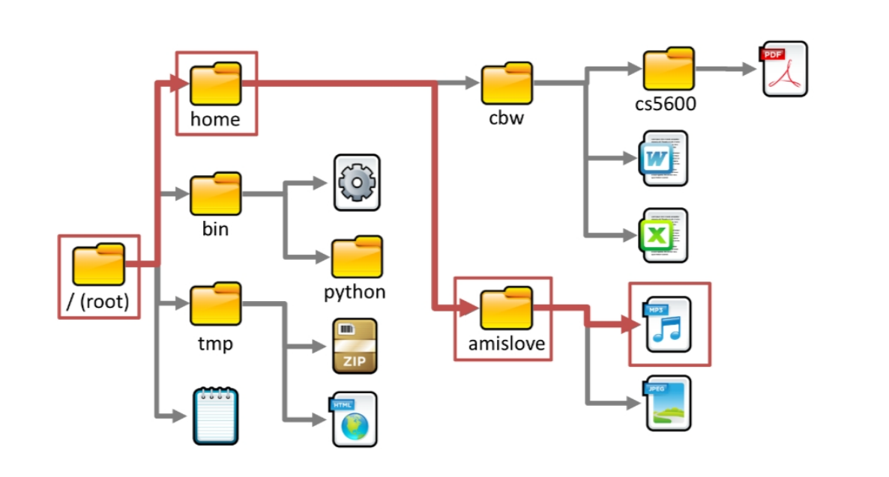
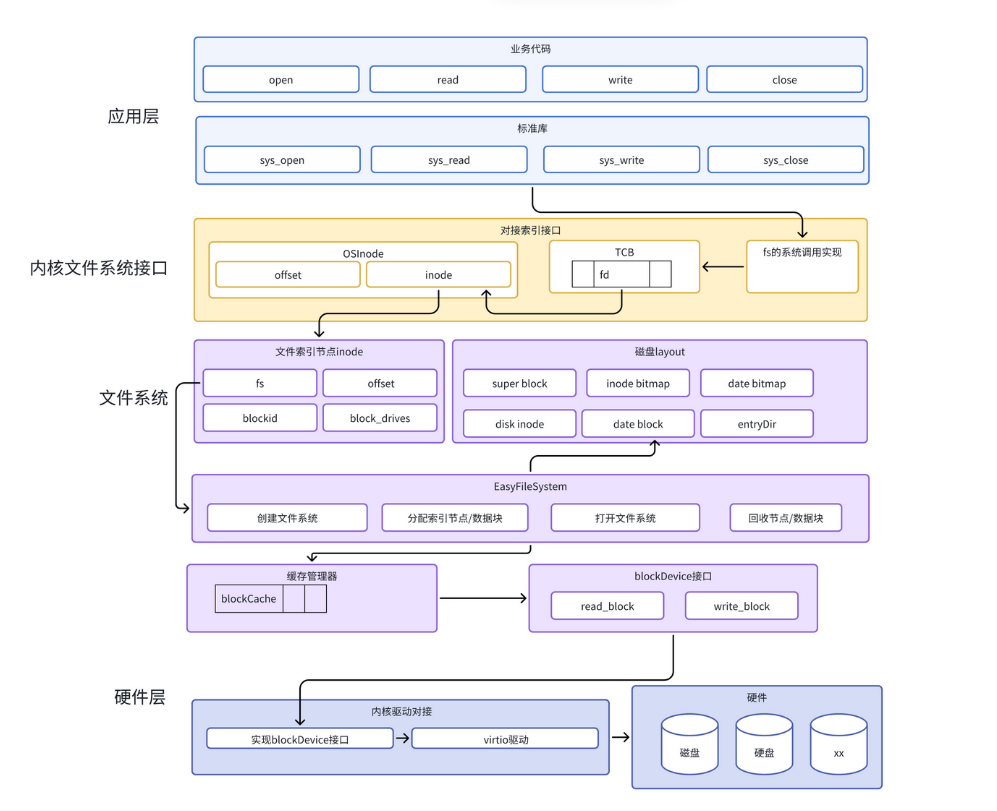
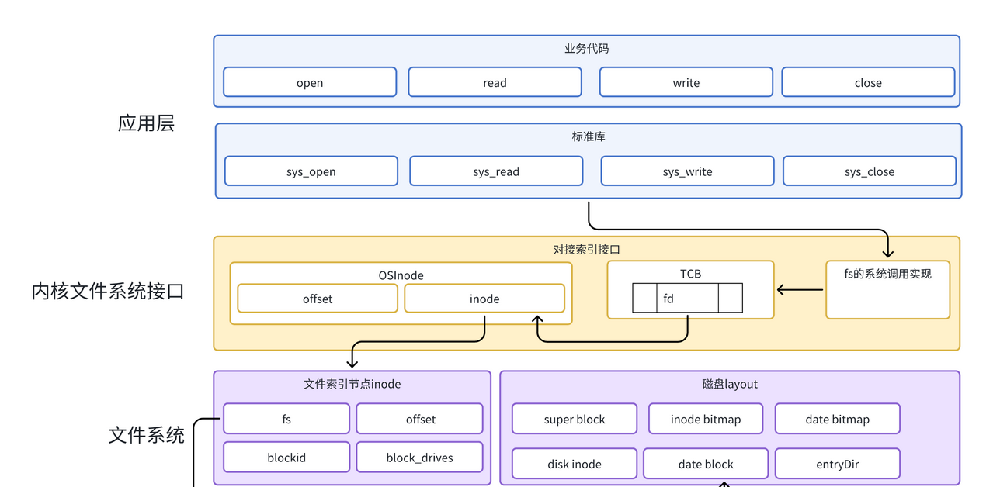
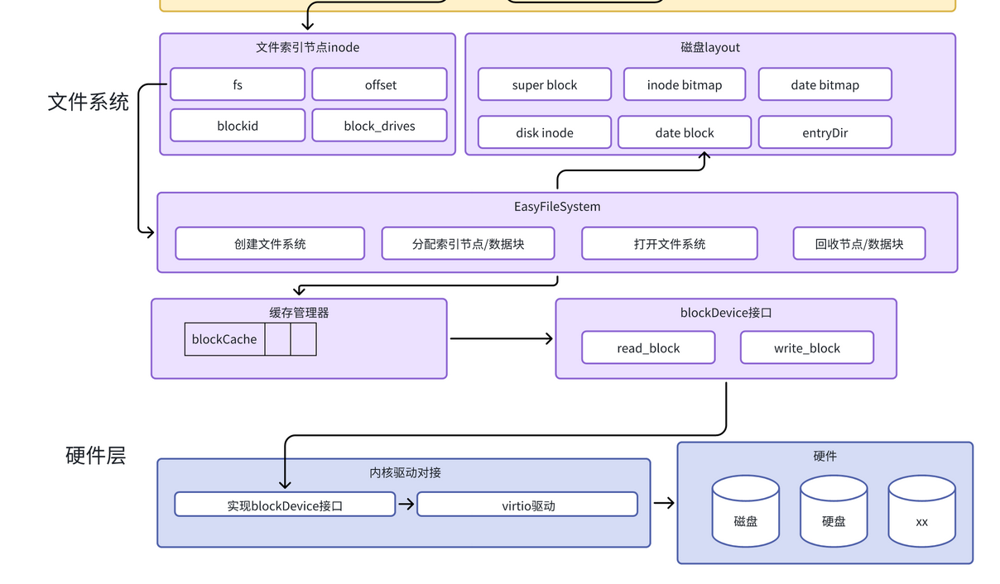
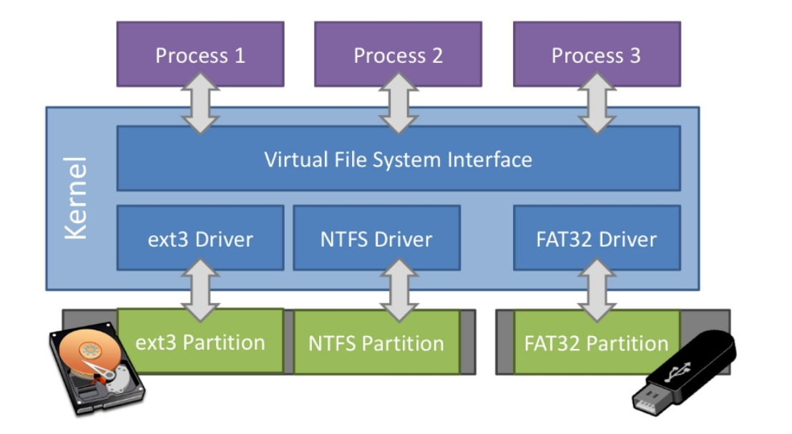
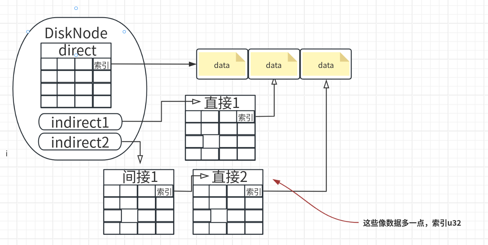

## 文件系统

所以本章要完成的操作系统的第一个核心目标是： **让应用能够方便地把数据持久保存起来** 。

- 磁带文件系统用于存储在磁带上的文件目录和文件，为提高效率，它通常允许将文件目录与文件数据分布在一起，因此不需要耗时且重复的磁带往返线性运动来写入新数据。由于磁带容量很大，保存方便，且很便宜（磁带的成本比磁盘低一个数量级），所以到现在为止，磁带文件系统还在被需要存储大量数据的单位（如数据中心）使用
- 1956 年，IBM发布了第一款硬盘驱动器，硬盘高速随机访问数据的能力使得它成为替代磁带的合理选择。在 Multics  之前，大多数操作系统一般提供特殊且复杂的文件系统来存储信息。这里的特殊和复杂性主要体现在操作系统对面向不同应用的文件数据格式的直接支持上。与当时的其他文件系统相比，Multics 文件系统不需要支持各种具体的文件数据格式，**而是把文件数据看成是一个无格式的字节流，**这样在一定程度上就简化了文件系统的设计。**Multics操作系统第一次引入了层次文件系统的概念**，即文件系统中的目录可以包含其他子目录，从而在理论和概念上描述了无限大的文件系统，并使得所有用户能够访问私人和共享文件

> [!note] 
>
> UNIX文件系统本身并不关心文件的具体内容，**这意味着任何程序都可以读写任何文件**。这样就避免了操作系统对各种文件内容的解析，极大地简化了操作系统的设计与实现。同时UNIX提出了“一切皆文件”的设计理念，这使得你几乎可以想到的**各种操作系统组件都可以通过文件系统中的文件来命名**。除了文件自身外，设备、管道、甚至网络、进程、内存空间都可以用文件来表示和访问.

### 本章要求

本章我们将实现一个简单的文件系统 – easyfs，能够对 **持久存储设备** (Persistent Storage) 这种 I/O 资源进行管理。对于应用程序访问持久存储设备的需求，内核需要新增两种文件：常规文件和目录文件，它们均以文件系统所维护的 **磁盘文件** 形式被组织并保存在持久存储设备上。这样，就形成了具有强大UNIX操作系统基本功能的 “霸王龙” [1](https://rcore-os.cn/rCore-Tutorial-Book-v3/chapter6/0intro.html#rex) 操作系统。



代码树


见：

```bash
./os/src
Rust        32 Files    2893 Lines
Assembly     3 Files      88 Lines
./easyfs/src
Rust         7 Files     908 Lines
├── bootloader
│   └── rustsbi-qemu.bin
├── Dockerfile
├── easy-fs(新增：从内核中独立出来的一个简单的文件系统 EasyFileSystem 的实现)
│   ├── Cargo.toml
│   └── src
│       ├── bitmap.rs(位图抽象)
│       ├── block_cache.rs(块缓存层，将块设备中的部分块缓存在内存中)
│       ├── block_dev.rs(声明块设备抽象接口 BlockDevice，需要库的使用者提供其实现)
│       ├── efs.rs(实现整个 EasyFileSystem 的磁盘布局)
│       ├── layout.rs(一些保存在磁盘上的数据结构的内存布局)
│       ├── lib.rs
│       └── vfs.rs(提供虚拟文件系统的核心抽象，即索引节点 Inode)
├── easy-fs-fuse(新增：将当前 OS 上的应用可执行文件按照 easy-fs 的格式进行打包)
│   ├── Cargo.toml
│   └── src
│       └── main.rs
├── LICENSE
├── Makefile
├── os
│   ├── build.rs
│   ├── Cargo.toml(修改：新增 Qemu 和 K210 两个平台的块设备驱动依赖 crate)
│   ├── Makefile(修改：新增文件系统的构建流程)
│   └── src
│       ├── config.rs(修改：新增访问块设备所需的一些 MMIO 配置)
│       ├── console.rs
│       ├── drivers(修改：新增 Qemu 和 K210 两个平台的块设备驱动)
│       │   ├── block
│       │   │   ├── mod.rs(将不同平台上的块设备全局实例化为 BLOCK_DEVICE 提供给其他模块使用)
│       │   │   ├── sdcard.rs(K210 平台上的 microSD 块设备, Qemu不会用)
│       │   │   └── virtio_blk.rs(Qemu 平台的 virtio-blk 块设备)
│       │   └── mod.rs
│       ├── entry.asm
│       ├── fs(修改：在文件系统中新增常规文件的支持)
│       │   ├── inode.rs(新增：将 easy-fs 提供的 Inode 抽象封装为内核看到的 OSInode
│       │   │            并实现 fs 子模块的 File Trait)
│       │   ├── mod.rs
│       │   ├── pipe.rs
│       │   └── stdio.rs
│       ├── lang_items.rs
│       ├── link_app.S
│       ├── linker-qemu.ld
│       ├── loader.rs(移除：应用加载器 loader 子模块，本章开始从文件系统中加载应用)
│       ├── main.rs
│       ├── mm
│       │   ├── address.rs
│       │   ├── frame_allocator.rs
│       │   ├── heap_allocator.rs
│       │   ├── memory_set.rs(修改：在创建地址空间的时候插入 MMIO 虚拟页面)
│       │   ├── mod.rs
│       │   └── page_table.rs(新增：应用地址空间的缓冲区抽象 UserBuffer 及其迭代器实现)
│       ├── sbi.rs
│       ├── syscall
│       │   ├── fs.rs(修改：新增 sys_open)
│       │   ├── mod.rs
│       │   └── process.rs(修改：sys_exec 改为从文件系统中加载 ELF，并支持命令行参数)
│       ├── task
│       │   ├── context.rs
│       │   ├── manager.rs
│       │   ├── mod.rs(修改初始进程 INITPROC 的初始化)
│       │   ├── pid.rs
│       │   ├── processor.rs
│       │   ├── switch.rs
│       │   ├── switch.S
│       │   └── task.rs
│       ├── timer.rs
│       └── trap
│           ├── context.rs
│           ├── mod.rs
│           └── trap.S
├── README.md
├── rust-toolchain
└── user
   ├── Cargo.lock
   ├── Cargo.toml
   ├── Makefile
   └── src
      ├── bin
      │   ├── cat_filea.rs(新增：显示文件filea的内容)
      │   ├── cmdline_args.rs(新增)
      │   ├── exit.rs
      │   ├── fantastic_text.rs
      │   ├── filetest_simple.rs(新增：创建文件filea并读取它的内容 )
      │   ├── forktest2.rs
      │   ├── forktest.rs
      │   ├── forktest_simple.rs
      │   ├── forktree.rs
      │   ├── hello_world.rs
      │   ├── initproc.rs
      │   ├── matrix.rs
      │   ├── pipe_large_test.rs
      │   ├── pipetest.rs
      │   ├── run_pipe_test.rs
      │   ├── sleep.rs
      │   ├── sleep_simple.rs
      │   ├── stack_overflow.rs
      │   ├── user_shell.rs
      │   ├── usertests.rs
      │   └── yield.rs
      ├── console.rs
      ├── lang_items.rs
      ├── lib.rs(修改：支持命令行参数解析)
      ├── linker.ld
      └── syscall.rs(修改：新增 sys_open)
```

### 导读

本章是一个简化的有一级目录并支持 `open，read， write， close` ，即创建/打开/读写/关闭文件一系列操作的文件系统。这里简要介绍一下在内核中添加文件系统的大致开发过程。

**第一步：是能够写出与文件访问相关的应用**

这里是参考了Linux的创建/打开/读写/关闭文件的系统调用接口，力图实现一个 [简化版的文件系统模型](https://rcore-os.cn/rCore-Tutorial-Book-v3/chapter6/1fs-interface.html#fs-simplification) 。

**第二步：就是要实现 easyfs 文件系统**

easyfs 文件系统的整体架构自下而上可分为五层：

1. 磁盘块设备接口层：读写磁盘块设备的trait接口
   - 无论对文件系统的操作如何复杂，从块设备的角度看，这些操作终究可以被分解成若干次基本的块读写操作。
2. 块缓存层：位于内存的磁盘块数据缓存
   - 数据缓存，读的更快
   - 数据读写一致性问题
3. 磁盘数据结构层：表示磁盘文件系统的数据结构
   - 我们就可以在内存中方便地处理easyfs文件系统在磁盘上的各种数据了，这就是第三层文件系统的磁盘数据结构。
4. 磁盘块管理器层：实现对磁盘文件系统的管理
   - easyfs文件系统中管理这些磁盘数据的控制逻辑主要集中在 **磁盘块管理器** 中，
5. 索引节点层：实现文件创建/文件打开/文件读写等操作
   - 对于单个文件的管理和读写的控制逻辑主要是 **索引节点（文件控制块）** 来完成，

**第三步：把easyfs文件系统加入内核中**

第一件是在Qemu模拟的 `virtio` 块设备上实现块设备驱动程序 `os/src/drivers/block/virtio_blk.rs` 

第二件事情是把文件访问相关的系统调用与easyfs文件系统连接起来。在easfs文件系统中是没有进程的概念的。而进程是程序运行过程中访问资源的管理实体，而之前的进程没有管理文件这种资源。 为此我们需要扩展进程的管理范围，把文件也纳入到进程的管理之中。 **由于我们希望多个进程都能访问文件，这意味着文件有着共享的天然属性**，这样自然就有了 `open/close/read/write` 这样的系统调用，便于进程通过互斥或共享方式访问文件。

**内核中的进程看到的文件应该是一个便于访问的Inode**，这就要对 `easy-fs` crate 提供的 `Inode` 结构进一步封装，形成 `OSInode` 结构，以表示进程中一个打开的常规文件

而进程为了进一步管理多个文件，需要扩展文件描述符表。这样进程通过系统调用打开一个文件后，会将文件加入到自身的文件描述符表中，并进一步通过文件描述符（也就是某个特定文件在自身文件描述符表中的下标）来读写该文件（ 即 `OSInode` 结构）。

对于应用程序而言，它理解的磁盘数据是常规的文件和目录，不是 `OSInode` 这样相对复杂的结构。





用户常常通过文件的 **拓展名** (Filename extension) 来推断该文件的用途，如 `main.rs` 的拓展名是 `.rs` ，我们由此知道它是一个 Rust 源代码文件。但从内核的角度来看，它会将所有文件无差别的看成一个字节序列，文件内容的结构和含义则是交给对应的应用进行解析。

在操作系统的用户看来，常规文件是保存在持久存储设备上的一个字节序列，每个常规文件都有一个 **文件名** (Filename) ，用户需要通过它来区分不同的常规文件。方便起见，在下面的描述中，“文件”有可能指的是常规文件、目录，也可能是之前提到的若干种进程可以读写的 标准输出、标准输入、管道等I/O 资源，请同学自行根据上下文判断取哪种含义。

[](https://rcore-os.cn/rCore-Tutorial-Book-v3/_images/file-and-dir.png)

#### stat查看文件属性

##### 常规文件

在 Linux 系统上， `stat` 工具可以获取文件的一些信息。下面以我们项目中的一个源代码文件 `os/src/main.rs` 为例：

```
cd os/src/
stat main.rs
File: main.rs
Size: 940           Blocks: 8          IO Block: 4096   regular file
Device: 801h/2049d  Inode: 4975        Links: 1
Access: (0644/-rw-r--r--)  Uid: ( 1000/   oslab)   Gid: ( 1000/   oslab)
Access: 2021-02-28 23:32:50.289925450 +0800
Modify: 2021-02-28 23:32:50.133927136 +0800
Change: 2021-02-28 23:32:50.133927136 +0800
Birth: -
```

`stat` 工具展示了 `main.rs` 的如下信息：

- File 表明它的文件名为 `main.rs` 。
- Size 表明它的字节大小为 940 字节。
- Blocks 表明它占据 8 个 **块** (Block) 来存储。在文件系统中，文件的数据以块为单位进行存储。在 IO Block 可以看出，在 Linux操作系统中的Ext4文件系统的每个块的大小为 4096 字节。
- regular file 表明这个文件是一个常规文件。事实上，其他类型的文件也可以通过文件名来进行访问。
- 当文件是一个特殊文件（如块设备文件或者字符设备文件）的时候，Device 将指出该特殊文件的 major/minor ID 。对于一个常规文件，我们无需关心它。
- Inode 表示文件的底层编号。在文件系统的底层实现中，并不是直接通过文件名来索引文件，而是首先需要将文件名转化为文件的底层编号，再根据这个编号去索引文件。目前我们无需关心这一信息。
- Links 给出文件的硬链接数。同一个文件系统中如果两个文件（目录也是文件）具有相同的inode号码，那么就称它们是“硬链接”关系。这样links的值其实是一个文件的不同文件名的数量。（本章的练习需要你在文件系统中实现硬链接！）
- Uid 给出该文件的所属的用户 ID ， Gid 给出该文件所属的用户组 ID 。Access 的其中一种表示是一个长度为 10 的字符串（这里是 `-rw-r--r--` ），其中第 1 位给出该文件的类型，这个文件是一个常规文件，因此这第 1 位为 `-` 。后面的 9 位可以分为三组，分别表示该文件的所有者/在该文件所属的用户组内的其他用户以及剩下的所有用户能够读取/写入/将该文件作为一个可执行文件来执行。
- Access/Modify 分别给出该文件的最近一次访问/最近一次修改时间。

##### 目录

最早的文件系统仅仅通过**文件名来区分文件**，但是这会造成一些归档和管理上的困难。如今我们的使用习惯是将**文件根据功能、属性的不同**分类归档到不同层级的目录之下。这样我们就很容易逐级找到想要的文件。

directory 表明 `os` 是一个目录，从 Access 字符串的首位 `d` 也可以看出这一点。对于目录而言， Access 的 `rwx` 含义有所不同：

- `r` 表示是否允许获取该目录下有哪些文件和子目录；
- `w` 表示是否允许在该目录下创建/删除文件和子目录；
- `x` 表示是否允许“通过”该目录。

Blocks 给出 `os` 目录也占用 8 个块进行存储。实际上目录也可以看作一种文件，它也有属于自己的底层编号，它的内容中保存着若干 **目录项** (Dirent, Directory Entry) ，可以看成一组映射，根据它下面的文件名或子目录名能够查到文件和子目录在文件系统中的底层编号，即 Inode 编号。但是与常规文件不同的是，用户无法 **直接** 修改目录的内容，只能通过创建/删除它下面的文件或子目录才能间接做到这一点．

> 将目录树结构扁平化，将文件系统的磁盘布局变为类键值对存储。

常规文件和目录都是实际保存在持久存储设备中的,扇区形式 <=> 内核目录逻辑目录树

` Windows 上的 FAT/NTFS 和 Linux 上的 Ext3/Ext4/Btrfs `

在一个计算机系统中，可以同时包含多个持久存储设备:为了能够对它们进行统一管理，在内核中有一层 **虚拟文件系统** (VFS, Virtual File System) ，它规定了逻辑上目录树结构的通用格式及相关操作的抽象接口，只要不同的底层文件系统均实现虚拟文件系统要求的那些抽象接口，再加上 **挂载** (Mount) 等方式.

#### 简化文件系统的知识储备

- 扁平化：仅存在根目录 `/` 一个目录，剩下所有的文件都放在根目录内。在索引一个文件的时候，我们直接使用文件的文件名而不是它含有 `/` 的绝对路径。

- 权限控制：我们不设置用户和用户组概念，全程只有单用户。同时根目录和其他文件也都没有权限控制位，即完全不限制文件的访问方式，不会区分文件是否可执行。

- 不记录文件访问/修改的任何时间戳。

- 不支持软硬链接。

- 除了下面即将介绍的系统调用之外，其他的很多文件系统相关系统调用均未实现


```rust
/// 功能：打开一个常规文件，并返回可以访问它的文件描述符。
/// 参数：path 描述要打开的文件的文件名（简单起见，文件系统不需要支持目录，所有的文件都放在根目录 / 下），
/// flags 描述打开文件的标志，具体含义下面给出。
/// 返回值：如果出现了错误则返回 -1，否则返回打开常规文件的文件描述符。可能的错误原因是：文件不存在。
/// syscall ID：56
fn sys_open(path: &str, flags: u32) -> isize
```

目前我们的内核支持以下几种标志（多种不同标志可能共存）：

- 如果 `flags` 为 0，则表示以只读模式 *RDONLY* 打开；
- 如果 `flags` 第 0 位被设置（0x001），表示以只写模式 *WRONLY* 打开；
- 如果 `flags` 第 1 位被设置（0x002），表示既可读又可写 *RDWR* ；
- 如果 `flags` 第 9 位被设置（0x200），表示允许创建文件 *CREATE* ，在找不到该文件的时候应创建文件；如果该文件已经存在则应该将该文件的大小归零；
- 如果 `flags` 第 10 位被设置（0x400），则在打开文件的时候应该清空文件的内容并将该文件的大小归零，也即 *TRUNC* 。

注意 `flags` 里面的权限设置只能**控制进程对本次打开的文件的访问**。一般情况下，在打开文件的时候首先需要经过文件系统的权限检查，比如一个文件自身不允许写入，那么进程自然也就不能以 *WRONLY* 或 *RDWR* 标志打开文件。但在我们简化版的文件系统中文件不进行权限设置，这一步就可以绕过。(**但是一般情况，需要现在文件权限允许的情况下，再考虑进程权限！**)


##### 文件的顺序读写

在打开一个文件之后，我们就可以用之前的 `sys_read/sys_write`  两个系统调用来对它进行读写了。需要注意的是，常规文件的读写模式和之前介绍过的几种文件有所不同。标准输入输出和匿名管道都属于一种流式读写，而常规文件则是顺序读写和随机读写的结合。由于常规文件可以看成一段字节序列，我们应该能够随意读写它的任一段区间的数据，即随机读写。然而用户仅仅通过 `sys_read/sys_write` 两个系统调用不能做到这一点。

进程为每个它打开的常规文件维护了一个偏移量，在刚打开时初始值一般为 0 字节。当 `sys_read/sys_write` 的时候，将会从文件字节序列偏移量的位置开始 **顺序** 把数据读到应用缓冲区/从应用缓冲区写入数据。操作完成之后，偏移量向后移动读取/写入的实际字节数。这意味着，下次 `sys_read/sys_write` 将会从刚刚读取/写入之后的位置继续。如果仅使用 `sys_read/sys_write` 的话，则只能从头到尾顺序对文件进行读写。**当我们需要从头开始重新写入或读取的话，只能通过 `sys_close` 关闭并重新打开文件来将偏移量重置为 0。**

### 简化文件系统

大家可以看到，本章的**内核功能越来越多**，代码量也越来越大（但仅仅是Linux代码量的万分之一左右）。为了减少同学**学习内核的分析理解成本**，我们需要让内核的各个部分之间尽量**松耦合**，所以easy-fs 被从内核中分离出来，它的实现分成两个不同的 crate ：

- `easy-fs` 为简易文件系统的核心部分，它是一个库形式 crate，实现一种简单的文件系统磁盘布局；
- `easy-fs-fuse` 是一个能在开发环境（如 Ubuntu）中运行的应用程序，它可以对 `easy-fs` 进行测试，或者将为我们内核开发的应用打包为一个 easy-fs 格式的文件系统镜像。

具体一点就是：能做到这一点，是由于我们在easy-fs设计上，采用了松耦合模块化设计思路。

- easy-fs与底层设备驱动之间通过抽象接口 `BlockDevice` 来连接，避免了与设备驱动的绑定。
- easy-fs通过Rust提供的alloc crate来隔离了操作系统内核的内存管理，避免了直接调用内存管理的内核函数。
- 在底层驱动上，采用的是轮询的方式访问 `virtio_blk` 虚拟磁盘设备，从而避免了访问外设中断的相关内核函数。
- easy-fs在设计中避免了直接访问进程相关的数据和函数，从而隔离了操作系统内核的进程管理

同时，easy-fs本身也划分成不同的层次，形成层次化和模块化的设计架构。`easy-fs` crate **自下而上**大致可以分成五个不同的层次：

1. 磁盘块设备接口层：定义了以`块`大小为单位对`磁盘块设备`进行读写的trait接口
2. 块缓存层：在内存中`缓存`磁盘块的数据，避免频繁读写磁盘
3. 磁盘数据结构层：磁盘上的超级块、位图、索引节点、数据块、目录项等`核心数据结构`和相关处理
4. 磁盘块管理器层：合并了上述核心数据结构和磁盘布局所形成的磁盘文件系统数据结构，以及基于这些结构的创建/打开文件系统的`相关处理`和磁盘块的`分配和回收`处理
5. 索引节点层：管理索引节点（即`文件控制块`）数据结构，并实现文件创建/文件打开/文件读写等成员函数来向上支持文件操作相关的系统调用

文件系统的内容多，但是线性思路，更容易理解

> [!note]
>
> 实际上，块和扇区是两个不同的概念。 **扇区** (Sector) 是块设备随机读写的数据单位，通常每个扇区为 512 字节。而块是文件系统存储文件时的数据单位，**每个块的大小等同于一个或多个扇区**。之前提到过 Linux 的Ext4文件系统的单个块大小默认为  4096 字节。在我们的 easy-fs 实现中一个块和一个扇区同为 512 字节，因此在后面的讲解中我们不再区分扇区和块的概念。

当磁盘上的数据结构比较复杂的时候，**很难通过应用来合理地规划块读取/写入的时机**。这不仅可能涉及到复杂的参数传递，稍有不慎还有可能引入同步性问题(目前可以暂时忽略)：即一个块缓冲区修改后的内容在后续的同一个块读操作中不可见，这很致命但又难以调试。**因此，我们的做法是将缓冲区统一管理起来**。当我们要读写一个块的时候，首先就是去全局管理器中查看这个块是否已被缓存到内存缓冲区中。如果是这样，则在一段连续时间内对于一个块进行的所有操作均是在同一个固定的缓冲区中进行的，这解决了同步性问题。此外，通过 `read/write_block` 进行块实际读写的时机完全交给块缓存层的全局管理器处理，上层子系统无需操心。全局管理器会尽可能将更多的块操作合并起来，并在必要的时机发起真正的块实际读写。（不具体给每一个应用针对同一页设置不同的缓冲区）

**注意**：写回磁盘的时机：

- 在 Linux 中，通常有一个后台进程负责定期将内存中缓冲区的内容写回磁盘。
- 另外有一个 `sys_fsync` 系统调用可以让应用主动通知内核将一个文件的修改同步回磁盘。
-  `BlockCache` 被 `drop` 时会被调用。

> [!note]
>
> - 对不可变引用
>
>   - RC:单线程，对同一数据进行多个引用，有应用计数
>
>   - Arc:多线程，引用的计数不会出现问题，而且可以处理数据竞争
>
> - 不可变引用的外皮，内部可变，骗编译器
>
>   - Refcell:
>   - Mutex:互斥锁
>
> `Arc<Mutex<T>>`可以对数据进行同时提供共享引用和互斥访问，一般情况，为了降低互斥影响，只在T类型的成员变量中需要修改的数据前加Mutex,
>
> 而互斥访问在
>
> - 单核上的意义在于提供内部可变性通过编译，
> - 在多核环境下则可以帮助我们避免可能的并发冲突
> - 一般情况下我们需要在更上层**先**提供保护措施避免两个线程同时对一个块缓存进行读写，这里只是一个保险

### 磁盘数据结构

最重要的功能是如何将一个逻辑上的文件目录树结构映射到磁盘上，**决定磁盘上的每个块应该存储文件相关的哪些数据**。为了更容易进行管理和更新，我们需要将磁盘上的数据组织为若干种不同的磁盘上数据结构，并合理安排它们在磁盘中的位置。

在 easy-fs 磁盘布局中，按照块编号从小到大顺序地分成 5 个不同属性的连续区域：

- 最开始的区域的长度为一个块，其内容是 easy-fs **超级块** (Super Block)。超级块内以魔数的形式提供了文件系统合法性检查功能，同时还可以定位其他连续区域的位置。
- 第二个区域是一个索引节点位图，长度为若干个块。它记录了后面的索引节点区域中有哪些索引节点已经被分配出去使用了，而哪些还尚未被分配出去。
- 第三个区域是索引节点区域，长度为若干个块。其中的每个块都存储了若干个索引节点。
- 第四个区域是一个数据块位图，长度为若干个块。它记录了后面的数据块区域中有哪些数据块已经被分配出去使用了，而哪些还尚未被分配出去。
- 最后的区域则是数据块区域，顾名思义，其中的每一个已经分配出去的块保存了文件或目录中的具体数据内容。


**索引节点** (Inode, Index Node) 是文件系统中的一种重要数据结构。逻辑目录树结构中的每个文件和目录都对应一个 inode ，我们前面提到的文件系统实现中，文件/目录的底层编号实际上就是指 inode 编号。**从索引方式上看，同时支持直接索引和间接索引。**

```rust
pub struct DiskInode{
    pub size: u32, // 文件或者目录的内容字节数
    // 存储文件/目录的实际数据的索引
    pub direct: [u32; INODE_DIRECT_COUNT], // 直接索引
    pub indirect1: u32, // 间接索引
    pub indirect2: u32,
    type_: DiskInodeType, 
}

```

- 当文件很小的时候，只需用到直接索引， `direct` 数组中最多可以指向 `INODE_DIRECT_COUNT` 个数据块，当取值为 28 的时候，通过直接索引可以找到 14KiB 的内容。

- 当文件比较大的时候，不仅直接索引的 `direct` 数组装满，还需要用到一级间接索引 `indirect1` 。它指向一个一级索引块，这个块也位于磁盘布局的数据块区域中。这个一级索引块中的每个 `u32` 都用来指向数据块区域中一个保存该文件内容的数据块，因此，最多能够索引128个数据块，对应 64KiB 的内容。

- 当文件大小超过直接索引和一级索引支持的容量上限 78KiB 的时候，就需要用到二级间接索引 `indirect2` 。它指向一个位于数据块区域中的二级索引块。二级索引块中的每个 `u32` 指向一个不同的一级索引块，这些一级索引块也位于数据块区域中。因此，通过二级间接索引最多能够索引8MiB的内容。

为了充分利用空间，我们将 `DiskInode` 的大小设置为 128 字节，每个块正好能够容纳 $\frac{512}{128}=4$​ 个 `DiskInode` 。在后续需要支持更多类型的元数据的时候，可以适当缩减直接索引 `direct` 的块数，并将节约出来的空间用来存放其他元数据，仍可保证 `DiskInode` 的总大小为 128 字节。



如果要找的`inode_id`节点位于第二间接，也就是`inode_id>INDIRECT1_BOUND`,此时`last = inode_id - INDIRECT1_BOUND`先减去全面两个索引分配的，然后`last = 二索引位置 + 一索引偏移`构成


> [!important]
>
> 页面分配的算法用对**取整**的巧妙之处：
> $$
> \lceil\frac{x}{y}\rceil = \lfloor\frac{x+y-1}{y}\rfloor
> $$
> 


- 作为一个文件而言，它的内容在文件系统看来没有任何既定的格式，都只是一个字节序列。因此每个保存内容的数据块都只是一个字节数组：

```rust
// easy-fs/src/layout.rs

type DataBlock = [u8; BLOCK_SZ];
```

- 然而，目录的内容却需要遵从一种特殊的格式。在我们的实现中，它可以看成一个目录项的序列，每个目录项都是一个二元组，二元组的首个元素是目录下面的一个文件（或子目录）的文件名（或目录名），另一个元素则是文件（或子目录）所在的索引节点编号。目录项相当于目录树结构上的子树节点，我们需要通过它来一级一级的找到实际要访问的文件或目录。

位图只是判断有效性的，空间分配还是`disk_inode`处理

##### read_disk_inode代码讲解

```rust
// 代码比较难
// impl Inode
fn read_disk_inode<V>(&self, f: impl FnOnce(&DiskInode) -> V) -> V {
    get_block_cache(
        self.block_id,
        Arc::clone(&self.block_device)
    ).lock().read(self.block_offset, f)
}
// impl BlockCache
pub fn read<T,V>(&self,offset: usize,f:impl FnOnce(&T)->V) -> V{
    f(self.get_ref(offset))
}

```

1. 先读取当前`Inode`的相应的块缓存
2. `let blockcache = Arc<Mutex<BlockCache>>.lock()`
3. `blockcache.read(self.offset,f)`：这里的`f`是`read_disk_inode()`参数的`f(&DiskInode)`，也即`blockcache.read(self.offset,f(&DiskInode))`
4. 由上面可以推断，`T = DiskInode`,然后执行函数体
5. `f(self.get_ref(offset)->&DiskInode) -> V`


##### 查找文件的步骤

1. `Inode`就是封装给操作系统的，没吊用
2. 先找到`DiskInode`
3. 在`DiskInode`里面找`DirEntry`，进行文件名比对，
4. 获得相应：文件/文件夹的`DiskInode`，里面存储的有效信息

----

包括 `find` 在内，所有暴露给文件系统的使用者的文件系统操作（还包括接下来将要介绍的几种），全程均需持有 `EasyFileSystem` 的互斥锁（相对而言，文件系统内部的操作，如之前的 `Inode::new` 或是上面的 `find_inode_id` ，都是假定在已持有 efs  锁的情况下才被调用的，因此它们不应尝试获取锁）。这能够保证在多核情况下，同时最多只能有一个核在进行文件系统相关操作。这样也许会带来一些不必要的性能损失，但我们目前暂时先这样做。如果我们在这里加锁的话，其实就能够保证块缓存的互斥访问了。

`easy-fs`  架构设计的一个优点在于它可以在Rust应用开发环境（Windows/macOS/Ubuntu）中，按照应用程序库的开发方式来进行测试，不必过早的放到内核中测试运行。众所周知，内核运行在裸机环境上，对其进行调试很困难。而面向应用的开发环境对于调试的支持更为完善，从基于命令行的 GDB 到 IDE 提供的图形化调试界面都能给文件系统的开发带来很大帮助。另外一点是，由于 `easy-fs` 需要放到在裸机上运行的内核中，使得 `easy-fs` 只能使用 `no_std` 模式，不能在 `easy-fs` 中调用标准库 `std` 。但是在把 `easy-fs` 作为一个应用的库运行的时候，可以暂时让使用它的应用程序调用标准库 `std` ，这也会在开发调试上带来一些方便。

### easy-fs 库的使用方法

> 参考`easy_fs_pack()`代码的注释

### 内核接入

- 块设备驱动层：针对内核所要运行在的 qemu 或 k210 平台，我们需要将平台上的块设备驱动起来并实现 `easy-fs` 所需的 `BlockDevice` Trait ，这样 `easy-fs` 才能将该块设备用作 easy-fs 镜像的载体。
- 这里是站在内核的角度，只需知道它接受一个块设备 `BlockDevice` ，并可以在上面打开文件系统 `EasyFileSystem` ，进而获取 `Inode` 核心数据结构，进行各种文件系统操作即可。
- 在内核中需要将 `easy-fs` 提供的 `Inode` 进一步封装成 `OSInode` ，以表示进程中一个打开的常规文件
- 文件描述符层：常规文件对应的 `OSInode` 是文件的内核内部表示，因此需要为它实现 `File` Trait 从而能够可以将它放入到进程文件描述符表中并通过 `sys_read/write` 系统调用进行读写。
- 系统调用层：由于引入了常规文件这种文件类型，导致一些系统调用以及相关的内核机制需要进行一定的修改。

总结就是：首先驱动程序链接文件系统，然后内核根据接口，获取Inode，然后内核定义一个自己的Osinode，应用把文件当做文件描述符，最后修改系统调用。

应用程序看到并被操作系统管理的 **文件** (File) 就是一系列的字节组合

`UserBuffer` 是我们在 `mm` 子模块中定义的应用地址空间中的一段缓冲区（即内存）的抽象。它的具体实现在本质上其实只是一个 `&[u8]` ，位于应用地址空间中，内核无法直接通过用户地址空间的虚拟地址来访问，因此需要进行封装。


```makefile
# os/Makefile
FS_IMG := ../user/target/$(TARGET)/$(MODE)/fs.img
run-inner: build
ifeq ($(BOARD),qemu)
		...
        -drive file=$(FS_IMG),if=none,format=raw,id=x0 \
        -device virtio-blk-device,drive=x0,bus=virtio-mmio-bus.0
```

- 第 12 行，我们为虚拟机添加一块虚拟硬盘，内容为我们之前通过 `easy-fs-fuse` 工具打包的包含应用 ELF 的 easy-fs 镜像，并命名为 `x0` 。
- 第 13 行，我们将硬盘 `x0` 作为一个 VirtIO 总线中的一个块设备接入到虚拟机系统中。 `virtio-mmio-bus.0` 表示 VirtIO 总线通过 **MMIO** 进行控制，且该块设备在总线中的编号为 0 。

**内存映射 I/O** (MMIO, Memory-Mapped I/O)  指的是外设的设备寄存器可以通过特定的==物理内存地址==来访问，每个外设的设备寄存器都分布在没有交集的一个或数个物理地址区间中，不同外设的设备寄存器所占的物理地址空间也不会产生交集，且这些外设物理地址区间**也不会和RAM的物理内存所在的区间存在交集**（注：在后续的外设相关章节有更深入的讲解）。

通过Qemu可知：

```c++
static const MemMapEntry virt_memmap[] = {
    [VIRT_DEBUG] =        {        0x0,         0x100 },
    [VIRT_MROM] =         {     0x1000,        0xf000 },
    [VIRT_TEST] =         {   0x100000,        0x1000 },
    [VIRT_RTC] =          {   0x101000,        0x1000 },
    [VIRT_CLINT] =        {  0x2000000,       0x10000 },
    [VIRT_ACLINT_SSWI] =  {  0x2F00000,        0x4000 },
    [VIRT_PCIE_PIO] =     {  0x3000000,       0x10000 },
    [VIRT_PLATFORM_BUS] = {  0x4000000,     0x2000000 },
    [VIRT_PLIC] =         {  0xc000000, VIRT_PLIC_SIZE(VIRT_CPUS_MAX * 2) },
    [VIRT_APLIC_M] =      {  0xc000000, APLIC_SIZE(VIRT_CPUS_MAX) },
    [VIRT_APLIC_S] =      {  0xd000000, APLIC_SIZE(VIRT_CPUS_MAX) },
    [VIRT_UART0] =        { 0x10000000,         0x100 },
    [VIRT_VIRTIO] =       { 0x10001000,        0x1000 },
    [VIRT_FW_CFG] =       { 0x10100000,          0x18 },
    [VIRT_FLASH] =        { 0x20000000,     0x4000000 },
    [VIRT_IMSIC_M] =      { 0x24000000, VIRT_IMSIC_MAX_SIZE },
    [VIRT_IMSIC_S] =      { 0x28000000, VIRT_IMSIC_MAX_SIZE },
    [VIRT_PCIE_ECAM] =    { 0x30000000,    0x10000000 },
    [VIRT_PCIE_MMIO] =    { 0x40000000,    0x40000000 },
    [VIRT_DRAM] =         { 0x80000000,           0x0 },
};
```

找到 VirtIO 外设总线的 MMIO 物理地址区间为从 0x10001000 开头的 4KiB 。为了能够在内核中访问 VirtIO 外设总线，我们就必须在内核地址空间中对特定内存区域提前进行映射.

#### VirtIOBlk的讲解

1. 首先封装一下`VirtIOBlk`,加一层互斥锁

```rust
pub struct VirtIOBlock(UPSafeCell<VirtIOBlk<'static, VirtioHal>>);
```

2. 由于`VirtIOBlock`是驱动，需要实现磁盘设备需要实现的接口：BlockDevice【这里直接转发VirIOBlk驱动已经实现的】

3. 然后初始化

```rust
pub fn new() -> Self {
    unsafe {
        Self(UPSafeCell::new(
            VirtIOBlk::<VirtioHal>::new(&mut *(VIRTIO0 as *mut VirtIOHeader)).unwrap(),
        ))
    }
}
```

`VirtIOBlk`需要提供一个结构体，一个实现`Hal`接口的结构体，然后提供一个`Header`指名：以 MMIO 方式访问 VirtIO 设备所需的一组设备寄存器的地址。

4. `VirtIOBlk`与`CPU`合作

VirtIO 设备需要占用部分内存作为一个公共区域从而更好的和 CPU 进行合作，需要CPU 可以向此环形队列中向 VirtIO 设备提交请求，也可以从队列中取得请求的结果。(想用页表机制还需要内存存页表项嘞，所以这个驱动也要使用一点内存)

那么，这个请求队列就要实现`Hal`，请求就放在`VirtQueue`里，但是对于 `VirtQueue` 的使用涉及到**物理内存的分配和回收**，但这并不在 VirtIO 驱动 `virtio-drivers `的职责范围之内，因此它声明了数个相关的接口，需要库的使用者自己来实现。所以`Hal`接口提供了一系列的函数，需要实现:

```rust
// 下面的函数需要操作连续的物理页，在内核的恒等映射的前提下，是满足的
fn virtio_dma_alloc(pages: usize) -> PhysAddr;
fn virtio_dma_dealloc(paddr: PhysAddr, pages: usize) -> i32;
fn virtio_phys_to_virt(paddr: PhysAddr) -> VirtAddr;
fn virtio_virt_to_phys(vaddr: VirtAddr) -> PhysAddr;
```

5. 申请的物理页存在哪里

```rust
lazy_static! {
    // 延长物理页的生命周期
    static ref QUEUE_FRAMES: UPSafeCell<Vec<FrameTracker>> = unsafe { UPSafeCell::new(Vec::new()) };
}
```

##### OSinode与Inode与fd

就目前的实现，inode是硬盘与操作系统的接口，OSinode是操作系统对此的封装，加了一点自己的要素，比如访问指针，然后这些供进程记录自己的文件状态(比如，文件访问指针)，然后文件描述符就是给应用程序的封装，方便他自己定义使用的文件编号

- 一个inode对应多个OSinode
- 一个文件描述符 一一对应 OSinode


##### DiskInode与Inode

DiskInode就是一个解析用的数据结构，然后申请空间之后，缓存里的数据位置通过Inode返回给操作系统，缓存通过驱动程序VirtIo在内存中申请缓存物理页。Inode在不在不影响缓存，他是先进先出机制，如果缓存没有，后面再分配。所以当Inode引用计数没有的时候，他自己会死掉，因为他没有机制绑定，他的空间都被回收了，至于他指向的数据，是缓存区，跟他没关系，不用回收

> [!note]
>
> 目前疑惑：文件系统的那个缓存是通过VirtIO驱动申请的内存？
>
> 感觉我的疑惑是**正确**的！！！之前在写文件系统的时候，就疑惑缓存是怎么跟内存挂钩的。

后面代码有个语法，记录一下：

`Vector<u8>::as_slice = &vector[..] = &[u8]`

解释缓存区的fd的0/1

缓存区也是文件，前期知识随便拿个内存搪塞一下，为了与后面文件呼应，提前提出了fd，但是不知所云，现在明白喽！！！

> 目前还有个疑问：
>
> 1. sys_read系统调用为啥要`drop(任务控制块？)`
>
> ```rust
> if let  Some(file) = &inner.fd_table[fd]{
>         let file = file.clone();
>         drop(inner); 
>         file.write
>     }
> ```
>
> 如果第2行`let file = file.clone();`删了，那么`drop(inner)`会报错：因为file通过inner引入；clone相当于赋值了个file，两个指针，这个file.
>
> 如果删除第3行`drop(inner); `，我感觉这个drop就是不怕一万，就怕万一，其实，按照完全执行，我想不出哪里会重复引用，文件不会，因为file把上个覆盖了，其实应该是怕报错，其实没有重复引用
>
> 2. 文件访问目前不会互斥？不会一个文件还没访问完，他拿着UPSafeCell，另个文件拿不到？
>
> 不会，因为借用文件的系统调用，目前都不会一直拿着所有权。如果是文件共享的话，可能会出问题，需要在操作完共享页之后，删除掉

注意，标准输入输出不是公用的，

```rust
fd_table:vec![
    // 标准输入
    Some(Arc::new(Stdin)),
    // 标准输出
    Some(Arc::new(Stdout)),
    // 当程序执行过程中发生错误时，错误信息会被发送到stderr流中显示在屏幕，然后Stdout仍然被别的进程使用
    Some(Arc::new(Stdout))
],
```


###### 草

```rust
use riscv::register::time;
const MSEC_PRE_SEC:usize = 1000; // -> 100000000
```
因为一个这个时间中断问题，我以为是我程序设计有问题，麻了

调试了**半天**，之前代码运行运行，总是memory_set中None.unwrap()，然后，发现代码一点问题没有，就是之前的一些没用文件没删，带来的后果，莫名错误

### 待解决

- 软硬链接