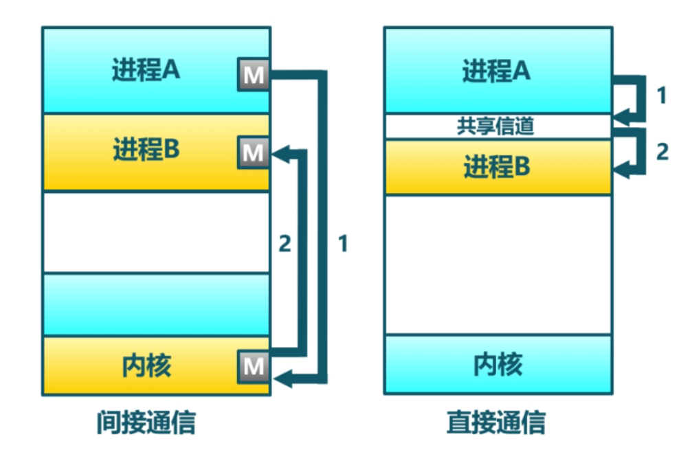
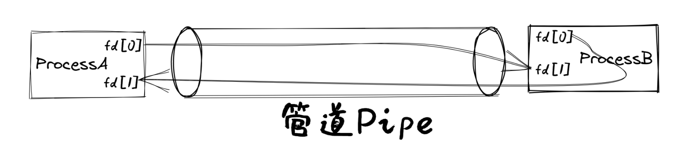

# 进程间通信

截止到目前为止，进程在输入和输出方面，还有不少限制，特别是进程能够进行交互的 I/O 资源还非常有限，只能接受用户在键盘上的输入，并将字符输出到屏幕上。我们一般将它们分别称为 **标准** 输入和 **标准** 输出。

更让应用开发者觉得束手束脚的是：进程被操作系统彻底隔离了。进程间无法方便地“沟通”，导致进程不能一起协作干“大事”。如果能让不同进程实现数据共享与交互，就能把不同程序的功能组合在一起，实现更加强大和灵活的功能。为了让简单的应用程序能够组合在一起形成各种强大和复杂的功能，本章要完成的操作系统的核心目标是： **让不同应用通过进程间通信的方式组合在一起运行** 。

对此Unix创新机制– **I/O重定向** 与 **管道（pipe）** 。基于这两种机制，操作系统在不用改变应用程序的情况下，可以将一个程序的输出重新定向到另外一个程序的输入中，这样程序之间就可以进行任意的连接，并组合出各种灵活的复杂功能。



管道是一种由操作系统提供的机制，它将**一个程序的输出连接到另一个程序的输入**。可以通过在shell程序中使用 `|`  符号来轻松访问和操作管道。管道是 UNIX  最重要的贡献之一，通过管道可以把功能单一的小程序灵活地组合起来实现各种复杂的功能，从而让UNIX的简单功能哲学（一次把一件事情做好）和复杂系统能力（通过基于管道的排列组合形成复杂能力）有机地融合在一起。

管道其实也可以看成是一种特殊的输入和输出，而前面讲解的 **文件系统** 中的对持久化存储数据的抽象 **文件(file)** 也是一种存储设备的输入和输出。所以，我们可以把这三种输入输出都统一在 **文件(file)**  这个抽象之中。这也体现了在 UNIX 操作系统中“ **一切皆文件** ” (Everything is a file) 的重要设计哲学。

为了让应用能够基于 **文件** 这个抽象接口对不同I/O设备或I/O资源进行操作，我们就需要对 **进程** 这个概念进行扩展，让它能够管理 **文件** 这种抽象资源和接口。我们要对文件范围进行扩充，从数据存储扩大到外设、管道这样的物理和虚拟资源。**仅仅实现文件的统一抽象和支持进程间通信的管道机制，还不够灵活**。因为这需要两个进程之间相互“知道”它们要通信，即它们不能独立存在。我们可以进一步扩展进程动态管理的机制，**来实现独立应用之间的I/O重定向，从而可以让独立的应用之间能够灵活组合完成复杂功能**。仅仅有支持数据传递的管道机制还不够便捷，进程间也需要更快捷的通知机制,这些都推动了一种 `信号（Signal）` 的事件通知机制的诞生。

- 管道：进程间通信
- 重定向：随便拿两个应用，不实现通知他俩，然后直接实现他俩的灵活组合，完成复杂功能
- 信号：通知机制

> [!note]
>
> 信号(Signal)可能是 UNIX 中最早实现的内核通知进程的机制
>
> 信号从 UNIX 的第一版本就已经存在了，由于其设计实现的细节和边界条件较多，容易出错，所以经历了许多次设计开发的迭代。在早期设计中，UNIX通过不同的系统调用来设置对不同类型信号的捕获；在UNIX第二版，出现了让用户给进程发信号的 `kill`  命令；在UNIX第四版，进一步简化了系统调用设计，可通过一个系统调用来设置对所有信号的捕获；发展到UNIX第七版，信号的设计模型还是不够可靠，会出现信号可能丢失的情况。在后续的BSD UNIX 4.3版和UNIX SVR3中，增加了可靠信号机制，而且BSD UNIX还扩展了 SIGUSR1 和 SIGUSR2  信号，目的是将其用于进程间传递特定事件，但BSD和SVF3二者并不兼容。直到POSIX.1标准的提出，才对可靠信号相关的系统调用和语义进行了标准化。


通过上图，大致可以看出迅猛龙操作系统 –  IPCOS增加了两种通信机制，一种是交换数据的管道（Pipe）机制，另外一种是发送异步通知事件的信号（signal）机制，应用程序通过新增的管道和信号相关的系统调用可以完成进程间通信。这两种机制所对应的资源都被进程管理，如下图所示。


发送信号的进程可以通过系统调用给接收信号的**目标进程控制块中的 signal 结构更新所发信号信息**，操作系统再通过扩展 trap_handler 中从内核态返回到用户态的处理流程， **改变了接收信号的目标进程的执行上下文**，从而让接收信号的目标进程可以**优先执行处理信号事件**的预设函数 signal_handler ，在处理完信号后，再继续执行之前暂停的工作。

```bash
./os/src
Rust        28 Files    2061 Lines
Assembly     3 Files      88 Lines

├── bootloader
│   └── rustsbi-qemu.bin
├── LICENSE
├── os
│   ├── build.rs
│   ├── Cargo.lock
│   ├── Cargo.toml
│   ├── Makefile
│   └── src
│       ├── config.rs
│       ├── console.rs
│       ├── entry.asm
│       ├── fs(新增：文件系统子模块 fs)
│       │   ├── mod.rs(包含已经打开且可以被进程读写的文件的抽象 File Trait)
│       │   ├── pipe.rs(实现了 File Trait 的第一个分支——可用来进程间通信的管道)
│       │   └── stdio.rs(实现了 File Trait 的第二个分支——标准输入/输出)
│       ├── lang_items.rs
│       ├── link_app.S
│       ├── linker-qemu.ld
│       ├── loader.rs
│       ├── main.rs
│       ├── mm
│       │   ├── address.rs
│       │   ├── frame_allocator.rs
│       │   ├── heap_allocator.rs
│       │   ├── memory_set.rs
│       │   ├── mod.rs
│       │   └── page_table.rs
│       ├── sbi.rs
│       ├── syscall
│       │   ├── fs.rs(修改：调整 sys_read/write 的实现，新增 sys_dup/pipe)
│       │   ├── mod.rs(修改：调整 syscall 分发)
│       │   └── process.rs
│       ├── task
│       │   ├── context.rs
│       │   ├── manager.rs
│       │   ├── mod.rs
│       │   ├── pid.rs
│       │   ├── processor.rs
│       │   ├── switch.rs
│       │   ├── switch.S
│       │   └── task.rs(修改：在任务控制块中加入文件描述符表相关机制)
│       ├── timer.rs
│       └── trap
│           ├── context.rs
│           ├── mod.rs
│           └── trap.S
├── README.md
├── rust-toolchain
└── user
    ├── Cargo.lock
    ├── Cargo.toml
    ├── Makefile
    └── src
        ├── bin
        │   ├── exit.rs
        │   ├── fantastic_text.rs
        │   ├── forktest2.rs
        │   ├── forktest.rs
        │   ├── forktest_simple.rs
        │   ├── forktree.rs
        │   ├── hello_world.rs
        │   ├── initproc.rs
        │   ├── matrix.rs
        │   ├── pipe_large_test.rs(新增)
        │   ├── pipetest.rs(新增)
        │   ├── run_pipe_test.rs(新增)
        │   ├── sleep.rs
        │   ├── sleep_simple.rs
        │   ├── stack_overflow.rs
        │   ├── user_shell.rs
        │   ├── usertests.rs
        │   └── yield.rs
        ├── console.rs
        ├── lang_items.rs
        ├── lib.rs(新增两个系统调用：sys_dup/sys_pipe)
        ├── linker.ld
        └── syscall.rs(新增两个系统调用：sys_dup/sys_pipe)
```

实现迅猛龙操作系统的过程就是对各种内核数据结构和相关操作的进一步扩展的过程。这里主要涉及到：

- 支持标准输入/输出文件
- 支持管道文件
- 支持对应用程序的命令行参数的解析和传递
- 实现标准 I/O 重定向功能
- 支持信号

**支持标准输入/输出文件**

到本章为止我们将支持三种文件：标准输入输出、管道以及在存储设备上的常规文件和目录文件。不同于前面章节，我们将标准输入输出分别抽象成 `Stdin` 和 `Stdout` 两个类型，并为他们实现 `File` Trait 。在 `TaskControlBlock::new` 创建初始进程的时候，就默认打开了标准输入输出，并分别绑定到文件描述符 0 和 1 上面.

**支持管道文件**

管道 `Pipe` 是另一种文件，它可以用于**父子进程间的单向进程间通信**。我们也需要为它实现 `File` Trait 。 `os/src/syscall/fs.rs` 中的系统调用 `sys_pipe` 可以用来打开一个管道并返回读端/写端两个文件的文件描述符。管道的具体实现在 `os/src/fs/pipe.rs` 中，本章第二节 [管道](https://rcore-os.cn/rCore-Tutorial-Book-v3/chapter7/2pipe.html) 中给出了详细的讲解。管道机制的测试用例可以参考 `user/src/bin` 目录下的 `pipetest.rs` 和 `pipe_large_test.rs` 两个文件。

**支持对应用程序的命令行参数的解析和传递**

为支持**独立进程间的I/O重定向**，将在本章第三节 [命令行参数与标准 I/O 重定向](https://rcore-os.cn/rCore-Tutorial-Book-v3/chapter7/3cmdargs-and-redirection.html) 中进一步支持对应用程序的命令行参数的解析和传递，这样可以让应用通过命令行参数来灵活地完成不同功能。这需要扩展对应的系统调用 `sys_exec` ,主要的改动就是在创建新进程时，把命令行参数压入用户栈中，这样应用程序在执行时就可以从用户栈中获取到命令行的参数值了。

**实现标准 I/O 重定向功能**

上面的工作都是为了支持I/O 重定向，但还差一点。我们还需添加一条文件描述符相关的重要规则：**即进程打开一个文件的时候，内核总是会将文件分配到该进程文件描述符表中编号最小的 空闲位置。还需实现符合这个规则的新系统调用 `sys_dup` ：复制文件描述符。这样就可以巧妙地实现标准 I/O 重定向功能了。**

具体思路是，在某应用进程执行之前，父进程（比如 user_shell进程）要对子进程的文件描述符表进行某种替换。以输出为例，父进程在创建子进程前，提前打开一个常规文件 A，然后 `fork` 子进程，在子进程的最初执行中，通过 `sys_close` 关闭 Stdout 文件描述符，用 `sys_dup` 复制常规文件 A 的文件描述符，这样 Stdout 文件描述符实际上指向的就是常规文件A了，这时再通过 `sys_close` 关闭常规文件 A 的文件描述符。至此，常规文件 A 替换掉了应用文件描述符表位置 1 处的标准输出文件，这就完成了所谓的 **重定向** ，即完成了执行新应用前的准备工作。接下来，子进程调用 `sys_exec` 系统调用，创建并开始执行新应用。在重定向之后，新应用所在进程认为自己输出到 fd=1 的标准输出文件，但实际上是输出到父进程（比如 user_shell进程）指定的文件A中，从而实现了两个进程之间的信息传递。


**支持信号**

信号（Signals）是操作系统中实现进程间通信的一种异步通知机制，可以看成是一个应用发出某种信号，希望另外一个应用能及时响应。操作系统为支持这一目标，需要解决三个主要问题：如何向进程发送信号、进程如何接收信号、而信号如何被处理。

操作系统首先需要定义信号类型，表明不同含义的事件。接下来需要扩展进程控制块的内容，把与信号作为一种资源管理起来。发送信号的进程要做的事情比较简单，通过系统调用 kill 给接收信号的目标进程发信号，操作系统会在目标进程控制块中的 signal 结构中记录要接收信号。

**这里比较复杂的是接收信号的进程要处理的事务**。

在进程控制块中，包含了

- 接收到的信号集合 signals ，
- 以及要接收的信号对应的信号处理函数的地址 SignalAction.handler。
  1. 当操作系统从内核态返回到目标进程的用户态继续执行时，具体的处理过程由 trap_handler 负责， trap_handler 分析目标进程控制块，如果该进程有带接收的信号，且提供了该信号对应的信号处理例程，
  2. 则备份目标进程的用户态执行上下文，再修改目标进程的用户态执行上下文，让目标进程先执行信号处理函数。目标进程执行完毕信号处理函数后，
  3. 需要执行一个系统调用 sys_sigreturn 回到内核态，这时内核再恢复刚才备份的目标进程的用户态执行上下文，这样目标进程就可以恢复之前的执行流程了。

###### I/O硬件设备

- **键盘设备** 是程序获得字符输入的一种设备，也可抽象为一种只读性质的文件，可以从这个文件中读出一系列的字节序列；
- **屏幕设备** 是展示程序的字符输出结果的一种字符显示设备，可抽象为一种只写性质的文件，可以向这个文件中写入一系列的字节序列，在显示屏上可以直接呈现出来；
- **串口设备**  是获得字符输入和展示程序的字符输出结果的一种字符通信设备，可抽象为一种可读写性质的文件，可以向这个文件中写入一系列的字节序列传给程序，也可把程序要显示的字符传输出去；还可以把这个串口设备拆分成两个文件，一个用于获取输入字符的只读文件和一个传出输出字符的只写文件。

我们提前把标准输出设备在文件描述符表中的文件描述符的值规定为 1 ，用 Stdout 表示；把标准输入设备在文件描述符表中的文件描述符的值规定为 0，用 Stdin 表示 。实际上，在本章中，标准输出文件就是串口输出，标准输入文件就是串口输入。开发者可通过QEMU的串口命令行界面或特定串口通信工具软件来对虚拟/物理串口设备进行输入/输出操作。**由于RustSBI直接管理了串口设备**，并给操作系统提供了基于串口收发字符的两个SBI接口，从而使得操作系统可以很简单地通过这两个SBI接口，完成输出或输入字符串的工作。

```rust
pub fn console_getchar() -> usize {
    #[allow(deprecated)]
    sbi_rt::legacy::console_getchar()
}
pub fn console_putchar(c:usize){
    #[allow(deprecated)]
    sbi_rt::legacy::console_putchar(c);
}
```

当一个进程被创建以后立即打开一个文件，则内核总是会返回文件描述符 3 （0~2号文件描述符已被缺省打开了）。当我们关闭一个打开的文件之后，它对应的文件描述符将会变得空闲并在后面可以被分配出去。

- 文件描述符为 0 的标准输入
- 文件描述符为 1 的标准输出
- 文件描述符为 2 的标准错误输出

标准输入/出读取：

- 文件都是有空间的，然后写到相应文件位置，但是标准输入/出 流没空间咋办啊，听过传递的用户地址空间直接写入用户空间中

- stdin文件 -> read -> 阻塞stdin没东西->键盘输入 -> stdin有东西-> 用户空间

- > 实际上是：read读取stdin文件，stdin阻塞，stdin文件是键盘的接口封装，然后键盘输入被读取,仿佛Stdio有文件一样

- 常规文件 ->read-> 用户空间 

常规文件：

- 先通过用户地址空间传来的，地址，我先得到这些用户地址空间需要的空间全部收集起来，然后通过内核的自己底层，返回虚拟空间对应的物理空间的buf引用，之后通过inode读取文件写入这个buf地址中


### 管道

在不改变应用程序代码的情况下，让操作系统具有进程间信息交换和功能组合的能力。这需要我们实现一种父子进程间的单向进程间通信机制——管道，并为此实现两个新的系统调用 `sys_pipe` 和 `sys_close` 。

**管道**是一种进程间通信（IPC）机制，它允许一个进程将数据发送给另一个进程。在Linux系统中，管道可以分为匿名管道和命名管道两种类型。

**匿名管道**

匿名管道是一种半双工的通信方式，它只能用于具有亲缘关系的进程之间，如父子进程或兄弟进程。匿名管道的创建和使用涉及到`pipe()`系统调用，它会在内核中创建一个缓冲区，并返回两个文件描述符，一个用于读，一个用于写。

**命名管道**

命名管道（FIFO）是一种全双工的通信方式，它允许任意两个进程之间进行通信，即使它们没有亲缘关系。命名管道的创建和使用涉及到`mkfifo()`系统调用，它会在文件系统中创建一个特殊类型的文件，其他进程可以通过打开这个文件来进行通信。

**独立进程间的通信**

独立进程间的通信通常需要借助于其他IPC机制，如套接字（socket）、消息队列（message queue）、共享内存（shared memory）等。这些机制允许不同的进程之间进行数据交换，但它们的使用方式和性能特点各不相同。

==我们也可以将管道看成一个有一定缓冲区大小的字节队列，它分为读和写两端，需要通过不同的文件描述符来访问。读端只能用来从管道中读取，而写端只能用来将数据写入管道。==

一般在shell程序中， `“|”` 是管道符号，即两个命令之间的一道竖杠。我们通过管道符号组合的命令，就可以了解登录Linux的用户的各种情况：

```bash
who                     # 登录Linux的用户信息
who | grep chyyuu       # 是否用户ID为chyyuu的用户登录了
who | grep chyyuu | wc  # chyyuu用户目前在线登录的个数
```

##### 系统调用

```rust
/// 功能：为当前进程打开一个管道。
/// 参数：pipe 表示应用地址空间中的一个长度为 2 的 usize 数组的起始地址，内核需要按顺序将管道读端
/// 和写端的文件描述符写入到数组中。
/// 返回值：如果出现了错误则返回 -1，否则返回 0 。可能的错误原因是：传入的地址不合法。
/// syscall ID：59
pub fn sys_pipe(pipe: *mut usize) -> isize;
```

只有当一个管道的**所有读端文件/写端文件都被关闭**之后，**管道占用的资源才会被回收**，因此我们需要通过关闭文件的系统调用 `sys_close` （它会在用户库中被包装为 `close` 函数。） ，来尽可能早的关闭之后不再用到的读端的文件和写端的文件。



上图像双向的管道，两个管道

每个读端或写端中都保存着所属管道自身的强引用计数，且我们确保这些引用计数只会出现在管道端口 `Pipe` 结构体中。于是，一旦一个管道所有的读端和写端均被关闭，便会导致它们所属管道的引用计数变为 0 ，循环队列缓冲区所占用的资源被自动回收。

```rust
    /// 判断写端是否全部关闭
    pub fn all_write_ends_closed(&self)->bool{
        self.write_end.as_ref().unwrap().upgrade().is_none()
    }
```

- 我认为一个管道，只能有一个写端，他通过判断弱引用的数据是否还在，判断主住是否还活着
- write_end如果后面不加as_ref，就会把write_end所有权夺走。
- ungrade如果是Some会返回Arc.clone之后的强引用数据,否则返回None

比如后面还会用到的：

```rust
inner.fd_table[new_fd] = Some(Arc::clone(inner.fd_table[fd].as_ref().unwrap()));
这里Arc尽管被克隆，也要传引用
```

管道的应用代码实现

```rust
首先：
make_pipe
1. 会创建一个内核的内存缓存给管道使用
2. 然后返回两个文件描述符，fd[1],fd[0]都指向这个缓存,分别只读只写
3. 这个缓存实现了File接口的读写
fork
4. 在创建子进程之后，子进程继承了父进程的2个接口
5. 然后子进程废掉一个fd,父进程废掉另一个fd，就实现了单向管道通信

由于只有缓存是互斥的，所以允许多个写端！！
管道一般认为是一直存在的，不要删他，重定向一般只能用一次，他把文件标准流替换了
```


### 重定向

#### 命令行参数(父进程给子进程)

我们目前的交互就只有shell的exec，所以传的参数只会到exec系统调用中，既然父亲有，为啥不用父亲的地址空间直接访问参数？因为exec替换应用逻辑段后，就没有父亲的数据了，这时候，在内核栈换掉之后，此时执行环境同，都在内核里，内核把数据写到用户栈中，之后恢复的时候，就可以获得数据了

有待改进：其他系统调用的时候？也差不多，直接改他的trap的数据指针


在应用第一次进入用户态的时候，我们放在 Trap 上下文 a0/a1 两个寄存器中的内容可以被用户库中的入口函数以参数的形式接收：（！！！因为exec第一次执行文件方式!!!!）

```
// user/src/lib.rs

#[no_mangle]
#[link_section = ".text.entry"]
pub extern "C" fn _start(argc: usize, argv: usize) -> ! {
    ...
    v = 类似于这种Vec<String>
    exit(main(argc, v.as_slice()));
}
```

可以看到，在入口 `_start` 中我们就接收到了命令行参数个数 `argc` 和字符串数组的起始地址 `argv` 。但是这个起始地址不太好用，我们希望能够将其转化为编写应用的时候看到的 `&[&str]` 的形式。转化的主体在第 10~23 行，就是分别取出 `argc` 个字符串的起始地址（基于字符串数组的 base 地址 `argv` ），从它向后找到第一个 `\0` 就可以得到一个完整的 `&str` 格式的命令行参数字符串并加入到向量 `v` 中。最后通过 `v.as_slice` 就得到了我们在 `main` 主函数中看到的 `&[&str]` 。

通过上面我们可以看出来，很多命令好像就像是exec的，就连cat可以封装层exec

### 标准输入输出重定向

为了进一步增强shell程序使用文件系统时的灵活性，我们需要新增标准输入输出重定向功能。这个功能在我们使用 Linux 内核的时候很常用，我们在自己的内核中举个例子：

```bash
>> yield > fileb
Shell: Process 2 exited with code 0
>> cat fileb
Hello, I am process 2.
Back in process 2, iteration 0.
Back in process 2, iteration 1.
Back in process 2, iteration 2.
Back in process 2, iteration 3.
Back in process 2, iteration 4.
yield pass.

Shell: Process 2 exited with code 0
>>

搭配：
yield > filename
cat filename
```

通过 `>` 我们可以将应用 `yield` 的输出重定向到文件 `fileb` 中。我们也可以注意到在屏幕上暂时看不到 `yield` 的输出了。在应用 `yield` 退出之后，我们可以使用 `cat` 工具来查看文件 `fileb` 的内容，可以看到里面的确是 `yield` 的输出。同理，通过 `<` 则可以将一个应用的输入重定向到某个指定文件而不是从键盘输入。


相当于，越过标准输入输出文件，直接进入常规文件。

**注意重定向功能对于应用来说是透明的**。在应用中除非明确指出了数据要从指定的文件输入或者输出到指定的文件，否则数据默认都是输入自进程文件描述表位置 0 （即 `fd=0` ）处的标准输入，并输出到进程文件描述符表位置 1 （即  `fd=1` ）处的标准输出。这是由于内核在执行 `sys_exec` 系统调用创建基于新应用的进程时，会直接把文件描述符表位置 0 放置标准输入文件，位置 1 放置标准输出文件，位置 2 放置标准错误输出文件。标准输入/输出文件其实是把设备当成文件，标准输入文件就是串口的输入或键盘，而标准输出文件就是串口的输出或显示器。	

上面代码的原因是，用户层的`console.rs`里面封装的`println,getchar`分别走的标准流 ->调用 内核里面的有针对标准流的特定实现。除非你特别指出，比如先打开其他文件描述符，然后通过标准输出流 + `core提供的外设驱动:这是为了帮助理解，实际上这个不是驱动`

注意这个标准输入输出，与命令行参数一样，都涉及到现对命令行参数的保存

我们尝试打开输入文件 `input` 到 `input_fd` 中。之后，首先通过 `close` 关闭标准输入所在的文件描述符 0 。之后通过 `dup` 来分配一个新的文件描述符来访问 `input_fd` 对应的输入文件。这里用到了文件描述符分配的重要性质：即必定分配可用描述符中编号最小的一个。由于我们刚刚关闭了描述符 0 ，那么在 `dup` 的时候一定会将它分配出去，于是现在==应用进程的文件描述符 0 就对应到输入文件==了。最后，因为应用进程的后续执行不会用到输入文件原来的描述符 `input_fd` ，所以就将其关掉。因为新的文件他的File实现不同，所以他与标准流不一样。而且，**这种重定向只能是一次性产品**，exec之后，必须执行完，因为他的标准流被顶掉了，不能再新建了，只能重新创建进程新建。


### 信号

我们需要有一种类似于硬件中断的软件级异步通知机制，使得进程在接收到特定事件的时候能够暂停当前的工作并及时响应事件，并在响应事件之后可以恢复当前工作继续执行。这些需求和想法推动了 **信号** (Signal) 机制的产生。信号（Signals）是类 UNIX 操作系统中实现进程间通信的一种**异步**通知机制，用来提醒某进程一个特定事件已经发生，需要及时处理。

如果该进程定义了信号的处理函数，

- 那么这个处理函数会被调用，
- 否则就执行默认的处理行为，比如让该进程退出。

在处理完信号之后，如果进程还没有退出，则会恢复并继续进程的正常执行。

- 如果将信号与硬件中断进行比较，我们可以把信号描述为软件中断。

- 信号的发送方可以是进程或操作系统内核(比如外设收到`ctrl + c`)

信号的接收方是一个进程，接收到信号有多种处理方式，最常见的三种如下：

- 忽略：就像信号没有发生过一样。
- 捕获：进程会调用相应的处理函数进行处理。
- 终止：终止进程

Linux 中有 62 个信号，每个信号代表着某种事件，**一般情况下，当进程收到某个信号时，意味着该信号所代表的事件发生了**。下面列出了一些常见的信号。

| 信号      | 含义                                                         |
| --------- | ------------------------------------------------------------ |
| SIGABRT   | 非正常的进程退出，可能由调用 `abort` 函数产生；`abort`函数通常用于在程序检测到不可恢复的错误时，立即终止程序的执行。 |
| SIGCHLD   | 进程状态变更时（通常是进程退出时），由内核发送给它的父进程   |
| SIGINT    | 在终端界面按下 `CTRL+C` 组合键时，由内核会发送给当前终端的前台进程 |
| SIGKILL   | 终止某个进程，由内核或其他进程发送给被终止进程               |
| SIGSEGV   | 非法内存访问异常，由内核发送给触发异常的进程                 |
| SIGILL    | 非法指令异常，由内核发送给触发异常的进程                     |
| SIGTSTP   | 在终端界面按下  `CTRL+Z` 组合键时，会发送给当前进程让它暂停  |
| SIGSTOP   | 也用于暂停进程，与 `SIGTSTP` 的区别在于 `SIGSTOP` 不能被忽略或捕获，即 `SIGTSTP` 更加灵活 |
| SIGCONT   | 恢复暂停的进程继续执行                                       |
| SIGUSR1/2 | 用户自定义信号 1/2                                           |

和之前介绍过的硬件中断一样，信号作为软件中断也可以分成同步和异步两种，这里的同步/异步指的是信号的触发同步/异步于接收到信号进程的执行。比如 `SIGILL` 和 `SIGSEGV` 就属于同步信号，而 `SIGCHLD` 和 `SIGINT` 就属于异步信号。

> 信号是操作系统中用于进程间通信的一种机制，它可以用来通知进程发生了某种事件。在信号处理中，同步和异步是指信号的触发方式与接收信号进程的执行之间的关系。
>
> #### 同步信号
>
> 同步信号是指信号的触发与接收信号进程的执行是同步的。也就是说，当信号被发送时，接收信号的进程必须立即暂停当前的执行，并立即处理该信号。如果信号的处理时间较长，那么接收信号的进程将会被阻塞，直到信号处理完成。例如，SIGILL（非法指令）和SIGSEGV（段错误）就是同步信号。当进程执行了非法指令或访问了无效的内存地址时，内核会立即发送这两种信号，进程必须立即停止当前的执行，并进入信号处理程序进行处理。
>
> 
>
> #### 异步信号
>
> 异步信号是指信号的触发与接收信号进程的执行是异步的。也就是说，当信号被发送时，接收信号的进程不必立即暂停当前的执行，而是可以继续执行其他任务。当信号处理程序完成后，内核会将信号发送给接收信号的进程，进程可以在适当的时候处理该信号。例如，SIGCHLD（子进程终止）和SIGINT（中断信号）就是异步信号。当子进程终止或接收到中断信号时，内核会将信号发送给父进程，但父进程不必立即处理该信号，可以继续执行其他任务。


信号有两种来源：最开始的时候进程在正常执行，此时可能内核或者其他进程给它发送了一个信号，这些就属于异步信号，是信号的第一种来源；信号的第二种来源则是由进程自身的执行触发，在处理 Trap 的时候内核会将相应的信号直接附加到进程控制块中，这种属于同步信号。

```rust
// 用户提出信号的方式

/// 功能：当前进程向另一个进程（可以是自身）发送一个信号。
/// 参数：pid 表示接受信号的进程的进程 ID, signum 表示要发送的信号的编号。
/// 返回值：如果传入参数不正确（比如指定进程或信号类型不存在）则返回 -1 ,否则返回 0 。
/// syscall ID: 129
pub fn kill(pid: usize, signum: i32) -> isize;
```

与信号处理相关的系统调用则有三个：

- `sys_sigaction` :设置信号处理例程
- `sys_procmask` :设置进程的信号屏蔽掩码
- `sys_sigreturn` :清除栈帧，从信号处理例程返回

```rust
这里面的mask是这个信号的掩码

pub struct SignalAction {
    pub handler: usize, // 处理例程的入口地址
    pub mask: SignalFlags,// 掩码，忽略信号(目前不允许信号的嵌套)
}

这个函数设置的全局掩码 

/// 功能：设置当前进程的全局信号掩码。
/// 参数：mask 表示当前进程要设置成的全局信号掩码，代表一个信号集合，
/// 在集合中的信号始终被该进程屏蔽。
/// 返回值：如果传入参数错误返回 -1 ，否则返回之前的信号掩码 。
/// syscall ID: 135
pub fn sigprocmask(mask: u32) -> isize;
```

介绍信号处理流程的时候提到过，在进程向内核提供的信号处理例程末尾，函数的编写者需要手动插入一个 `sigreturn` 系统调用来通知内核信号处理过程结束，就是上面的handle。

```rust
fn func() {
    println!("user_sig_test passed");
    sigreturn(); // 返回原来陷入位置
}

#[no_mangle]
pub fn main() -> i32 {
    let mut new = SignalAction::default();
    let mut old = SignalAction::default();
    new.handler = func as usize;

    println!("signal_simple: sigaction");
     // 信号的执行函数是应用自己设置
    // 先通过Sigaction，向内核给每个信号绑定一个处理函数，old：不是返回地址，是以前的处理函数，一般是默认函数
    if sigaction(SIGUSR1, Some(&new), Some(&mut old)) < 0 { 
        panic!("Sigaction failed!");
    }
    println!("signal_simple: kill");
    // 通过kill，向进程（自己）发布一个信号
    if kill(getpid() as usize, SIGUSR1) < 0 {
        println!("Kill failed!");
        exit(1);
    }
    println!("signal_simple: Done");
    0
}
```

我们将信号机制的实现划分为两部分：

- 一是进程通过 `sigaction` 系统调用设置信号处理例程和通过 `sigprocmask` 设置进程全局信号掩码。这些操作只需简单修改进程控制块中新增的相关数据结构即可，比较简单。
- 二是如何向进程发送信号、进程如何接收信号、而信号又如何被处理，这些操作需要结合到本书前面的章节介绍的对于 Trap 处理流程，因此会比较复杂。

信号的产生有以下几种方式：

1. 进程通过 `kill` 系统调用给自己或者其他进程发送信号。
2. 内核检测到某些事件给某个进程发送信号，但这个事件与接收信号的进程的执行无关。典型的例子如： `SIGCHLD` 当子进程的状态改变后由内核发送给父进程。可以看出这可以用来实现更加灵活的进程管理，但我们的内核为了简单目前并没有实现 `SIGCHLD` 这类信号。
3. 前两种属于异步信号，最后一种则属于同步信号：即进程执行的时候触发了某些条件，于是在 Trap 到内核处理的时候，内核给该进程发送相应的信号。比较常见的例子是进程执行的时候出错，比如段错误 `SIGSEGV` 和非法指令异常 `SIGILL` 。

注意我们并没有修改 Trap 上下文中的 `sp` ，这意味着例程还会在原先的用户栈上执行。这是为了实现方便，在 Linux 的实现中，内核会为每次例程的执行重新分配一个用户栈

```rust
/// 用户自己调用，用户例程执行结束，退出信号处理，返回用户
/// 如果用户没有调用这个,exit会收到什么参数？
pub fn sys_sigreturn() -> isize {
    if let Some(task) = current_task() {
        let mut inner = task.inner_exclusive_access();
        inner.handling_sig = -1; // 当前没有信号处理例程
        // 获取上下文可变引用
        let trap_ctx = inner.get_trap_cx();
        // 修改上下文应用
        *trap_ctx = inner.trap_ctx_backup.unwrap();
        // 函数返回参数,
        // 错：由于函数没有接受之前传的参数，所以这个参数是 信号，不是信号编号(这个是信号处理之后的上下文，这个返回值没用到)
        // 对：信号处理之前，保存之前系统调用返回值，会不断迭代回最初没信号的时候的返回值
        // 不理解这里trap_cx不会被覆盖啊？会的，因为syscall的值会给trap_cx[10],我们要提前把syscall返回值修改了
        trap_ctx.x[10] as isize
    } else {
        -1
    }
}
```


> > note
>
> 对齐为什么能保证不会跨页?
>
> 对齐16字节后SignalAction的起始地址是16的倍数，低四位为0，而SignalAction一共有12字节，低四位从0000加到1011，更高位地址相同，包括虚拟页号.
>
> 如果你跨页了，SignalAction的起始地址不会是16的倍数啊
>
> 假设页是64byte
>
> 跨页的起始地址：高位：xxx地位 (110100,111111)  不是 高位 000 低位010000的倍数


### 待解决

- 分别编写基于UNIX的signal机制的Linux应用程序，实现进程间异步通知

  - 答案是基于父子进程的，无趣，能不能进程独立进程通知？？？

- 共享内存的数据共享

  1. 自己理解

     - 好像有个共享逻辑段，设置段权限

     - 还没用cow，直接共享

     - 然后通过shmget系统调用返回共享页码

     - 然后shmat系统调用通过这个页码返回一个页数据应用

     - 然后子进程发出共享，一直获取页的标志，等父进程准备好，标志就好了

  2. Linux实现

     - 在物理内存上开辟一块空间，称为共享内存；不同进程将这块共享内存连接到自己的地址空间
     - 所有进程间通信中速度最快的一种方式(没有若干次数据拷贝)
     - 共享内存生命周期随内核(说明有`pub static ref`的全局数据结构，然后通过标识符返回文件)

     ```C++
      // 如果共享内存不存在，创建共享内存，如果存在就打开共享内存
     // 返回值：成功返回共享内存的标识符，失败返回-1
      int shmget(key_t key, size_t size, int shmflg);
     
     /*
     错 ：
     - 这里的key相当于共享内存中的索引
     - shmflg:类似文件权限 
     - 就类似文件描述符在任务控制块中的的索引,同一块共享内存的不同进程返回值可能不一样
     */
     
     对：
     - key = string  = 共享内存的别名(通过相同的键值，链接同一块共享内存)
     - shmflg:类似文件权限 
     - 返回值：共享内存在数组中的索引/标识符 ，然后给shmat调用
     
         // 将共享内存链接到进程地址空间    
        // 返回值：失败返回NULL,成功返回一个指针，为地址空间的虚拟地址，并且连接数加1（nattch）
         void *shmat(int shmid, const void *shmaddr, int shmflg);
     
     
     
     ```

     

- 管道的缓存的实现
  - 首先设置缓存
  - pipe <- `Arc<缓存>`
  - 文件控制块<-`Arc<Pipe>`
  - 然后就是生命周期 = 文件控制块的Pipe
- 邮箱说明：每个进程拥有唯一一个邮箱，基于“数据报”收发字节信息，利用环形buffer存储，读写顺序为  FIFO，不记录来源进程。每次读写单位必须为一个报文，如果用于接收的缓冲区长度不够，舍弃超出的部分（截断报文）。为了简单，邮箱中最多拥有16条报文，每条报文最大长度256字节。当邮箱满时，发送邮件（也就是写邮箱）会失败。不考虑读写邮箱的权限，也就是所有进程都能够随意给其他进程的邮箱发报。
- signal等待
  - 比如子进程想共享，获得父进程肯定，此时不用循环
  - 先stop暂停，等父进程的con,然后他继续执行