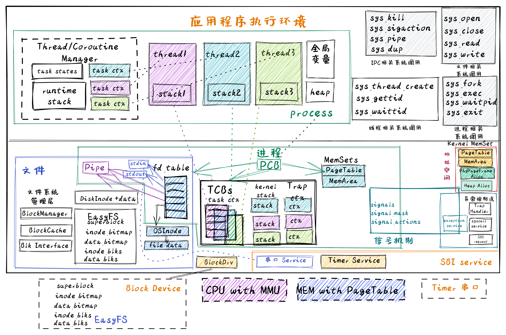
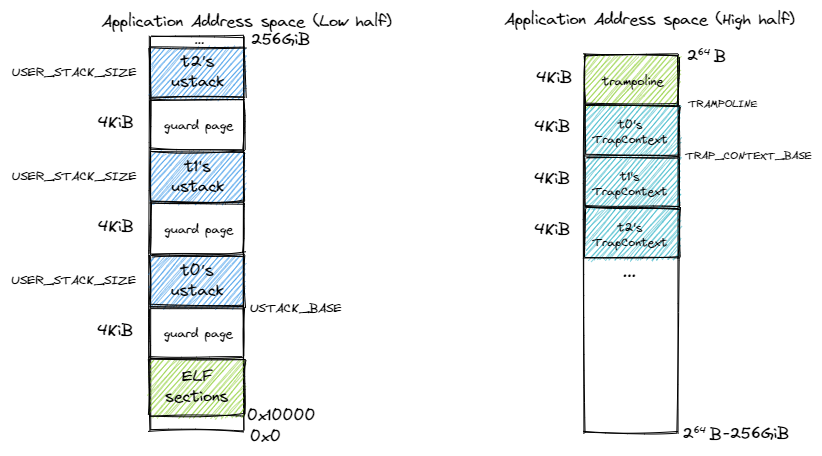

# 并发

## 介绍

到目前，我们已经完成了组成应用程序执行环境的操作系统的三个重要抽象：进程、地址空间和文件。**对于单核处理器而言，在任意一个时刻只会有一个进程被操作系统调度，从而在处理器上执行**。到目前为止的并发，仅仅是进程间的并发，而对于一个进程内部，还没有并发性的体现。而这就是线程（Thread）出现的起因：提高一个进程内的并发性。

> Dijkstra  教授带领他的小团队在设计开发THE操作系统的过程中，异步中断触发的难以重现的并发错误，让他们在调试操作系统中碰到了困难。这种困难激发了Dijkstra团队的灵感，他们设计了操作系统的分层结构来避免操作系统的复杂性负担，同时还设计了信号量机制和对应的P和V操作，来确保线程对共享变量的灵活互斥访问，并支持线程之间的同步操作。P和V是来自荷兰语单词“测试”和“增加”的首字母，是很罕见的非英语来源的操作系统术语。
>
> **贝尔实验室Victor A. Vyssotsky提出线程（thread）概念**
>
> 1964年开始设计的Multics操作系统已经有进程的概念，也有多处理器并行处理的GE 645硬件设计，甚至提出了线程（ **thread** ）的概念。1966年，参与Multics开发的MIT博士生 Jerome Howard Saltzer在其博士毕业论文的一个注脚提到贝尔实验室的Victor A. Vyssotsky用 **thread**  这个名称来表示处理器（processor）执行程序（program）代码序列这个过程的抽象概念，Saltzer进一步把”进程（process）”描述为处理器执行程序代码的当前状态（即线程）和可访问的地址空间。但他们并没有建立类似信号量这样的有效机制来避免并发带来的同步互斥问题。
>
> **Brinch Hansen、Tony Hoare和Dijkstra提出管程机制**
>
> 丹麦的Brinch Hansen，英国的Tony  Hoare和Dijkstra并不满足于信号量来解决操作系统和应用中的并发问题。因为对于复杂一些的同步互斥问题（如哲学家问题），如果使用信号量机制不小心，容易引起死锁等错误。在 1971年的研讨会上，他们三人开始讨论管程（Monitor）的想法，希望设计一种更高级的并发管理语言结构，便于程序员开发并发程序。
>
> > - 写作是对简单性的严格测试：不可能令人信服地写出无法理解的想法。
> > - 编程是用清晰的散文写文章并使它们可执行的艺术


> 并行与并发
>
> 在单处理器情况下，多个进程或线程是并发执行的。
>
> 并行：两个或多个进程在同一时间运行
>
> 并发：两个或多个进程在同一时间间隔运行

对于很多应用（以单一进程的形式运行）而言，**逻辑上由多个可并行执行的任务组成**，如果其中一个任务被阻塞，将导致整个进程被阻塞，这意味着不依赖该任务的其他任务也被阻塞，然而它们实际上本不应该受到影响。这就降低了系统的并发执行效率。

**在这里，线程不是为了强调可以并行，而是为了说明进程可以被分解为很多任务组成，有些任务的失败不能暗示着进程就没法执行了**，比如并联与串联，原来的单线进程是串联任务组成，有了线程就允许并联的出现

举个例子

> 举个具体的例子，我们平常用编辑器来编辑文本内容的时候，都会有一个定时自动保存的功能，即把当前文档内容保存到磁盘上。假设磁盘性能导致编辑器自动保存的过程较慢，并影响到整个进程被阻塞，这就会影响到用户编辑文档的人机交互体验：即用户只有等到磁盘写入操作完成后，操作系统重新调度该进程运行，用户才可继续编辑文档。
>
> 如果我们把一个进程内的多个可并行执行的任务通过一种更细粒度的方式让操作系统进行调度，那么就可以在进程内实现并发执行。在上面的例子中，负责保存文档内容的任务与负责编辑文档的任务可以并发执行，不会出现一个被阻塞的任务导致其它任务都阻塞的情况。这种任务就是一种更细粒度的调度对象，也就是我们这里说的线程。

### 线程

#### 定义

线程是操作系统能够进行运算调度的最小单位(协程操作系统管不了)

简单地说，线程是进程的组成部分，进程可包含1 –  n个线程，属于同一个进程的线程共享进程的资源，比如地址空间，打开的文件等。线程基本上由线程ID、执行状态、当前指令指针(PC)、寄存器集合和栈组成。线程是可以被操作系统或用户态调度器独立调度（Scheduling）和分派（Dispatch）的基本单位。

在==本章之前==，进程是程序的基本执行实体，**是程序对某数据集合进行操作的一次执行过程**，是系统进行资源（处理器，地址空间和文件等）分配和调度的基本单位。在有了线程后，**对进程的定义也要调整了，进程是线程的资源容器，线程成为了程序的基本执行实体。**

> **线程与进程的区别**
>
> 注：下面的比较是把以线程为调度对象的操作系统作为分析对象，其进程与线程的区别：
>
> - 进程间相互独立（即资源隔离），同一进程的各线程间共享进程的资源（即资源共享）；
> - 子进程和父进程有不同的地址空间和资源，而多个线程（没有父子关系）则共享同一所属进程的地址空间和资源；
> - 每个线程有其自己的执行上下文（线程ID、程序计数器、寄存器集合和执行栈），而进程的执行上下文包括其管理的所有线程的执行上下文和地址空间（故同一进程下的线程间上下文切换比进程间上下文切换要快）；
> - 线程是一个可调度/分派/执行的实体（线程有就绪、阻塞和运行三种基本执行状态），进程不是可调度/分派/执行的的实体，而是线程的资源容器；
> - 进程间通信需要通过IPC机制（如管道等）， 属于同一进程的线程间可以共享“即直接读写”进程的数据，但需要同步互斥机制的辅助，避免出现数据不一致性以及不确定计算结果的问题。

我们把这种两个或多个线程在竞争访问同一资源时，执行结果取决于它们的不可预知的执行顺序的情况称为 **线程的竞态条件（race condition）**。出现线程的数据不一致问题和竞态条件问题的根本原因是 **调度的不可控性** ：即读写共享变量的代码片段会随时可能被操作系统调度和切换。


数据竞争的例子：

```rust
//全局共享变量 NUM初始化为 0
static mut NUM : usize = 0;
...

//主进程中的所有线程都会执行如下的核心代码
unsafe { NUM = NUM + 1; }
...


//所有线程执行完毕后，主进程显示num的值
unsafe {
    println!("NUM = {:?}", NUM);
}
```

如果线程的个数为 `n` ，那么最后主进程会显示的数应该是多少呢？ 也许同学觉得应该也是 `n` ，但现实并不是这样。为了了解事实真相，我们首先必须了解Rust编译器对 `num = num + 1;` 这一行源代码生成的汇编代码序列。

```asm
# 假设NUM的地址为 0x1000
# unsafe { NUM = NUM + 1; } 对应的汇编代码如下
addi x6, x0, 0x1000        # addr 100: 计算NUM的地址
                           # 由于时钟中断可能会发生线程切换
ld   x5, 0(x6)             # addr 104: 把NUM的值加载到x5寄存器中
                           # 由于时钟中断可能会发生线程切换
addi x5, x5, 1             # addr 108: x5 <- x5 + 1
                           # 由于时钟中断可能会发生线程切换
sd   x5, 0(x6)             # addr 112: 把NUM+1的值写回到NUM地址中
```

在这个例子中，一行Rust源代码其实被Rust编译器生成了四行RISC-V汇编代码。如果多个线程在操作系统的管理和调度下都执行这段代码，那么在上述四行汇编代码之间（即第4，6，8行的地方）的时刻可能产生时钟中断，并导致线程调度和切换。

- 设有两个线程，线程A先进入上述汇编代码区，将要把 `NUM` 增加一，为此线程A将 `NUM` 的值（假设它这时是 `0` ）加载到 `x5` 寄存器中，然后执行加一操作，此时 `x5 = 1` 。这时时钟中断发生，操作系统将当前正在运行的线程A的上下文（它的程序计数器、寄存器，包括 `x5` 等）保存到线程控制块（在内存中）中。

- 再接下来，线程B被选中运行，并进入同一段代码。它也执行了前两条指令，获取 `NUM` 的值（此时仍为 `0` ）并将其放入 `x5` 中，线程B继续执行接下来指令，将 `x5` 加一，然后将 `x5` 的内容保存到 `NUM` （地址 `0x1000` ）中。因此，全局变量 `NUM` 现在的值是 `1` 。

- 最后又发生一次线程上下文切换，线程A恢复运行，此时的 `x5=1`，现在线程A准备执行最后一条 `sd` 指令，将 `x5` 的内容保存到 `NUM` （地址 `0x1000` ）中，`NUM` 再次被设置为 `1` 。

简单总结，这两个线程执行的结果是：增加 `NUM` 的代码被执行两次，初始值为 `0` ，但是结果为 `1` 。而我们一般理解这两个线程执行的“正确”结果应该是全局变量 `NUM` 等于  `2` 。

> **并发相关术语**
>
> - 共享资源（shared resource）：不同的线程/进程都能访问的变量或数据结构。
> - 临界区（critical section）：访问共享资源的一段代码。
> - 竞态条件（race condition）：多个线程/进程都进入临界区时，都试图更新共享的数据结构，导致产生了不期望的结果。
> - 不确定性（indeterminate）： 多个线程/进程在执行过程中出现了竞态条件，导致执行结果取决于哪些线程在何时运行，即执行结果不确定，而开发者期望得到的是确定的结果。
> - 原子性（atomic）：一系列操作要么全部完成，要么一个都没执行，不会看到中间状态。在数据库领域，具有原子性的一系列操作称为事务（transaction）。
> - 互斥（mutual exclusion）：一种原子性操作，能保证同一时间只有一个线程进入临界区，从而避免出现竞态条件，并产生确定的预期执行结果。
> - 同步（synchronization）：多个并发执行的进程/线程在**一些关键点上需要互相等待**，这种相互制约的等待称为进程/线程同步。
> - 死锁（dead lock）：一个线程/进程集合里面的每个线程/进程都在等待只能由这个集合中的其他一个线程/进程（包括他自身）才能引发的事件，这种情况就是死锁。
> - 饥饿（hungry）：指一个可运行的线程/进程尽管能继续执行，但由于操作系统的调度而被无限期地忽视，导致不能执行的情况。

同步互斥：关键点等待，然后一个进入临界区。操作系统中常见的同步互斥机制包括：互斥锁（Mutex Lock）、信号量（Semaphore）、条件变量（Conditional Variable）等。

### 互斥锁

互斥锁是操作系统中用于保护共享资源的机制。互斥锁能够确保在任何时候只有一个线程访问共享资源，从而避免资源竞争导致的数据不一致的问题。可以使用Rust标准库中的 std::sync::Mutex 类型来实现互斥锁。下面是一个使用互斥锁保护共享变量的示例：

```rust
    use std::sync::{Arc, Mutex};
    use std::thread;

    fn main() {
            // 创建一个可变的整数并将其包装在 Mutex 中
            let data = Arc::new(Mutex::new(0));

            // 创建两个线程，并传递 `data` 的 Arc 实例给它们
            let data_clone = data.clone();
            let handle1 = thread::spawn(move || {
                    let mut data = data_clone.lock().unwrap();
                    *data += 1;
            });

            let data_clone = data.clone();
            let handle2 = thread::spawn(move || {
                    let mut data = data_clone.lock().unwrap();
                    *data += 1;
            });

            // 等待两个线程结束
            handle1.join().unwrap();
            handle2.join().unwrap();

            // 输出结果
            println!("Result: {}", *data.lock().unwrap());
    }
```

在上面的代码中，两个线程都会尝试访问 data 变量，但是因为它被包装在了 Mutex 中，所以只有一个线程能够获取锁并访问变量。在获取互斥锁的时候，线程会被挂起，直到另一个线程释放了锁。最终的输出结果是 2。

### 条件变量

条件变量是操作系统中的一种同步原语，可用于在多个线程之间进行协作，即允许一个线程在另一个线程完成某些操作之前等待。条件变量与互斥锁经常一起使用，以保证在同一时刻只有一个线程在访问共享资源。

在 Rust 中，条件变量是由 std::sync::Condvar 结构体表示的。条件变量需要配合互斥体（由 std::sync::Mutex 结构体表示）使用，**因为条件变量用于在互斥体保护的条件下通知等待的线程**。

```rust
    fn main() {
            use std::sync::{Arc, Condvar, Mutex};
            use std::thread;

            let pair = Arc::new((Mutex::new(false), Condvar::new()));
            let pair2 = Arc::clone(&pair);

            // Inside of our lock, spawn a new thread, and then wait for it to start.
            thread::spawn(move || {
                    let (lock, cvar) = &*pair2;
                    let mut started = lock.lock().unwrap();
                    *started = true;
                    // We notify the condvar that the value has changed.
                    cvar.notify_one();
            });

            // Wait for the thread to start up.
            let (lock, cvar) = &*pair;
            let mut started = lock.lock().unwrap();
            while !*started {
                    started = cvar.wait(started).unwrap();
            }
    }
```

这是一个使用 Rust  中的条件变量（Condvar）和互斥锁（Mutex）来同步两个线程进行协作的示例。在这个示例中，新线程通过更改布尔值并通知条件变量来发送信号，而主线程则使用条件变量来等待信号。首先，它定义了一个元组 (Mutex<bool>, Condvar)，并使用  Arc（原子引用计数）将其包装在一个可共享的指针中。这个指针有两个副本，因此两个线程都可以访问这个元组。然后，它启动了一个新的线程，并在这个线程内部使用互斥锁来更改共享的布尔值。最后，它使用条件变量来等待这个布尔值被更改，然后退出循环。

### 信号量

信号量是操作系统中的一种同步原语，用于在多个线程或进程之间共享资源时进行互斥访问。它通常是一个整数值，用于计数指定数量的资源可用。当一个线程需要使用资源时，它会执行信号量的 acquire 操作，如果信号量的值小于等于零，则线程将被挂起，（直到信号量的值变为正数，则会被唤醒）；否则将信号量的值减一，操作正常返回。另一方面，当一个线程完成使用资源后，它可以执行信号量的 release 操作，将信号量的值加一，并唤醒一个或所有挂起的线程。Rust 标准库中没有信号量类型，但我们可以用Mutex和Condvar来构造信号量类型。

```rust
    use std::sync::{Condvar, Mutex};

    pub struct Semaphore {
            condvar: Condvar,
            counter: Mutex<isize>,
    }

    impl Semaphore {
            pub fn new(var: isize) -> Semaphore {
                    Semaphore {
                            condvar: Condvar::new(),
                            counter: Mutex::new(var),
                    }
            }
            pub fn acquire(&self) {
                    // gain access to the atomic integer
                    let mut count = self.counter.lock().unwrap();

                    // wait so long as the value of the integer <= 0
                    while *count <= 0 {
                            count = self.condvar.wait(count).unwrap();
                    }

                    // decrement our count to indicate that we acquired
                    // one of the resources
                    *count -= 1;
            }
            pub fn release(&self) {
                    // gain access to the atomic integer
                    let mut count = self.counter.lock().unwrap();

                    // increment its value
                    *count += 1;

                    // notify one of the waiting threads
                    self.condvar.notify_one();
            }
    }
```

我们构造的 Semaphore 类型包含了三个方法：

- new(var) 方法创建一个信号量，并初始化信号量值 counter`的为 `var；
- acquire() 方法将信号量值减一，如果信号量的值已经为零，则线程通过条件变量 condvar 的 wait 操作将自己挂起；
- release() 方法将信号量值加一，并通过条件变量 condvar 的 notify_one 操作唤醒一个挂起线程。

有了信号量，我们就可以建立使用信号量的示例程序，该程序创建了三个线程，每个线程都会调用 acquire 方法获取信号量，然后输出一条消息，最后在信号量上调用 release 方法释放信号量。

```rust
    use std::sync::Arc;
    use std::thread;
    fn main() {
            //let sem = Semaphore::new(1);
            // 创建信号量，并设置允许同时访问的线程数为 2。
            let semaphore = Arc::new(Semaphore::new(2));

            // 创建三个线程。
            let threads = (0..3)
                    .map(|i| {
                            let semaphore = semaphore.clone();
                            thread::spawn(move || {
                                    // 在信号量上调用 acquire 方法获取信号量。
                                    semaphore.acquire();

                                    // 输出消息。
                                    println!("Thread {}: acquired semaphore", i);

                                    // 模拟执行耗时操作。
                                    thread::sleep(std::time::Duration::from_secs(1));

                                    // 在信号量上调用 release 方法释放信号量。
                                    println!("Thread {}: releasing semaphore", i);
                                    semaphore.release();
                            })
                    })
                    .collect::<Vec<_>>();

            // 等待所有线程完成。
            for thread in threads {
                    thread.join().unwrap();
            }
    }
```

这段代码创建了一个名为 semaphore 的信号量，并设置允许并发操作的线程数为 2。然后创建了三个线程，在每个线程中，首先调用信号量的 acquire` 方法来尝试获取信号量。如果获取了信号量，就可以输出一条消息，并模拟执行一些耗时操作，最后调用信号量的 release 方法来释放信号量，从而让其他线程有机会获取信号量并继续执行。该示例运行的结果如下所示：

```
上面的代码就是
线程1:main
线程i:thread i
i+1个线程一起并发，如果主线程没了，子线程直接没；如果join了，那么主线程要等相应子线程
<----stdout------>
Thread 0: acquired semaphore
Thread 1: acquired semaphore
Thread 0: releasing semaphore
Thread 1: releasing semaphore
Thread 2: acquired semaphore
Thread 2: releasing semaphore
```

上述的示例都是在用户态实现的应用程序，其中的Thread、Mutex和Condvar需要应用程序所在的操作系统（这里就是Linux）提供相应的支持。在本章中，我们会在自己写的操作系统中实现Thread、Mutex、Condvar和Semaphore 机制，从而对同步互斥的原理有更加深入的了解，对应操作系统如何支持这些同步互斥底层机制有全面的掌握。

## 代码树



增加了在**用户态管理的用户态线程/用户态协程**，以及在**内核态管理的用户态线程**。对于用户态管理的用户态线程和协程，新增了一个运行在用户态的 Thread/Coroutine Manager 运行时库（Runtime Lib），这个不需要改动操作系统内核。 而对于内核态管理的用户态线程，则需要新增线程控制块（Thread  Control Block, TCB）结构，把之前进程控制块（Process Control Block,  PCB）中与执行相关的内容剥离给了线程控制块。同时，进一步重构进程控制块，把线程控制块列表作为进程控制块中的一部分资源，这样一个进程控制块就可以管理多个线程了。最后还提供与线程相关的系统调用，如创建线程、等待线程结束等，以支持多线程应用的执行。

这里，我们可以把进程、线程和协程中的控制流执行看出是一种任务（Task）的执行过程，如下图所示：


**可以看出进程包含线程（即有栈协程），线程包含无栈协程，形成一个层次包含关系**。而与它们执行相关的重点是切换控制流，即任务切换，关键就是保存于恢复任务上下文，任务上下文的核心部分就是每个任务所分时共享的硬件寄存器内容。对于`无栈协程`，切换这些`寄存器`就够了；对于拥有独立栈的`线程`而言，还需进一步切换`线程栈`；如果是拥有独立地址空间的进程而言，那还需进一步切换`地址空间`（即切换页表）。

在以上的实现中，我们还实现了同步互斥的数据结构：


```C
.
     ├── ...
     ├── os
     │   ├── ...
     │   └── src
     │       ├── ...
     │       ├── sync (新增：同步互斥子模块 sync)
     │       │   ├── mod.rs
     │       │   ├── condvar.rs（条件变量实现）
     │       │   ├── mutex.rs （互斥锁实现）
     │       │   └── semaphore.rs （信号量实现）
     │       ├── syscall
     │       │   ├── ...
     │       │   ├── mod.rs（增加与线程/同步互斥相关的系统调用定义）
     │       │   ├── sync.rs（增加与同步互斥相关的系统调用具体实现）
     │       │   └── thread.rs（增加与线程相关的系统调用具体实现）
     │       ├── task (重构进程管理子模块，以支持线程)
     │       │   ├── ...
     │       │   ├── process.rs（包含线程控制块的进程控制块）
     │       │   └── task.rs（线程控制块）
     │       ├── timer.rs （增加支持线程睡眠一段时间的功能）
     │       └── trap
     │           ├── context.rs
     │           ├── mod.rs
     │           └── trap.S
     └── user
         ├── ...
             ├── src
             │   ├── bin (新增各种多线程/协程/同步互斥测试用例)
             │   │   ├── ...
             │   │   ├── early_exit2.rs（多线程测例）
             │   │   ├── early_exit.rs（多线程测例）
             │   │   ├── eisenberg.rs （面向n个线程的Eisenberg&McGuire 软件同步互斥示例）
             │   │   ├── mpsc_sem.rs（基于信号量的生产者消费者问题示例）
             │   │   ├── peterson.rs（面向2个线程的Peterson软件同步互斥示例）
             │   │   ├── phil_din_mutex.rs（基于互斥锁的哲学家就餐问题示例）
             │   │   ├── race_adder_arg.rs（具有竞态条件错误情况的多线程累加计算示例）
             │   │   ├── race_adder_atomic.rs（基于原子变量的多线程累加计算示例）
             │   │   ├── race_adder_loop.rs（具有竞态条件错误情况的多线程累加计算示例）
             │   │   ├── race_adder_mutex_blocking.rss（基于可睡眠互斥锁的多线程累加计算示例）
             │   │   ├── race_adder_mutex_spin.rs（基于忙等互斥锁的多线程累加计算示例）
             │   │   ├── race_adder.rs（具有竞态条件错误情况的多线程累加计算示例）
             │   │   ├── stackful_coroutine.rs（用户态多线程（有栈协程）管理运行时库和多线程示例）
             │   │   ├── stackless_coroutine.rs（用户态无栈协程管理运行时库和多协程示例）
             │   │   ├── sync_sem.rs（基于信号量的多线程同步示例）
             │   │   ├── test_condvar.rs（基于条件变量和互斥锁的多线程同步示例）
             │   │   ├── threads_arg.rs（带参数的多线程示例）
             │   │   ├── threads.rs（无参数的多线程示例）
             │   │   └── usertests.rs（运行所有应用的示例）
             │   └── ...
```

## 用户态线程

线程的运行需要一个执行环境，这个执行环境可以是操作系统内核，也可以是更简单的用户态的一个线程管理运行时库。如果是**基于用户态**的线程管理运行时库来实现对线程的支持，那我们需要对线程的管理、调度和执行方式进行一些限定。由于是在用户态进行线程的创建，调度切换等，这就意味着我们不需要操作系统提供进一步的支持，即**操作系统不需要感知到这种线程的存在**。如果一个线程A想要运行，它只有等到目前正在运行的线程B主动交出处理器的使用权，从而让线程管理运行时库有机会得到处理器的使用权，且线程管理运行时库通过调度，选择了线程A，再完成线程B和线程A的线程上下文切换后，线程A才能占用处理器并运行。这其实就是第三章讲到的`任务切换：switch`和`协作调度(任务管理器+yield)`的另外一种更简单的具体实现。

线程的定义：

- 线程ID
- 执行状态
- 当前指令指针(PC)
- 通用寄存器集合
- 栈

步骤：

1. 定义全局的线程管理器
2. 然后创建线程(传闭包函数地址作为sepc)
3. 注意线程的栈通过申请`vec![u8]`作为栈
4. 然后就是`switch()`保存一些寄存器，有一些寄存器不需要保存，会有`caller`保存(任务切换)
5. 实现在`os的同级目录的 Green-Thread`，没写完，简单的很，但是有些地方写不出来，于是搁置了，也不想搞了，因为完全没有必要

> 优点：
>
> 用户态的线程不需要走内核的trap!
>
> 缺点：
>
> 带了的一个潜在不足是没法让线程管理运行时直接切换线程，只能等当前运行的线程主动让出处理器使用权后，线程管理运行时才能切换检查。

## 内核态线程

- 进程主要的目的是隔离，而线程的引入强调了共享，即属于同一进程的多个线程可共享进程的资源，这样就必须要解决同步问题了。所以没有在进程就涉及同步互斥。
- 学生对进程有一定了解后，再来理解线程也会更加容易。因为从对程序执行的控制流进行调度和切换上看，本章讲解的线程调度与切换操作是之前讲解的进程调度与切换的一个子集。

**在没有线程之前，一个进程在一个时刻只有一个执行点**（即程序计数器 PC  寄存器保存的要执行指令的指针以及栈的位置）。线程的引入把进程内的这个单一执行点给扩展为多个执行点，即在进程中存在多个线程，每个线程都有一个执行点。而且这些线程共享进程的地址空间，所以可以**不必采用相对比较复杂的进程间通信机制（一般需要内核的介入）**也可以很方便地直接访问进程内的数据进行协作。

在线程的具体运行过程中，需要有**程序计数器寄存器**来记录当前的执行位置，需要有一组**通用寄存器记录当前的指令的操作数据**，需要有一个**栈**作为线程执行过程的函数调用栈保存局部变量等内容，这就形成了线程上下文的主体部分。

线程不涉及父子关系，全是兄弟，但是兄弟中的老大，就是主线程跟其他线程有点不同。类似于进程标识符（PID），每个线程都有一个在所属进程内生效的线程标识符（TID）。

而对于线程的话，除了主线程仍然从程序入口点（一般是 `main` 函数）开始执行之外，**每个线程的生命周期都与程序中的一个函数的一次执行绑定。**也就是说，线程从该函数入口点开始执行，当函数返回之后，线程也随之退出。因此，在创建线程的时候我们需要提供程序中的一个函数让线程来执行这个函数。

```c
int pthread_create(
    	pthread_t *restrict thread, // 实际是先创建线程实例，然后返回结构体指针，对他操作
              const pthread_attr_t *restrict attr,  // 线程的一些参数
                  void *(*start_routine)(void *), // 线程函数，void函数可以轻松转化为其他类型函数指针
                  void *restrict arg); // 函数参数（比如，不同参数区分进程）

int pthread_join(pthread_t thread, void **retval); //线程等待另个线程退出，retval捕获线程返回值
```

线程模型特点：

- 线程有三种状态：就绪态、运行态和阻塞态（阻塞态是本章后面并发部分的重点概念，到时会详细讲解）；
- 同进程下的所有线程共享所属进程的地址空间和其他共享资源（如文件等）；
- 线程可被操作系统调度来分时占用 CPU 执行；
- 线程可以动态创建和退出；
- 同进程下的多个线程不像进程一样存在父子关系，但有一个特殊的主线程在它所属进程被创建的时候产生，应用程序的 `main` 函数就运行在这个主线程上。当主线程退出后，整个进程立即退出，也就意味着不论进程下的其他线程处于何种状态也随之立即退出；
- 线程可通过系统调用获得操作系统的服务。注意**线程和进程两个系列的系统调用**不能混用。

从逻辑上来说某些段是由所有线程共享的（比如包含代码中的全局变量的全局数据段），而**某些段是由某个线程独占的（比如操作系统为每个线程分配的栈）**，通常情况下程序员会遵循这种约定。然而，线程之间并不能严格做到隔离。举例来说，**一个线程访问另一个线程的栈这种行为并不会被操作系统和硬件禁止**。这也体现了线程和进程的不同：**线程的诞生是为了方便共享，而进程更强调隔离**。

相比于创建进程的 `fork` 系统调用，创建线程无需建立新的地址空间，这是二者之间最大的不同。

在 C/Rust  语言实现的多线程应用中，**当线程执行的函数返回之后线程会自动退出**，在编程的时候无需对函数做任何特殊处理。其实现原理是当函数返回之后，会**自动跳转**到用户态一段**预先设置好的代码**，在这段代码中通过系统调用实现线程退出操作。在这里，我们为了让实现更加简单，约定线程函数需要在返回之前通过 `exit` 系统调用退出。这里 `exit` 系统调用的**含义发生了变化**：从进程退出变成线程退出。内核在收到线程发出的 `exit` 系统调用后，会回收线程占用的用户态资源，包括用户栈和 Trap 上下文等。线程占用的内核态资源（包括内核栈等）则需要在进程内使用 `waittid` 系统调用来回收.


而且，为了实现更加简单，我们要求每个应用对于 **线程和进程两个系列的系统调用只能使用其中之一** 。比如创建子进程了，就不允许创建线程。创建线程了，就不允许子进程。

这意味着调度器需要考虑更多的因素，，比如当一个线程时间片用尽交出 CPU  使用权的时候，切换到同进程下还是不同进程下的线程的上下文切换开销往往有很大不同，可能影响到是否需要切换页表。不过我们为了实现更加简单，仍然采用  Round-Robin 调度算法，将所有线程一视同仁，不考虑它们属于哪个进程。


每个线程都有自己独立的用户栈和 Trap 上下文，且它们在所属进程的地址空间中的位置可由 TID 计算得到。参考新的进程地址空间如下图所示：

> 内核栈有啥用？
>
> 保存线程在内核的状态的，为啥这么说呢；
>
> - 你trap进来之后，内核需要保存trap_return之后返回的地方，这个跟trap_cx还有点不一样
> - 任务切换也是内核栈存

调度任务初始化 = {任务控制块 + trap_cx} = ok


返回的时候，线程的ustack_sp啥时候修改为我们需要的？

修改的寄存器x[2]就是sp，他需要在最后面改

```rust
    pub fn set_sp(&mut self,sp:usize){
        self.x[2] = sp;
    }
然后trap_return -> user_space -> 读取加载trap_cx
```


```
let task = current_task().unwrap();
    let process = task.process.upgrade().unwrap();
    let task_inner = task.inner_exclusive_access();
    let mut process_inner = process.inner_exclusive_access();
    // a thread cannot wait for itself
    if task_inner.res.as_ref().unwrap().tid == tid {
        return -1;
    }
    let mut exit_code: Option<i32> = None;
    let waited_task = process_inner.tasks[tid].as_ref();
    if let Some(waited_task) = waited_task {
        if let Some(waited_exit_code) = waited_task.inner_exclusive_access().exit_code {
            exit_code = Some(waited_exit_code);
        }
    } else {
        // waited thread does not exist
        return -1;
    }
    if let Some(exit_code) = exit_code {
        // dealloc the exited thread
        process_inner.tasks[tid] = None;
        exit_code
    } else {
        // waited thread has not exited
        -2
    }
```
