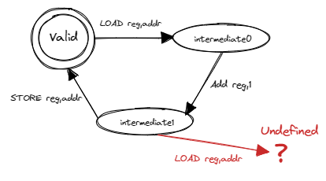

# 并发

## 介绍

到目前，我们已经完成了组成应用程序执行环境的操作系统的三个重要抽象：进程、地址空间和文件。**对于单核处理器而言，在任意一个时刻只会有一个进程被操作系统调度，从而在处理器上执行**。到目前为止的并发，仅仅是进程间的并发，而对于一个进程内部，还没有并发性的体现。而这就是线程（Thread）出现的起因：提高一个进程内的并发性。

> Dijkstra  教授带领他的小团队在设计开发THE操作系统的过程中，异步中断触发的难以重现的并发错误，让他们在调试操作系统中碰到了困难。这种困难激发了Dijkstra团队的灵感，他们设计了操作系统的分层结构来避免操作系统的复杂性负担，同时还设计了信号量机制和对应的P和V操作，来确保线程对共享变量的灵活互斥访问，并支持线程之间的同步操作。P和V是来自荷兰语单词“测试”和“增加”的首字母，是很罕见的非英语来源的操作系统术语。
>
> **贝尔实验室Victor A. Vyssotsky提出线程（thread）概念**
>
> 1964年开始设计的Multics操作系统已经有进程的概念，也有多处理器并行处理的GE 645硬件设计，甚至提出了线程（ **thread** ）的概念。1966年，参与Multics开发的MIT博士生 Jerome Howard Saltzer在其博士毕业论文的一个注脚提到贝尔实验室的Victor A. Vyssotsky用 **thread**  这个名称来表示处理器（processor）执行程序（program）代码序列这个过程的抽象概念，Saltzer进一步把”进程（process）”描述为处理器执行程序代码的当前状态（即线程）和可访问的地址空间。但他们并没有建立类似信号量这样的有效机制来避免并发带来的同步互斥问题。
>
> **Brinch Hansen、Tony Hoare和Dijkstra提出管程机制**
>
> 丹麦的Brinch Hansen，英国的Tony  Hoare和Dijkstra并不满足于信号量来解决操作系统和应用中的并发问题。因为对于复杂一些的同步互斥问题（如哲学家问题），如果使用信号量机制不小心，容易引起死锁等错误。在 1971年的研讨会上，他们三人开始讨论管程（Monitor）的想法，希望设计一种更高级的并发管理语言结构，便于程序员开发并发程序。
>
> > - 写作是对简单性的严格测试：不可能令人信服地写出无法理解的想法。
> > - 编程是用清晰的散文写文章并使它们可执行的艺术


> 并行与并发
>
> 在单处理器情况下，多个进程或线程是并发执行的。
>
> 并行：两个或多个进程在同一时间运行
>
> 并发：两个或多个进程在同一时间间隔运行

对于很多应用（以单一进程的形式运行）而言，**逻辑上由多个可并行执行的任务组成**，如果其中一个任务被阻塞，将导致整个进程被阻塞，这意味着不依赖该任务的其他任务也被阻塞，然而它们实际上本不应该受到影响。这就降低了系统的并发执行效率。

**在这里，线程不是为了强调可以并行，而是为了说明进程可以被分解为很多任务组成，有些任务的失败不能暗示着进程就没法执行了**，比如并联与串联，原来的单线进程是串联任务组成，有了线程就允许并联的出现

举个例子

> 举个具体的例子，我们平常用编辑器来编辑文本内容的时候，都会有一个定时自动保存的功能，即把当前文档内容保存到磁盘上。假设磁盘性能导致编辑器自动保存的过程较慢，并影响到整个进程被阻塞，这就会影响到用户编辑文档的人机交互体验：即用户只有等到磁盘写入操作完成后，操作系统重新调度该进程运行，用户才可继续编辑文档。
>
> 如果我们把一个进程内的多个可并行执行的任务通过一种更细粒度的方式让操作系统进行调度，那么就可以在进程内实现并发执行。在上面的例子中，负责保存文档内容的任务与负责编辑文档的任务可以并发执行，不会出现一个被阻塞的任务导致其它任务都阻塞的情况。这种任务就是一种更细粒度的调度对象，也就是我们这里说的线程。

### 线程

#### 定义

线程是操作系统能够进行运算调度的最小单位(协程操作系统管不了)

简单地说，线程是进程的组成部分，进程可包含1 –  n个线程，属于同一个进程的线程共享进程的资源，比如地址空间，打开的文件等。线程基本上由线程ID、执行状态、当前指令指针(PC)、寄存器集合和栈组成。线程是可以被操作系统或用户态调度器独立调度（Scheduling）和分派（Dispatch）的基本单位。

在==本章之前==，进程是程序的基本执行实体，**是程序对某数据集合进行操作的一次执行过程**，是系统进行资源（处理器，地址空间和文件等）分配和调度的基本单位。在有了线程后，**对进程的定义也要调整了，进程是线程的资源容器，线程成为了程序的基本执行实体。**

> **线程与进程的区别**
>
> 注：下面的比较是把以线程为调度对象的操作系统作为分析对象，其进程与线程的区别：
>
> - 进程间相互独立（即资源隔离），同一进程的各线程间共享进程的资源（即资源共享）；
> - 子进程和父进程有不同的地址空间和资源，而多个线程（没有父子关系）则共享同一所属进程的地址空间和资源；
> - 每个线程有其自己的执行上下文（线程ID、程序计数器、寄存器集合和执行栈），而进程的执行上下文包括其管理的所有线程的执行上下文和地址空间（故同一进程下的线程间上下文切换比进程间上下文切换要快）；
> - 线程是一个可调度/分派/执行的实体（线程有就绪、阻塞和运行三种基本执行状态），进程不是可调度/分派/执行的的实体，而是线程的资源容器；
> - 进程间通信需要通过IPC机制（如管道等）， 属于同一进程的线程间可以共享“即直接读写”进程的数据，但需要同步互斥机制的辅助，避免出现数据不一致性以及不确定计算结果的问题。

我们把这种两个或多个线程在竞争访问同一资源时，执行结果取决于它们的不可预知的执行顺序的情况称为 **线程的竞态条件（race condition）**。出现线程的数据不一致问题和竞态条件问题的根本原因是 **调度的不可控性** ：即读写共享变量的代码片段会随时可能被操作系统调度和切换。


数据竞争的例子：

```rust
//全局共享变量 NUM初始化为 0
static mut NUM : usize = 0;
...

//主进程中的所有线程都会执行如下的核心代码
unsafe { NUM = NUM + 1; }
...


//所有线程执行完毕后，主进程显示num的值
unsafe {
    println!("NUM = {:?}", NUM);
}
```

如果线程的个数为 `n` ，那么最后主进程会显示的数应该是多少呢？ 也许同学觉得应该也是 `n` ，但现实并不是这样。为了了解事实真相，我们首先必须了解Rust编译器对 `num = num + 1;` 这一行源代码生成的汇编代码序列。

```asm
# 假设NUM的地址为 0x1000
# unsafe { NUM = NUM + 1; } 对应的汇编代码如下
addi x6, x0, 0x1000        # addr 100: 计算NUM的地址
                           # 由于时钟中断可能会发生线程切换
ld   x5, 0(x6)             # addr 104: 把NUM的值加载到x5寄存器中
                           # 由于时钟中断可能会发生线程切换
addi x5, x5, 1             # addr 108: x5 <- x5 + 1
                           # 由于时钟中断可能会发生线程切换
sd   x5, 0(x6)             # addr 112: 把NUM+1的值写回到NUM地址中
```

在这个例子中，一行Rust源代码其实被Rust编译器生成了四行RISC-V汇编代码。如果多个线程在操作系统的管理和调度下都执行这段代码，那么在上述四行汇编代码之间（即第4，6，8行的地方）的时刻可能产生时钟中断，并导致线程调度和切换。

- 设有两个线程，线程A先进入上述汇编代码区，将要把 `NUM` 增加一，为此线程A将 `NUM` 的值（假设它这时是 `0` ）加载到 `x5` 寄存器中，然后执行加一操作，此时 `x5 = 1` 。这时时钟中断发生，操作系统将当前正在运行的线程A的上下文（它的程序计数器、寄存器，包括 `x5` 等）保存到线程控制块（在内存中）中。

- 再接下来，线程B被选中运行，并进入同一段代码。它也执行了前两条指令，获取 `NUM` 的值（此时仍为 `0` ）并将其放入 `x5` 中，线程B继续执行接下来指令，将 `x5` 加一，然后将 `x5` 的内容保存到 `NUM` （地址 `0x1000` ）中。因此，全局变量 `NUM` 现在的值是 `1` 。

- 最后又发生一次线程上下文切换，线程A恢复运行，此时的 `x5=1`，现在线程A准备执行最后一条 `sd` 指令，将 `x5` 的内容保存到 `NUM` （地址 `0x1000` ）中，`NUM` 再次被设置为 `1` 。

简单总结，这两个线程执行的结果是：增加 `NUM` 的代码被执行两次，初始值为 `0` ，但是结果为 `1` 。而我们一般理解这两个线程执行的“正确”结果应该是全局变量 `NUM` 等于  `2` 。

> **并发相关术语**
>
> - 共享资源（shared resource）：不同的线程/进程都能访问的变量或数据结构。
> - 临界区（critical section）：访问共享资源的一段代码。
> - 竞态条件（race condition）：多个线程/进程都进入临界区时，都试图更新共享的数据结构，导致产生了不期望的结果。
> - 不确定性（indeterminate）： 多个线程/进程在执行过程中出现了竞态条件，导致执行结果取决于哪些线程在何时运行，即执行结果不确定，而开发者期望得到的是确定的结果。
> - 原子性（atomic）：一系列操作要么全部完成，要么一个都没执行，不会看到中间状态。在数据库领域，具有原子性的一系列操作称为事务（transaction）。
> - 互斥（mutual exclusion）：一种原子性操作，能保证同一时间只有一个线程进入临界区，从而避免出现竞态条件，并产生确定的预期执行结果。
> - 同步（synchronization）：多个并发执行的进程/线程在**一些关键点上需要互相等待**，这种相互制约的等待称为进程/线程同步。
> - 死锁（dead lock）：一个线程/进程集合里面的每个线程/进程都在等待只能由这个集合中的其他一个线程/进程（包括他自身）才能引发的事件，这种情况就是死锁。
> - 饥饿（hungry）：指一个可运行的线程/进程尽管能继续执行，但由于操作系统的调度而被无限期地忽视，导致不能执行的情况。

同步互斥：关键点等待，然后一个进入临界区。操作系统中常见的同步互斥机制包括：互斥锁（Mutex Lock）、信号量（Semaphore）、条件变量（Conditional Variable）等。

### 互斥锁

互斥锁是操作系统中用于保护共享资源的机制。互斥锁能够确保在任何时候只有一个线程访问共享资源，从而避免资源竞争导致的数据不一致的问题。可以使用Rust标准库中的 std::sync::Mutex 类型来实现互斥锁。下面是一个使用互斥锁保护共享变量的示例：

```rust
    use std::sync::{Arc, Mutex};
    use std::thread;

    fn main() {
            // 创建一个可变的整数并将其包装在 Mutex 中
            let data = Arc::new(Mutex::new(0));

            // 创建两个线程，并传递 `data` 的 Arc 实例给它们
            let data_clone = data.clone();
            let handle1 = thread::spawn(move || {
                    let mut data = data_clone.lock().unwrap();
                    *data += 1;
            });

            let data_clone = data.clone();
            let handle2 = thread::spawn(move || {
                    let mut data = data_clone.lock().unwrap();
                    *data += 1;
            });

            // 等待两个线程结束
            handle1.join().unwrap();
            handle2.join().unwrap();

            // 输出结果
            println!("Result: {}", *data.lock().unwrap());
    }
```

在上面的代码中，两个线程都会尝试访问 data 变量，但是因为它被包装在了 Mutex 中，所以只有一个线程能够获取锁并访问变量。在获取互斥锁的时候，线程会被挂起，直到另一个线程释放了锁。最终的输出结果是 2。

### 条件变量

条件变量是操作系统中的一种同步原语，可用于在多个线程之间进行协作，即允许一个线程在另一个线程完成某些操作之前等待。条件变量与互斥锁经常一起使用，以保证在同一时刻只有一个线程在访问共享资源。

在 Rust 中，条件变量是由 std::sync::Condvar 结构体表示的。条件变量需要配合互斥体（由 std::sync::Mutex 结构体表示）使用，**因为条件变量用于在互斥体保护的条件下通知等待的线程**。

```rust
    fn main() {
            use std::sync::{Arc, Condvar, Mutex};
            use std::thread;

            let pair = Arc::new((Mutex::new(false), Condvar::new()));
            let pair2 = Arc::clone(&pair);

            // Inside of our lock, spawn a new thread, and then wait for it to start.
            thread::spawn(move || {
                    let (lock, cvar) = &*pair2;
                    let mut started = lock.lock().unwrap();
                    *started = true;
                    // We notify the condvar that the value has changed.
                    cvar.notify_one();
            });

            // Wait for the thread to start up.
            let (lock, cvar) = &*pair;
            let mut started = lock.lock().unwrap();
            while !*started {
                    started = cvar.wait(started).unwrap();
            }
    }
```

这是一个使用 Rust  中的条件变量（Condvar）和互斥锁（Mutex）来同步两个线程进行协作的示例。在这个示例中，新线程通过更改布尔值并通知条件变量来发送信号，而主线程则使用条件变量来等待信号。首先，它定义了一个元组 (Mutex<bool>, Condvar)，并使用  Arc（原子引用计数）将其包装在一个可共享的指针中。这个指针有两个副本，因此两个线程都可以访问这个元组。然后，它启动了一个新的线程，并在这个线程内部使用互斥锁来更改共享的布尔值。最后，它使用条件变量来等待这个布尔值被更改，然后退出循环。

### 信号量

信号量是操作系统中的一种同步原语，用于在多个线程或进程之间共享资源时进行互斥访问。它通常是一个整数值，用于计数指定数量的资源可用。当一个线程需要使用资源时，它会执行信号量的 acquire 操作，如果信号量的值小于等于零，则线程将被挂起，（直到信号量的值变为正数，则会被唤醒）；否则将信号量的值减一，操作正常返回。另一方面，当一个线程完成使用资源后，它可以执行信号量的 release 操作，将信号量的值加一，并唤醒一个或所有挂起的线程。Rust 标准库中没有信号量类型，但我们可以用Mutex和Condvar来构造信号量类型。

```rust
    use std::sync::{Condvar, Mutex};

    pub struct Semaphore {
            condvar: Condvar,
            counter: Mutex<isize>,
    }

    impl Semaphore {
            pub fn new(var: isize) -> Semaphore {
                    Semaphore {
                            condvar: Condvar::new(),
                            counter: Mutex::new(var),
                    }
            }
            pub fn acquire(&self) {
                    // gain access to the atomic integer
                    let mut count = self.counter.lock().unwrap();

                    // wait so long as the value of the integer <= 0
                    while *count <= 0 {
                            count = self.condvar.wait(count).unwrap();
                    }

                    // decrement our count to indicate that we acquired
                    // one of the resources
                    *count -= 1;
            }
            pub fn release(&self) {
                    // gain access to the atomic integer
                    let mut count = self.counter.lock().unwrap();

                    // increment its value
                    *count += 1;

                    // notify one of the waiting threads
                    self.condvar.notify_one();
            }
    }
```

我们构造的 Semaphore 类型包含了三个方法：

- new(var) 方法创建一个信号量，并初始化信号量值 counter`的为 `var；
- acquire() 方法将信号量值减一，如果信号量的值已经为零，则线程通过条件变量 condvar 的 wait 操作将自己挂起；
- release() 方法将信号量值加一，并通过条件变量 condvar 的 notify_one 操作唤醒一个挂起线程。

有了信号量，我们就可以建立使用信号量的示例程序，该程序创建了三个线程，每个线程都会调用 acquire 方法获取信号量，然后输出一条消息，最后在信号量上调用 release 方法释放信号量。

```rust
    use std::sync::Arc;
    use std::thread;
    fn main() {
            //let sem = Semaphore::new(1);
            // 创建信号量，并设置允许同时访问的线程数为 2。
            let semaphore = Arc::new(Semaphore::new(2));

            // 创建三个线程。
            let threads = (0..3)
                    .map(|i| {
                            let semaphore = semaphore.clone();
                            thread::spawn(move || {
                                    // 在信号量上调用 acquire 方法获取信号量。
                                    semaphore.acquire();

                                    // 输出消息。
                                    println!("Thread {}: acquired semaphore", i);

                                    // 模拟执行耗时操作。
                                    thread::sleep(std::time::Duration::from_secs(1));

                                    // 在信号量上调用 release 方法释放信号量。
                                    println!("Thread {}: releasing semaphore", i);
                                    semaphore.release();
                            })
                    })
                    .collect::<Vec<_>>();

            // 等待所有线程完成。
            for thread in threads {
                    thread.join().unwrap();
            }
    }
```

这段代码创建了一个名为 semaphore 的信号量，并设置允许并发操作的线程数为 2。然后创建了三个线程，在每个线程中，首先调用信号量的 acquire` 方法来尝试获取信号量。如果获取了信号量，就可以输出一条消息，并模拟执行一些耗时操作，最后调用信号量的 release 方法来释放信号量，从而让其他线程有机会获取信号量并继续执行。该示例运行的结果如下所示：

```
上面的代码就是
线程1:main
线程i:thread i
i+1个线程一起并发，如果主线程没了，子线程直接没；如果join了，那么主线程要等相应子线程
<----stdout------>
Thread 0: acquired semaphore
Thread 1: acquired semaphore
Thread 0: releasing semaphore
Thread 1: releasing semaphore
Thread 2: acquired semaphore
Thread 2: releasing semaphore
```

上述的示例都是在用户态实现的应用程序，其中的Thread、Mutex和Condvar需要应用程序所在的操作系统（这里就是Linux）提供相应的支持。在本章中，我们会在自己写的操作系统中实现Thread、Mutex、Condvar和Semaphore 机制，从而对同步互斥的原理有更加深入的了解，对应操作系统如何支持这些同步互斥底层机制有全面的掌握。

## 代码树


增加了在**用户态管理的用户态线程/用户态协程**，以及在**内核态管理的用户态线程**。对于用户态管理的用户态线程和协程，新增了一个运行在用户态的 Thread/Coroutine Manager 运行时库（Runtime Lib），这个不需要改动操作系统内核。 而对于内核态管理的用户态线程，则需要新增线程控制块（Thread  Control Block, TCB）结构，把之前进程控制块（Process Control Block,  PCB）中与执行相关的内容剥离给了线程控制块。同时，进一步重构进程控制块，把线程控制块列表作为进程控制块中的一部分资源，这样一个进程控制块就可以管理多个线程了。最后还提供与线程相关的系统调用，如创建线程、等待线程结束等，以支持多线程应用的执行。

这里，我们可以把进程、线程和协程中的控制流执行看出是一种任务（Task）的执行过程，如下图所示：


**可以看出进程包含线程（即有栈协程），线程包含无栈协程，形成一个层次包含关系**。而与它们执行相关的重点是切换控制流，即任务切换，关键就是保存于恢复任务上下文，任务上下文的核心部分就是每个任务所分时共享的硬件寄存器内容。对于`无栈协程`，切换这些`寄存器`就够了；对于拥有独立栈的`线程`而言，还需进一步切换`线程栈`；如果是拥有独立地址空间的进程而言，那还需进一步切换`地址空间`（即切换页表）。

在以上的实现中，我们还实现了同步互斥的数据结构：


```C
.
     ├── ...
     ├── os
     │   ├── ...
     │   └── src
     │       ├── ...
     │       ├── sync (新增：同步互斥子模块 sync)
     │       │   ├── mod.rs
     │       │   ├── condvar.rs（条件变量实现）
     │       │   ├── mutex.rs （互斥锁实现）
     │       │   └── semaphore.rs （信号量实现）
     │       ├── syscall
     │       │   ├── ...
     │       │   ├── mod.rs（增加与线程/同步互斥相关的系统调用定义）
     │       │   ├── sync.rs（增加与同步互斥相关的系统调用具体实现）
     │       │   └── thread.rs（增加与线程相关的系统调用具体实现）
     │       ├── task (重构进程管理子模块，以支持线程)
     │       │   ├── ...
     │       │   ├── process.rs（包含线程控制块的进程控制块）
     │       │   └── task.rs（线程控制块）
     │       ├── timer.rs （增加支持线程睡眠一段时间的功能）
     │       └── trap
     │           ├── context.rs
     │           ├── mod.rs
     │           └── trap.S
     └── user
         ├── ...
             ├── src
             │   ├── bin (新增各种多线程/协程/同步互斥测试用例)
             │   │   ├── ...
             │   │   ├── early_exit2.rs（多线程测例）
             │   │   ├── early_exit.rs（多线程测例）
             │   │   ├── eisenberg.rs （面向n个线程的Eisenberg&McGuire 软件同步互斥示例）
             │   │   ├── mpsc_sem.rs（基于信号量的生产者消费者问题示例）
             │   │   ├── peterson.rs（面向2个线程的Peterson软件同步互斥示例）
             │   │   ├── phil_din_mutex.rs（基于互斥锁的哲学家就餐问题示例）
             │   │   ├── race_adder_arg.rs（具有竞态条件错误情况的多线程累加计算示例）
             │   │   ├── race_adder_atomic.rs（基于原子变量的多线程累加计算示例）
             │   │   ├── race_adder_loop.rs（具有竞态条件错误情况的多线程累加计算示例）
             │   │   ├── race_adder_mutex_blocking.rss（基于可睡眠互斥锁的多线程累加计算示例）
             │   │   ├── race_adder_mutex_spin.rs（基于忙等互斥锁的多线程累加计算示例）
             │   │   ├── race_adder.rs（具有竞态条件错误情况的多线程累加计算示例）
             │   │   ├── stackful_coroutine.rs（用户态多线程（有栈协程）管理运行时库和多线程示例）
             │   │   ├── stackless_coroutine.rs（用户态无栈协程管理运行时库和多协程示例）
             │   │   ├── sync_sem.rs（基于信号量的多线程同步示例）
             │   │   ├── test_condvar.rs（基于条件变量和互斥锁的多线程同步示例）
             │   │   ├── threads_arg.rs（带参数的多线程示例）
             │   │   ├── threads.rs（无参数的多线程示例）
             │   │   └── usertests.rs（运行所有应用的示例）
             │   └── ...
```

## 用户态线程

线程的运行需要一个执行环境，这个执行环境可以是操作系统内核，也可以是更简单的用户态的一个线程管理运行时库。如果是**基于用户态**的线程管理运行时库来实现对线程的支持，那我们需要对线程的管理、调度和执行方式进行一些限定。由于是在用户态进行线程的创建，调度切换等，这就意味着我们不需要操作系统提供进一步的支持，即**操作系统不需要感知到这种线程的存在**。如果一个线程A想要运行，它只有等到目前正在运行的线程B主动交出处理器的使用权，从而让线程管理运行时库有机会得到处理器的使用权，且线程管理运行时库通过调度，选择了线程A，再完成线程B和线程A的线程上下文切换后，线程A才能占用处理器并运行。这其实就是第三章讲到的`任务切换：switch`和`协作调度(任务管理器+yield)`的另外一种更简单的具体实现。

线程的定义：

- 线程ID
- 执行状态
- 当前指令指针(PC)
- 通用寄存器集合
- 栈

步骤：

1. 定义全局的线程管理器
2. 然后创建线程(传闭包函数地址作为sepc)
3. 注意线程的栈通过申请`vec![u8]`作为栈
4. 然后就是`switch()`保存一些寄存器，有一些寄存器不需要保存，会有`caller`保存(任务切换)
5. 实现在`os的同级目录的 Green-Thread`，没写完，简单的很，但是有些地方写不出来，于是搁置了，也不想搞了，因为完全没有必要

> 优点：
>
> 用户态的线程不需要走内核的trap!
>
> 缺点：
>
> 带了的一个潜在不足是没法让线程管理运行时直接切换线程，只能等当前运行的线程主动让出处理器使用权后，线程管理运行时才能切换检查。

## 内核态线程

- 进程主要的目的是隔离，而线程的引入强调了共享，即属于同一进程的多个线程可共享进程的资源，这样就必须要解决同步问题了。所以没有在进程就涉及同步互斥。
- 学生对进程有一定了解后，再来理解线程也会更加容易。因为从对程序执行的控制流进行调度和切换上看，本章讲解的线程调度与切换操作是之前讲解的进程调度与切换的一个子集。

**在没有线程之前，一个进程在一个时刻只有一个执行点**（即程序计数器 PC  寄存器保存的要执行指令的指针以及栈的位置）。线程的引入把进程内的这个单一执行点给扩展为多个执行点，即在进程中存在多个线程，每个线程都有一个执行点。而且这些线程共享进程的地址空间，所以可以**不必采用相对比较复杂的进程间通信机制（一般需要内核的介入）**也可以很方便地直接访问进程内的数据进行协作。

在线程的具体运行过程中，需要有**程序计数器寄存器**来记录当前的执行位置，需要有一组**通用寄存器记录当前的指令的操作数据**，需要有一个**栈**作为线程执行过程的函数调用栈保存局部变量等内容，这就形成了线程上下文的主体部分。

线程不涉及父子关系，全是兄弟，但是兄弟中的老大，就是主线程跟其他线程有点不同。类似于进程标识符（PID），每个线程都有一个在所属进程内生效的线程标识符（TID）。

而对于线程的话，除了主线程仍然从程序入口点（一般是 `main` 函数）开始执行之外，**每个线程的生命周期都与程序中的一个函数的一次执行绑定。**也就是说，线程从该函数入口点开始执行，当函数返回之后，线程也随之退出。因此，在创建线程的时候我们需要提供程序中的一个函数让线程来执行这个函数。

```c
int pthread_create(
    	pthread_t *restrict thread, // 实际是先创建线程实例，然后返回结构体指针，对他操作
              const pthread_attr_t *restrict attr,  // 线程的一些参数
                  void *(*start_routine)(void *), // 线程函数，void函数可以轻松转化为其他类型函数指针
                  void *restrict arg); // 函数参数（比如，不同参数区分进程）

int pthread_join(pthread_t thread, void **retval); //线程等待另个线程退出，retval捕获线程返回值
```

线程模型特点：

- 线程有三种状态：就绪态、运行态和阻塞态（阻塞态是本章后面并发部分的重点概念，到时会详细讲解）；
- 同进程下的所有线程共享所属进程的地址空间和其他共享资源（如文件等）；
- 线程可被操作系统调度来分时占用 CPU 执行；
- 线程可以动态创建和退出；
- 同进程下的多个线程不像进程一样存在父子关系，但有一个特殊的主线程在它所属进程被创建的时候产生，应用程序的 `main` 函数就运行在这个主线程上。当主线程退出后，整个进程立即退出，也就意味着不论进程下的其他线程处于何种状态也随之立即退出；
- 线程可通过系统调用获得操作系统的服务。注意**线程和进程两个系列的系统调用**不能混用。

从逻辑上来说某些段是由所有线程共享的（比如包含代码中的全局变量的全局数据段），而**某些段是由某个线程独占的（比如操作系统为每个线程分配的栈）**，通常情况下程序员会遵循这种约定。然而，线程之间并不能严格做到隔离。举例来说，**一个线程访问另一个线程的栈这种行为并不会被操作系统和硬件禁止**。这也体现了线程和进程的不同：**线程的诞生是为了方便共享，而进程更强调隔离**。

相比于创建进程的 `fork` 系统调用，创建线程无需建立新的地址空间，这是二者之间最大的不同。

在 C/Rust  语言实现的多线程应用中，**当线程执行的函数返回之后线程会自动退出**，在编程的时候无需对函数做任何特殊处理。其实现原理是当函数返回之后，会**自动跳转**到用户态一段**预先设置好的代码**，在这段代码中通过系统调用实现线程退出操作。在这里，我们为了让实现更加简单，约定线程函数需要在返回之前通过 `exit` 系统调用退出。这里 `exit` 系统调用的**含义发生了变化**：从进程退出变成线程退出。内核在收到线程发出的 `exit` 系统调用后，会回收线程占用的用户态资源，包括用户栈和 Trap 上下文等。线程占用的内核态资源（包括内核栈等）则需要在进程内使用 `waittid` 系统调用来回收.


而且，为了实现更加简单，我们要求每个应用对于 **线程和进程两个系列的系统调用只能使用其中之一** 。比如创建子进程了，就不允许创建线程。创建线程了，就不允许子进程。

这意味着调度器需要考虑更多的因素，，比如当一个线程时间片用尽交出 CPU  使用权的时候，切换到同进程下还是不同进程下的线程的上下文切换开销往往有很大不同，可能影响到是否需要切换页表。不过我们为了实现更加简单，仍然采用  Round-Robin 调度算法，将所有线程一视同仁，不考虑它们属于哪个进程。


每个线程都有自己独立的用户栈和 Trap 上下文，且它们在所属进程的地址空间中的位置可由 TID 计算得到。参考新的进程地址空间如下图所示：

> 内核栈有啥用？
>
> 保存线程在内核的状态的，为啥这么说呢；
>
> - 你trap进来之后，内核需要保存trap_return之后返回的地方，这个跟trap_cx还有点不一样
> - 任务切换也是内核栈存

调度任务初始化 = {任务控制块 + trap_cx} = ok


返回的时候，线程的ustack_sp啥时候修改为我们需要的？

修改的寄存器x[2]就是sp，他需要在最后面改

```rust
    pub fn set_sp(&mut self,sp:usize){
        self.x[2] = sp;
    }
然后trap_return -> user_space -> 读取加载trap_cx
```


## 互斥

```rust
// adder.rs

static mut A: usize = 0;
const THREAD_COUNT: usize = 4;
const PER_THREAD: usize = 10000;
fn main() {
    let mut v = Vec::new();
    for _ in 0..THREAD_COUNT {
        v.push(std::thread::spawn(|| {
            unsafe {
                for _ in 0..PER_THREAD {
                    A = A + 1;
                }
            }
        }));
    }
    for handle in v {
        handle.join().unwrap();
    }
    println!("{}", unsafe { A });
}
```

以我们的多线程计数器 `adder.rs` 为例，状态转移过程如下：



这里我们将全局变量 `A` 视为一种资源，操作 `A=A+1` 为一个三阶段操作。我们可以用**有限状态自动机**来描述资源 `A` 和操作 `A=A+1` ：状态机中一共有 3 种状态，一个合法状态和两个不合法的中间状态 0 和 1。对于每次操作，第一条指令 `A` 从合法状态转移到中间状态 0；第二条指令 `A` 从中间状态 0 转移到中间状态 1；第三条指令 `A` 从中间状态 1 转移回合法状态。将操作块交错的情况代入到状态机中，最开始切换到 T0 之前 `A` 处于合法状态，接下来切换到 T0 执行了第一、二条指令之后 `A` 转移到中间状态 1，而此时操作系统切换到 T1 ， T1 又开始执行第一条指令。问题来了：我们发现中间状态 1 并没有定义此时再执行**第一条指令**应该如何转移。如果去执行的话，**就会产生未定义行为**并可能永远无法使 `A` 回到合法状态。不过，由于 `adder.rs` 中 `A` 只是一个整数，我们会发现 `A` 仍能回到合法状态，只是结果不对。如果换成一种复杂的数据结构，就会产生极其微妙且难以调试的结果。

**共享资源** (Shared Resources) 是指多个线程均能够访问的资源。线程对于共享资源进行操作的那部分代码被称为 **临界区** (Critical Section)。在多线程并发访问某种共享资源的时候，为了正确性，必须要满足 **互斥** (Mutual Exclusion) 访问要求，即同一时间最多只能有一个线程在这种共享资源的临界区之内。

**对于这种原生类型**，现代指令集架构额外提供一组 **原子指令** (Atomic Instruction) ，在某些架构上只需一条原子指令就能完成包括访存、算术运算在内的一系列功能。这就是说 `adder.rs` 中的 `A=A+1` 操作其实只需一条原子指令就能完成。如果这样做的话，我们相当于 **将临界区缩小为一条原子指令** ，这已经是处理器执行指令和时间片切分的最小单位，因此我们不使用任何保护手段也能满足互斥要求。

在互斥锁没有释放的前提下，拥有锁的线程会一直执行，直到它完成了对共享资源的操作并释放了锁。这是因为互斥锁的设计目的是确保在任何时刻只有一个线程可以访问被保护的资源。**当一个线程成功获取了互斥锁并开始执行被保护的代码块时，其他试图获取同一把锁的线程将被阻塞，直到锁被释放**。所以上述代码可修改为：

```rust
use std::sync::Mutex;
static mut A: usize = 0;
static LOCK: Mutex<bool> = Mutex::new(true);
const THREAD_COUNT: usize = 4;
const PER_THREAD: usize = 10000;
fn main() {
    let mut v = Vec::new();
    for _ in 0..THREAD_COUNT {
        v.push(std::thread::spawn(|| {
            for _ in 0..PER_THREAD {
                let _lock = LOCK.lock();
                unsafe { A = A + 1; }
            }
        }));
    }
    for handle in v {
        handle.join().unwrap();
    }
    println!("{}", unsafe { A });
}
```

但是，这只能保证获取锁的时候，线程阻塞，这个意思不等价于处理A的时候阻塞！


锁机制有多种不同的实现。对于一种实现而言，我们常常用以下的指标来从多个维度评估这种实现是否能够正确、高效地达成锁这种互斥原语应有的功能：

- 忙则等待：意思是当一个线程持有了共享资源的锁，此时资源处于繁忙状态，这个时候其他线程必须等待拿着锁的线程将锁释放后才有进入临界区的机会。这其实就是互斥访问的另一种说法。这种互斥性是锁实现中最重要的也是必须做到的目标，不然共享资源访问的正确性会受到影响。
- **空闲则入** (在《操作系统概念》一书中也被称为 **前进** Progress)：若资源处于空闲状态且有若干线程尝试进入临界区，那么一定能够在有限时间内从这些线程中选出一个进入临界区。如果不满足空闲则入的话，可能导致即使资源空闲也没有线程能够进入临界区，对于锁来说是不可接受的。
- **有界等待** (Bounded Waiting)：当线程获取锁失败的时候首先需要等待锁被释放，但这并不意味着此后它能够立即抢到被释放的锁，因为此时可能还有其他的线程也处于等待状态。于是它可能需要等待一轮、二轮、多轮才能拿到锁，甚至在极端情况下永远拿不到锁。 **有界等待** 要求每个线程在等待有限长时间后最终总能够拿到锁。相对的，线程可能永远无法拿到锁的情况被称之为 **饥饿** (Starvation) 。这体现了锁实现分配共享资源给线程的 **公平性** (Fairness) 。
- 让权等待（可选）：线程如何进行等待实际上也大有学问。这里所说的让权等待是指需要等待的线程暂时主动或被动交出 CPU 使用权来让 CPU 做一些有意义的事情，这通常需要操作系统的支持。这样可以提升系统的总体效率。

> **Rust Tips: 易失性读写 read/write_volatile**
>
> 有些时候，编译器会对一些访存行为进行优化。举例来说，如果我们写入一个内存位置并立即读取该位置，并且在同段时间内其他线程不会访问该内存位置，这意味着我们写入的值能够在 RAM  上保持不变。那么，编译器可能会认为读取到的值必定是此前写入的值，于是在最终的汇编码中读取内存的操作可能被优化掉。然而，有些时候，特别是访问  I/O 外设以 MMIO  方式映射的设备寄存器时，即使是相同的内存位置，对它进行读取和写入的含义可能完全不同，于是读取到的值和我们之前写入的值可能没有任何关系。连续两次读取同个设备寄存器也可能得到不同的结果。这种情况下，编译器对访存行为的修改显然是一种误优化。
>
> 于是，在访问 **I/O 设备寄存器或是与 RAM 特性不同**的内存区域时，就要注意通过 `read/write_volatile` 来确保编译器完全按照我们的源代码生成汇编代码而不会自作主张进行删除或者重排访存操作等优化。

### 软件

软件互斥的缺点：

更为重要的是，这类算法存在着时代局限性，对 CPU 的内存访问有着比较严格的要求，因此这类算法是不能不加修改的运行在现代多核处理器上的。如果要保证其正确性，则要付出极大的性能开销，甚至得不偿失。

#### 单标记互斥

```rust
static mut OCCUPIED: bool = false;

unsafe fn lock() {
    while vload!(OCCUPIED) {}
    OCCUPIED = true;
}

unsafe fn unlock() {
    OCCUPIED = false;
}
```

我们使用一个新的全局变量 `OCCUPIED` 作为标记，表示当前是否有线程在临界区内。在 `lock` 的时候，我们等待 `OCCUPIED` 变为 false （注意这里的 `vload!` 来自用户库 `user_lib` ，基于临界区中用到的 `read_volatile` 实现，含义相同），这意味着没有线程在临界区内了，于是将标记修改为 true 并自己进入临界区。在退出临界区 `unlock` 的时候则只需将标记改成 false 。

第 6 行不断 while 循环直到标记被改为 false ，在循环体内则不做任何事情，这是一种典型的 **忙等待** (Busy Waiting) 策略，它也被形象地称为 **自旋** (Spinning) 。

###### 出问题

单标记的步骤，分解：

1. 将标记的值加载到寄存器 reg
2. 条件跳转，如果 reg 为 1 则跳转回第一阶段开始新一轮循环；否则向下进行
3. 将标记赋值为 1

可能第3阶段返回值之后，被两个线程加载到寄存器

###### 意见

可以让这个OCCUPIED变成一个原子操作，每次只能有一个进程拥有他。但是这个原子操作不是作用在修改上，而是作用在获取上，一旦一个进城获取，他就要修改状态，所以**修改加获取**合并成原子操作。

[见下方的原子操作](#原子操作)

#### Peterson算法


```rust
/// 适用于两个线程

// flag[i] = true，表示i线程想进入
static mut flag:[bool;2] = [flag;2]

// turn=i：表示轮到第i个线程进入
let turn:usize = 0;

unsafe lock(id:usize){
        flag[id] = true;
        let j = 1-id;
        turn = j

        // 如果第j个线程想进，而且轮到他了，自己就只能等待了
        while(flag[j]&&turn[j]){}
}

unsafe unlock(id:usize){
    flag[id] = false
}
```

- 首先，这个算法适合两个线程
- 可以看出问题的关键在于 $turn$。无论操作系统如何进行调度，在单核 CPU 上，线程$T_i$和线程$T_j$对于$turn$的 **修改总有一个在时间上靠后** 。

- 满足：空闲则入，忙则等待，有界等待(不会饥饿)

- flag相当于自己同意，turn相当于也得到对方同意，所以算法正确
- 好像就这个算法需要考虑==CPU对内存访问顺序的优化改变==

#### Dekker算法


算法思路与Peterson差不多，也是双线程算法(这两种算法的基本思路是相同的，但是`Dekkers`算法更容易推广到**多进程**的情况。因此，以下我们将尝试以`Dekkers`算法为基础，实现多进程的互斥访问。)

- 先让自己想进；
  - 如果对方不想进，我直接进临界区
  - 对方想进(此时我也想进)
    - 如果轮到我了，我直接进
    - 如果没轮到我
      - 自己不想进
      - 等对方空闲则入，弄完，轮到我
      - 我想进

- 我进入临界区了，此时turn没轮到他，他进不来
  - 我执行代码...
  - 最后：我让对面进
  - 我自己不想进了

#### Eisenberg & McGuire多线程算法(待)

#### Filter算法：N大于2时的Peterson算法(待)

#### Lamport面包店算法(待)

#### Szymanski算法(待)

## 硬件

### 关闭中断

我们知道操作系统，特别是当线程处于临界区被切换出去的时候，将导致不同线程的临界区交错运行使得共享资源访问出错，进行的这种抢占式调度是由时钟中断触发的。如果应用程序能够控制中断的打开（使能）与关闭（屏蔽），那就能提供互斥解决方案了。

```rust
fn lock() {
    disable_interrupt(); //屏蔽中断的机器指令
}

fn unlock() {
    enable_interrupt(); //使能中断的机器指令
}
```

首先，这种做法给了用户态程序使能/屏蔽中断这种特权，相当于相信应用并放权给它。这会面临和我们引入抢占式调度之前一样的问题：线程可以选择恶意永久关闭中断而独占所有 CPU 资源，这将会影响到整个系统的正常运行。因此，**事实上至少在 RISC-V  这样含多个特权级的架构中，这甚至是完全做不到的**。回顾第三章，可以看到中断使能和屏蔽的相关标志位分布在 S 特权级的 CSR `sstatus` 和 `sie` ，甚至更高的 M 特权级的 CSR  中。**用户态试图修改它们将会触发非法指令异常，操作系统会直接杀死该线程**。其次，即使我们能够做到，它对于多处理器架构也是无效的。假设同一进程的多个线程运行在不同的 CPU 上，它们都尝试访问同种共享资源。一般来说，每个 CPU  都有自己的独立的中断相关的寄存器，它只能对自己的中断处理进行设置。**对于一个线程来说，它可以关闭它所在 CPU  的中断，但是这无法影响到其他线程所在的 CPU  ，其他线程仍然可以在此时进入临界区**，便不能满足互斥访问的要求了。所以，采用控制中断的方式仅对一些非常简单，且信任应用的单处理器场景有效，而对于更广泛的其他场景是不够的。**屏蔽中断并不能在多核操作系统起作用**

需要注意的是，这种关闭中断的方法作为用户态锁机制的实现很不靠谱，在实现内核态锁机制的时候有些情况下却是必不可少的。**我们将在第九章介绍位于内核态的一种基于关中断的锁实现**

### 原子操作

```rust
static OCCUPIED: AtomicBool = AtomicBool::new(false);

fn lock() {
    while OCCUPIED
    .compare_exchange(false, true, Ordering::Relaxed, Ordering::Relaxed)
    .is_err()
    {
        yield_();
    }
}

fn unlock() {
    OCCUPIED.store(false, Ordering::Relaxed);
}
```

这里我们将全局锁标记替换为原子 bool 类型 `AtomicBool` 。它支持 `AtomicBool::compare_exchange` 操作，接口定义如下：

```
pub fn compare_exchange(
    &self,
    current: bool,
    new: bool,
    success: Ordering,
    failure: Ordering,
) -> Result<bool, bool>;
```

其功能为：如果原子变量当前的值与 `current` 相同，则将原子变量的值修改为 `new` ，否则不进行修改。无论是否进行修改，都会返回原子变量在操作之前的值。==在这里就实现了修改加获取合并为原子操作==，然后搭配单标志互斥，美滋滋。

#### CAS-**比较并交换**

一种原子操作：

```rust
/// 效果的伪代码展示
fn compare_and_swap(ptr: *mut i32, expected: i32, new: i32) -> i32 {
    let original = unsafe { *ptr };
    if original == expected {
        unsafe { *ptr = new; }
    }
    original
}
```

#### TAS-测试并设置

 CAS 之外，曾经还有另一类常用来实现同步机制的原子指令，它被称为 **测试并设置** (Test-And-Set, TAS) 。相比 CAS ， TAS 没有比较的步骤，它直接将 `new` 写入到内存并返回内存位置原先的值。用 Rust 语言伪代码描述 TAS 的功能如下：

```rust
fn test_and_set(ptr: *mut i32, new: i32) -> i32 {
    let original = unsafe { *ptr };
    unsafe { *ptr = new };
    original
}
```

然后采用TAS实现的锁效果

```rust
static mut OCCUPIED: i32 = 0;

unsafe fn lock() {
    // 相比CAS而言，比较被放在外面
    // 只有一次返回原来值0,其他都是1
    while (test_and_set(&mut OCCUPIED, 1) == 1) {}
}

unsafe fn unlock() {
    OCCUPIED = 0;
}
```

#### LR/SC:加载保留与条件储存

LR:LR 指令可以读取内存中的一个值（其地址保存在寄存器 `rs1` 中）到目标寄存器 `rd` 

SC： SC 指令，它的功能是将内存中的这个值（其地址保存在寄存器 `rs1` 中且与 LR 指令中的相同）改成寄存器 `rs2` 保存的值。**但前提是：执行 LR 和 SC 这两条指令之间的这段时间内，内存中的这个值并未被修改。如果这个前提条件不满足，那么 SC 指令不会进行修改**

那么 SC 指令是如何判断此前一段时间该内存中的值是否被修改呢？在 RISC-V 架构下，存在一个 **保留集**  (Reservation Set) 的概念，这也是“加载保留”这种叫法的来源。保留集用来实现 LR/SC 的检查机制：当 CPU 执行 LR  指令的时候，硬件会记录下此时内存中的值是多少，此外还可能有一些附加信息，这些被记录下来的信息就被称为保留集。之后，当其他 CPU  或者外设对内存这个值进行修改的时候，硬件可以将这个值对应的保留集标记为非法或者删除。等到之前执行 LR 指令的 CPU 执行 SC  指令的时候，CPU 就可以检查保留集是否存在/合法或者保留集记录的值是否与内存中现在的值一致，以这种方式来决定是否进行写入以及目标寄存器 `rd` 的值。


RISC-V 并不原生支持 CAS/TAS 原子指令，但我们可以通过 LR/SC 指令对来实现它。比如下面是通过 LR/SC 指令对来模拟 CAS 指令。有兴趣的同学可以对照注释自行研究。

```asm
# 参数 a0 存放内存中的值的所在地址
# 参数 a1 存放 expected
# 参数 a2 存放 new
# 返回值 a0 略有不同：这里若比较结果相同则返回 0 ，否则返回 1
# 而不是返回 CAS 之前内存中的值
cas:
    lr.w t0, (a0) # LR 将值加载到 t0
    bne t0, a1, fail # 如果值和 a1 中的 expected 不同，跳转到 fail
    sc.w t0, a2, (a0) # SC 尝试将值修改为 a2 中的 new
    bnez t0, cas # 如果 SC 的目标寄存器 t0 不为 0 ，说明 LR/SC 中间值被修改，重试
    li a0, 0 # 成功，返回值为 0
    ret # 返回
fail:
    li a0, 1 # 失败，返回值为 1
    ret # 返回
```

让我们来对原子指令部分进行一个小结。为了提供软件所需的包含互斥锁在内的各种同步机制，**硬件对于内存中的一个字、双字、四字（位宽分别为16、32、64位，且通常要求是对齐的）这类通用的存储单位提供了一系列原子指令**，这些原子指令能够对内存中的值进行加载、运算、修改等多种操作，且能够保证整个过程是原子的。也就是说，在硬件层面上，**其原子性有着更高的优先级**而不会被中断、多个 CPU 同时访问内存中同个位置或者指令执行中的更多情况破坏。

正因如此，我们才说：“ **原子指令是整个计算机系统中最根本的原子性和互斥性的来源** 。”这种最根本的互斥性来源于总线的仲裁，表现为原子指令，作用范围为基础存储单位。

> 原子指令在多核中也是满足的
>
> 事实上，当多个 CPU 同时执行这些原子指令的时候，它们会将相关请求发送到 CPU 与 RAM  间总线上，总线会将这些请求进行排序。这就好像一群纷乱的游客在通过一个狭窄的隘口的时候必须单列排队通过，无论如何总会产生一种顺序。于是我们会看到，请求排在最前面的 CPU 能够成功，随后它便相当于独占了这一块被访问的内存区域。接下来，排在后面的 CPU 的请求都会失败了，这种状况会持续到之前独占的 CPU 将对应内存区域重置（相当于 `unlock` ）

### 让权等待

总体上说，若要以忙等方式进行等待，首先要保证忙等是有意义的，不然就只是单纯的在浪费 CPU 资源。怎样才算是有意义的忙等呢？那就是 **在忙等的时候被等待的条件有可能从不满足变为满足** 。比如说，一个线程占据 CPU 资源进行忙等的同时，另一个线程可以在另一个 CPU 上执行，外设也在工作，它们都可以修改内存使得条件得到满足。这种情况才有等待的价值。于是可以知道， **在单核环境下且等待条件不涉及外设的时候，一个线程的忙等是没有意义的** ，因为被等待的条件的状态不可能发生变化。

忙等的优势是在条件成立的第一时间就能够进行响应，对于事件的响应延迟更低，实时性更好，而且不涉及开销很大的上下文切换。它的缺点则是不可避免的会浪费一部分 CPU 资源在忙等上。

**为了克服忙等带来的资源和切换上下文的浪费**，在操作系统的协助下，我们可以对于等待进行更加精细的控制。为了避免等待事件的线程在事件到来之前被调度到而产生大量上下文切换开销，我们可以新增一种 **阻塞** (Blocking) 机制。**当线程需要等待事件到来的时候，操作系统可以将该线程标记为阻塞状态** (Blocked)  并将其从调度器的就绪队列中移除。由于操作系统每次只会从就绪队列中选择一个线程分配 CPU 资源，被阻塞的线程就不再会获得 CPU  使用权，也就避免了上下文切换。相对的，在线程要等待的事件到来之后，我们需要解除线程的阻塞状态，将线程状态改成就绪状态，并将线程重新加入到就绪队列，使其有资格得到 CPU 资源。这就是与阻塞机制配套的唤醒机制。

阻塞机制的缺点在于会不可避免的产生两次上下文切换。站在等待的线程的视角，它会被切换出去再切换回来然后再继续执行。在事件产生频率较低、事件到来速度比较慢的情况下这不是问题，但当事件产生频率很高的时候直接忙等也许是更好的选择。

> **为什么同样使用单标记，这里却无需用到原子操作？**
>
> 这里我们仅用到单标记 `locked` ，为什么无需使用原子指令来保证对于 `locked` 本身访问的互斥性呢？这其实是因为，RISC-V 架构规定从用户态陷入内核态之后所有（内核态）中断默认被自动屏蔽，也就是说与应用的执行不同， **目前系统调用的执行是不会被中断打断的** 。同时，目前我们是在单核上，也 **不会有多个 CPU 同时执行系统调用的情况** 。在这种情况下，内核态的共享数据访问就仍在 `UPSafeCell` 的框架之内，只要使用它就能保证互斥访问。

## 互斥锁(Mutex)

- 单标志的互斥锁

```rust
pub struct MutexSpin {
    locked: UPSafeCell<bool>,
}

impl MutexSpin {
    pub fn new() -> Self {
        Self {
            locked: unsafe { UPSafeCell::new(false) },
        }
    }
}

impl Mutex for MutexSpin {
    fn lock(&self) {
        // locked = true的时候会返回，执行临界区；否则会yield
        loop {
            let mut locked = self.locked.exclusive_access();
            if *locked {
                drop(locked);
                suspend_current_and_run_next();
                continue;
            } else {
                *locked = true;
                // 防止来回自由无条件进入
                return;
            }
        }
    }

    fn unlock(&self) {
        let mut locked = self.locked.exclusive_access();
        *locked = false;
    }
}

```


- 基于阻塞的

```rust
/// 需要保存阻塞的队列
pub struct MutexBlockingInner {
    locked: bool,
    wait_queue: VecDeque<Arc<TaskControlBlock>>,
}

impl MutexBlocking {
    pub fn new() -> Self {
        Self {
            inner: unsafe {
                UPSafeCell::new(MutexBlockingInner {
                    locked: false,
                    wait_queue: VecDeque::new(),
                })
            },
        }
    }
}

impl Mutex for MutexBlocking {
    fn lock(&self) {
        let mut mutex_inner = self.inner.exclusive_access();
        if mutex_inner.locked {
            mutex_inner.wait_queue.push_back(current_task().unwrap());
            drop(mutex_inner);
            block_current_and_run_next();
        } else {
            mutex_inner.locked = true;
        }
    }

    fn unlock(&self) {
        let mut mutex_inner = self.inner.exclusive_access();
        assert!(mutex_inner.locked);
        if let Some(waking_task) = mutex_inner.wait_queue.pop_front() {
            wakeup_task(waking_task); // 唤醒的线程是初始化的falsw
        } else {
            mutex_inner.locked = false; // 如果没有可唤醒的线程，就让自己是false，可以直接进入临界区
        }
    }
}
```


## 信号量(Semaphore)

当我们需要一种线程间更灵活的同步访问需求，如要求同时最多只允许 N 个线程在临界区中访问共享资源，或让某个线程等待另外一个线程执行到某一阶段后再继续执行的同步过程等，互斥锁这种方式就有点力不从心了。

> **同步** (Synchronization) 和 **互斥** (Mutual  Exclusion)  事实上是在多线程并发访问过程中出现的两种不同需求。同步指的是线程执行顺序上的一些约束，比如一个线程必须等待另一个线程执行到某个阶段之后才能继续向下执行；而互斥指的是多线程在访问共享资源的时候，同一时间最多只有一个线程能够在共享资源的临界区中。

**信号量是一种同步原语，用一个变量或一种抽象数据类型实现，用于控制多个线程对共享资源的访问**。

信号量支持两种操作：P 操作（来自荷兰语中的 Proberen ，意为尝试）和 V 操作（来自荷兰语中的 Verhogen ，意为增加），其中 P 操作表示线程尝试占用一个资源，而与之匹配的 V 操作表示线程将占用的资源归还。P 操作和 V 操作也是基于阻塞-唤醒机制实现的。当进行 P  操作的时候，如果此时没有可用的资源，则当前线程会被阻塞；而进行 V  操作的时候，如果返还之后有了可用的资源，且此时有线程被阻塞，那么就可以考虑唤醒它们。

- 信号量的一种实现

```rust
fn P(S) {
    if S >= 1
        // 如果还有可用资源，更新资源剩余数量 S
        S = S - 1;
        // 使用资源
    else
        // 已经没有可用资源
        // 阻塞当前线程并将其加入阻塞队列
        <block and enqueue the thread>;
}

fn V(S) {
    if <some threads are blocked on the queue>
        // 如果已经有线程在阻塞队列中
        // 则唤醒这个线程
        <unblock a thread>;
    else
        // 否则只需恢复 1 资源可用数量
        S = S + 1;
}
```

- 信号量的第二种实现

```rust
fn P(S) {
    S = S - 1;
    if 0 > S then
        // 阻塞当前线程并将其加入阻塞队列
        <block and enqueue the thread>;
}

fn V(S) {
    S = S + 1;
    if <some threads are blocked on the queue>
        // 如果已经有线程在阻塞队列中
        // 则唤醒这个线程
        <unblock a thread>;
}
```

- 资源<=0时，p(S)会阻塞，
- V(S)无条件唤醒线程

##### 信号量的使用场景

1. 信号量作为同步原语来解决条件同步问题；（能实现提醒的作用）
2. 互斥
3. 生产者和消费者基于一个有限缓冲进行协作的复杂问题。

- N=1是互斥锁

- N=0的信号量使用：

当 N=0的时候，信号量就与资源管理无关了，而是可以用作一种比较通用的同步原语。比如，现在的需求是：线程 A 需要等待线程 B 执行到了某一阶段之后再向下执行。假设有一个N=0的信号量。那么，在线程 A 需要等待的时候可以对该信号量进行 P 操作，于是线程会被阻塞。在线程 B 执行完指定阶段之后再对该信号量进行 V 操作就能够唤醒线程 A 向下执行。


> **唤醒丢失问题**
>
> 在上面线程 A 和 B 的同步问题中，其实未必总先是线程 A 执行到 P 操作被阻塞住，然后线程 B 执行 V 操作唤醒线程 A  。也有另一种可能是线程 B 先执行 V 操作，随后线程 A 再执行 P 操作。那么在线程 B 执行 V  操作的时候，信号量的阻塞队列中是没有任何线程的，此时 B 无法唤醒 A 。但如果此时 B 什么都不做，那么之后 A 执行 P  操作陷入阻塞的时候就没有任何线程能够唤醒 A 了，这将导致 A 无法顺利执行。(pv必须成对出现)
>
> 这种问题被我们称为 **唤醒丢失** (Lost Wakeup) 问题。为了解决这个问题，我们需要 B 在进行 V 操作的时候即使没有线程需要唤醒，也需要一种方法将这次可能的唤醒记录下来。请同学思考我们在上面的信号量实现中是如何解决这个问题的。

###### 同步互斥

```rust
// user/src/bin/sync_sem.rs

const SEM_SYNC: usize = 0;

unsafe fn first() -> ! {
    sleep(10);
    println!("First work and wakeup Second");
    semaphore_up(SEM_SYNC);
    exit(0)
}

unsafe fn second() -> ! {
    println!("Second want to continue,but need to wait first");
    semaphore_down(SEM_SYNC);
    println!("Second can work now");
    exit(0)
}

#[no_mangle]
pub fn main() -> i32 {
    // create semaphores
    assert_eq!(semaphore_create(0) as usize, SEM_SYNC);
    // create threads
    let threads = vec![
        thread_create(first as usize, 0),
        thread_create(second as usize, 0),
    ];
    // wait for all threads to complete
    for thread in threads.iter() {
        waittid(*thread as usize);
    }
    println!("sync_sem passed!");
    0
}
```

###### 生产者和消费者

- 空闲槽位资源,初始数量N等于缓冲区容量。生产者每次写入需要占用 1 个，消费者每次读取恢复 1 个；

- 可用数据资源，初始数量 N=0（最开始缓冲区为空）。消费者每次读取占用 1 个，生产者每次写入恢复 1 个；

- 将缓冲区以及相应指针（即 `front` 和 `tail` ）整体上视作一种共享资源，那么生产者和消费者的写入和读取都会对这个共享资源进行修改。注意 **信号量只保证无可用资源时进行阻塞，但并不保证访问共享资源的互斥性，甚至这可能是两种不同资源** 。因此，我们还需要引入互斥锁对缓冲区进行保护，这里使用一个N=1的二值信号量来实现。

在这里我们需要理解，相当于生产者一个，消费者一个，缓存一个。

```rust
unsafe fn producer(id: *const usize) -> ! {
    let id = *id;
    for _ in 0..NUMBER_PER_PRODUCER {
        // 生产者生产了，他需要知道有没有空闲槽位(有没有可用他不在乎)
        semaphore_down(SEM_EMPTY);
        // 进入缓存
        semaphore_down(SEM_MUTEX);
        BUFFER[TAIL] = id;
        TAIL = (TAIL + 1) % BUFFER_SIZE;
        // 出缓存
        semaphore_up(SEM_MUTEX);
        // 结束之后，可用资源多了
        semaphore_up(SEM_AVAIL);
    }
    exit(0)
}

unsafe fn consumer() -> ! {
    for _ in 0..PRODUCER_COUNT * NUMBER_PER_PRODUCER {
        semaphore_down(SEM_AVAIL);
        semaphore_down(SEM_MUTEX);
        print!("{} ", BUFFER[FRONT]);
        FRONT = (FRONT + 1) % BUFFER_SIZE;
        semaphore_up(SEM_MUTEX);
        semaphore_up(SEM_EMPTY);
    }
    println!("");
    exit(0)
}
```

信号量题目：

- 几个对象，每个对象的资源有几种，然后分配信号量(生产者需要空闲empty缓存)
- 每个对象执行操作的时候，首先确定自己资源够吗，会被阻塞？(先判断自己资源够的情况下，再判断能不能进缓存)
- 然后互斥锁
- 执行结束，带来的影响，其他信号量的变化

不能先互斥锁，在操作对象：

比如刚开始，消费者，占用缓存，其他人缓存必须等；然后消费者没资源，阻塞了，然后两边都阻塞了，死锁！！！

## 条件变量

```rust
static mut A: usize = 0;
unsafe fn first() -> ! {
    A = 1;
    ...
}

unsafe fn second() -> ! {
    while A == 0 {
      // 忙等直到 A==1
    };
    //继续执行相关事务
}
```

目前有这么个需求，状态同步问题，如果基于**互斥锁**，就是：

```rust
unsafe fn first() -> ! {
    mutex_lock(MUTEX_ID);
    A = 1;
    mutex_unlock(MUTEX_ID);
    ...
}

unsafe fn second() -> ! {
    mutex_lock(MUTEX_ID);
    while A == 0 { }
    mutex_unlock(MUTEX_ID);
    //继续执行相关事务
}
```

如果second先拿到所有权，那么就会**陷入死锁，对此修改一下,**类似于????，就是下面：

```rust
unsafe fn second() -> ! {
    loop {
        mutex_lock(MUTEX_ID);
        if A == 0 {
            mutex_unlock(MUTEX_ID);
        } else {
            mutex_unlock(MUTEX_ID);
            break;
        }
    }
    //继续执行相关事务
}
```

为了取消来回切换上下文的报销，加入信号量(一旦要循环，就先让你阻塞)

```rust
unsafe fn first() -> ! {
    mutex_lock(MUTEX_ID);
    A = 1;
    semaphore_up(SEM_ID);
    mutex_unlock(MUTEX_ID);
    ...
}

unsafe fn second() -> ! {
    loop {
        mutex_lock(MUTEX_ID);
        if A == 0 {
            mutex_unlock(MUTEX_ID);
            semaphore_down(SEM_ID);
        } else {
            mutex_unlock(MUTEX_ID);
            break;
        }
    }
    //继续执行相关事务
}
```

但是上述的例子，信号量能交换位置？不能，会导致死锁

---

从上面的例子可以看出，互斥锁和信号量能实现很多功能，但是它们对于程序员的要求较高，一旦使用不当就很容易出现难以调试的死锁问题。对于这种比较复杂的同步互斥问题，就可以用本节介绍的条件变量来解决。

信号量加互斥锁的缺点：

- 信号量本质上是一个整数，它不足以描述所有类型的等待条件/事件；
- 在使用信号量的时候需要特别小心。比如，up 和 down 操作必须配对使用。而且在和互斥锁组合使用的时候需要注意操作顺序，不然容易导致死锁。

管程是一个由**过程**（Procedures，是 Pascal 语言中的术语，等同于我们今天所说的函数）、**共享变量及数据结构等**组成的一个集合，体现了面向对象思想。**编程语言负责提供管程的底层机制**，程序员则可以**根据需求设计自己的管程**，包括自定义管程中的过程和共享资源。**线程只需调用管程中的过程即可，过程会对管程中线程间的共享资源进行操作**。需要注意的是，**管程中的共享资源不允许直接访问**，而是只能通过管程中的过程间接访问，这是在编程语言层面对共享资源的一种保护，与 C++/Java 等语言中类的私有成员类似。

### 管程

```rust
type Queue<T> = Vec<T>;
/// 管程
struct Monitor {
    // 共享变量
    saved: i32,
    full: bool,
    // 条件变量
    fullq: Queue<()>,
    emptyq: Queue<()>,
}
/// 过程
impl Monitor {
        fn put(&mut self, item: i32) {
                if self.full {
                        // 这里假设简单的阻塞操作，实际可能更复杂
                       delay()
                }
                self.saved = item;
                self.full = true;
                // 这里假设简单的唤醒操作，实际可能更复杂
               continue()
        }
}
```

阻塞和唤醒操作分别叫做 `delay` 和 `continue` ，它们都是在数据类型 `Queue` 上进行的。这里的 `Queue` 本质上是一个阻塞队列： `delay` 会将当前线程阻塞并加入到该阻塞队列中；而 `continue` 会从该阻塞队列中移除一个线程并将其唤醒。今天我们通常将这个 `Queue` 称为 **条件变量** (Condition Variable) ，而将条件变量的阻塞和唤醒操作分别叫做 `wait` 和 `signal` 。


> 注：自旋锁是指一直等的时候，还占系统资源，一直while{}忙等

每个条件变量都有一个自己的阻塞队伍，一个管程可能有多个条件变量。

管程是编程语言的组成部分，编译器知道其特殊性，因此可以采用与其他过程调用不同的方法来处理对管程的调用，**比如编译器可以在管程中的每个过程的入口/出口处自动加上互斥锁的获取/释放操作。这一过程对程序员是透明的，降低了程序员的心智负担，也避免了程序员误用互斥锁而出错。**

注意条件变量与管程过程自带的互斥锁是如何交互的：**当调用条件变量的 `wait` 操作阻塞当前线程的时候，注意到该操作是在管程过程中，因此此时当前线程是持有锁的**。经验告诉我们 **不要在持有锁的情况下陷入阻塞** ，因此在陷入阻塞状态之前当前线程必须先释放锁；当被阻塞的线程被其他线程使用 `signal` 操作唤醒之后，需要重新获取到锁才能继续执行，不然的话就无法保证管程过程的互斥访问。因此，站在线程的视角，必须持有锁才能调用条件变量的 `wait` 操作阻塞自身，且 `wait` 的功能按顺序分成下述多个阶段，由编程语言保证其原子性：

- 释放锁；
- 阻塞当前线程；
- 当前线程被唤醒之后，重新获取到锁。
- `wait` 返回，当前线程成功向下执行。

> > important
>
> 由于互斥锁的存在， `signal` 操作也不只是简单的唤醒操作。当线程$T_1$在执行过程（位于管程过程中）中发现某条件满足准备唤醒线程$T_2$的时候，如果直接让线程$T_2$继续执行（也位于管程过程中），就会违背管程过程的互斥访问要求。因此，问题的关键是，在$T_1$唤醒$T_2$的时候，$T_1$​如何处理它正持有的锁。具体来说，根据相关线程的优先级顺序，唤醒操作有这几种语义：
>
> - Hoare 语义：优先级$T_2>T_1>other\ processes$。也就是说，当$T_1$发现条件满足之后，立即通过 `signal` 唤醒$T_2$并 **将锁转交** 给$T_2$，这样$T_2$就能立即继续执行，而 $T_1$ 则暂停执行并进入一个 *紧急等待队列* 。当 $T_2$退出管程过程后会将锁交回给紧急等待队列中的 $T_1$ ，从而 $T_1$可以继续执行。
>
> - Hansen 语义：优先级 $T_2>T_1>other\ processes$。即$T_1$ 发现条件满足之后，先继续执行，直到退出管程之前再使用 `signal` 唤醒并 **将锁转交** 给$T_2$ ，于是 $T_2$可以继续执行。**注意在 Hansen 语义下， `signal` 必须位于管程过程末尾。**
>
> - Mesa 语义：优先级$T_2>T_1=other\ processes$ 。即$T_1$发现条件满足之后，就可以使用 `signal` 唤醒  ，但是并$T_2$**不会将锁转交** 给 $T_2$ 。这意味着在$T_1$退出管程过程释放锁之后，$T_2$还需要和其他线程竞争，直到抢到锁之后才能继续执行。
>
> **总结**
>
> hoare和Hansen**被唤醒之后其等待的条件一定是成立的** （因为$T_1$和$T_2$ 中间没有其他线程），因此 **没有必要重复检查条件是否成立就可以向下执行** 。
>
> 而Mesa由于公平竞争，导致可能轮到他时，任务又不满足了。需要仿佛确认！

在使用 `wait` 操作进行条件等待的时候，通常有以下两种方式：

```rust
// 第一种方法，基于 if/else；知道wait返回之后，条件一定成立
if (!condition) {
    wait();
} else {
    ...
}

// 第二种方法，基于 while；wait返回之后，条件成立与否未知
while (!condition) {
    wait();
}
```


- 条件变量 -> 信号量 -> 通知

- 互斥锁是进入临界区，开始处理

**在使用条件变量的时候需要特别注意** ==唤醒丢失==  **问题** 。也就是说和信号量不同，如果调用 `signal` 的时候没有任何线程在条件变量的阻塞队列中，那么这次 `signal` 不会有任何效果，这次唤醒也不会被记录下来。对于这个例子来说，我们在 `first` 中还会修改 `A` ，因此如果 `first` 先执行，即使其中的 `signal` 没有任何效果，之后执行 `second` 的时候也会发现条件已经满足而不必进入阻塞。


条件变量通过互斥锁知道阻塞哪些线程

```rust

const THREAD_NUM: usize = 3;

struct Barrier {
    mutex_id: usize,
    condvar_id: usize,
    count: UnsafeCell<usize>,
}

impl Barrier {
    pub fn new() -> Self {
        Self {
            mutex_id: mutex_create() as usize,
            condvar_id: condvar_create() as usize,
            count: UnsafeCell::new(0),
        }
    }
    pub fn block(&self) {
        mutex_lock(self.mutex_id);
        let count = self.count.get();
        // SAFETY: Here, the accesses of the count is in the
        // critical section protected by the mutex.
        unsafe { *count = *count + 1; }
        if unsafe { *count } == THREAD_NUM {
            condvar_signal(self.condvar_id);
        } else {
            condvar_wait(self.condvar_id, self.mutex_id);
            condvar_signal(self.condvar_id);
        }
        mutex_unlock(self.mutex_id);
    }
}

unsafe impl Sync for Barrier {}

lazy_static! {
    static ref BARRIER_AB: Barrier = Barrier::new();
    static ref BARRIER_BC: Barrier = Barrier::new();
}

fn thread_fn() {
    for _ in 0..300 { print!("a"); }
    BARRIER_AB.block();
    for _ in 0..300 { print!("b"); }
    BARRIER_BC.block();
    for _ in 0..300 { print!("c"); }
    exit(0)
}
```

可以将 `thread_fn` 分成打印字符 a、打印字符 b 和打印字符 c 这三个阶段。考虑这样一种同步需求：即在阶段间设置 **同步屏障** ，只有 *所有的* 线程都完成上一阶段之后，这些线程才能够进入下一阶段。

条件变量普遍写法：

- 互斥锁
- 在必要关键点加入过程，过程里
  - 临界条件-唤醒一个线程  - 释放锁
  - 否则都堵塞；如果被唤醒了，继续唤醒，释放锁
- 互斥开

不用考虑太多，就互斥夹住里面，然后临界就唤醒，否则就都堵塞；堵塞出来的，他获得所有权，继续唤醒，因为一会他要丢锁


不知道条件变量的意义，咋用，存在的意义？

如果线程在条件变量wait出来的时候，被分配锁了，**然后其他线程这个时间久进不来这个区域了**；想用这个锁，会被互斥锁堵塞，不过队列不在条件变量的队列里，而是互斥锁。


# 并发问题

## 并发缺陷

互斥缺陷也称为违反原子性缺陷，在并发应用程序中**对共享变量没进行合理的保护**是导致出现这类缺陷的一个重要原因。

```rust
static mut A: usize = 0;
//... other code
unsafe fn thr1() -> ! {
    if (A == 0) {
      println!("thr1: A is Zero  --> {}", A);
    }
    //... other code
}
unsafe fn thr2() -> ! {
    A = A+1;
    println!("thr2: A is One  --> {}", A);
}
```

在代码执行到第4行时，判断A=0,即将进入第五行的时候，执行`thr2`线程，然后继续执行第5行的时候，输出A=1

**原因：**线程在对共享变量进行访问时，违反了临界区的互斥性（原子性）原则。解决这样的问题需要给共享变量的访问加锁，确保每个线程访问共享变量时，都持有锁。但是对于**两次有密切联系的代码**，需要放在一个锁里。

## 同步缺陷

同步缺陷也称为违反顺序缺陷，在并发应用程序中**对共享变量访问的先后顺序的可能性没有充分分析**是导致出现这类缺陷的一个重要原因。

```rust
static mut A: usize = 0;
...
unsafe fn thr1() -> ! {
   ...    //在某种情况下会休眠
   A = 1;
   ...
}
unsafe fn thr2() -> ! {
   if A==1 {
      println!("Correct");
   }else{
      println!("Panic");
   }
}
pub fn main() -> i32 {
   let mut v = Vec::new();
   v.push(thread_create(thr1 as usize, 0));
   sleep(10);
   ...
   v.push(thread_create(thr2 as usize, 0));
   ...
}
```

本来想先先执行thr1的，却有可能thr2先执行了

## 死锁缺陷

```rust
unsafe fn thr1() -> ! {
   mutex1.lock();
   mutex2.lock();
   ...
}
unsafe fn thr2() -> ! {
   mutex2.lock();
   mutex1.lock();
   ...
}
```

两个线程分别死锁，占有其他线程资源

### 死锁预防

死锁的四个必要条件

- 互斥：线程互斥地访问资源。
- 持有并等待：线程已持有了部分资源，同时又在等待其他资源。
- 非抢占：线程已持有的资源不能被抢占。
- 循环等待：线程之间存在一个资源持有/等待的环，环上每个线程都持有部分资源，而这部分资源又是下一个线程在等待申请的资源。

> 如果线程间产生了死锁，那么**上面四个条件一定会发生**。换个角度来看，如果这四个条件中的任意一个没有满足，死锁就不会产生。

一个比较实用的预防死锁的方法是打破循环等待，具体做法就是给锁/访问的资源进行排序，要求每个线程都按照排好的顺序依次申请锁和访问资源。这种顺序性避免了循环等待，也就不会产生死锁。对所有资源进行排序，按照顺序申请资源，释放资源时按相反的顺序释放。这样可以确保进程在申请资源时不会形成循环等待。


假设A<B<C，？？？？运行之前需要提前准备好所有数据？？？？

如果A申请的资源1被B拿走，那么A提前进入死锁，B之后需要的资源不会被A申请。

如果C需要的资源被B拿走，那么在最初申请的时候，C应该被阻塞，B不可能被拿走；如果之后B拿走C的资源，说明B此时需要的资源都够，B还能继续执行！


### 死锁避免

银行家算法：不安全状态并不等于死锁，而是指有死锁的可能性。安全状态和不安全状态的区别是：从安全状态出发，操作系统通过调度线程执行序列，能够保证所有线程都能完成，一定不会出现死锁；而从不安全状态出发，就没有这样的保证，可能出现死锁。
